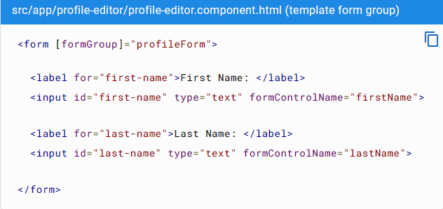

# 						Angular Base


## 1.Template


### Displaying values with interpolation


Interpolation refers to embedding expressions into marked up text. 

By default, interpolation uses the double curly braces `{{` and `}}` as delimiters.


### Pipes

Use [pipes](https://angular.io/guide/glossary#pipe) to transform strings, currency amounts, dates, and other data for display.


#### pipe

A class which is preceded by the `@Pipe{}` decorator and which defines a function that transforms input values to output values for display in a [view](https://angular.io/guide/glossary#view). Angular defines various pipes, and you can define new pipes.

To learn more, see [Pipes](https://angular.io/guide/pipes).


#### What is a pipe

Pipes are simple functions to use in [template expressions](https://angular.io/guide/glossary#template-expression) to accept an input value and return a transformed value. Pipes are useful because you can use them throughout your application, while only declaring each pipe once. For example, you would use a pipe to show a date as **April 15, 1988** rather than the raw string format.


#### Built-in pipes

Angular provides built-in pipes for typical data transformations, including transformations for internationalization (i18n), which use locale information to format data. The following are commonly used built-in pipes for data formatting:

- [`DatePipe`](https://angular.io/api/common/DatePipe): Formats a date value according to locale rules.
- [`UpperCasePipe`](https://angular.io/api/common/UpperCasePipe): Transforms text to all upper case.
- [`LowerCasePipe`](https://angular.io/api/common/LowerCasePipe): Transforms text to all lower case.
- [`CurrencyPipe`](https://angular.io/api/common/CurrencyPipe): Transforms a number to a currency string, formatted according to locale rules.
- [`DecimalPipe`](https://angular.io/api/common/DecimalPipe): Transforms a number into a string with a decimal point, formatted according to locale rules.
- [`PercentPipe`](https://angular.io/api/common/PercentPipe): Transforms a number to a percentage string, formatted according to locale rules.


Create pipes to encapsulate custom transformations and use your custom pipes in template expressions.


#### Pipes and precedence

The pipe operator has a higher precedence than the ternary operator (`?:`), which means `a ? b : c | x` is parsed as `a ? b : (c | x)`. The pipe operator cannot be used without parentheses in the first and second operands of `?:`.

Due to precedence, if you want a pipe to apply to the result of a ternary, wrap the entire expression in parentheses; for example, `(a ? b : c) | x`.


## 2.Property Binding


**Understanding the flow of data**

Property binding moves a value in one direction, from a component's property into a target element property.


**Binding to a property**

To bind to an element's property, enclose it in square brackets, `[]`, which identifies the property as a target property.


A target property is the DOM property to which you want to assign a value.

To assign a value to a target property for the image element's `src` property, type the following code:

```html

```


In most cases, the target name is the name of a property, even when it appears to be the name of an attribute.

In this example, `src` is the name of the `` element property.


The brackets, `[]`, cause Angular to evaluate the right-hand side of the assignment as a dynamic expression.


**Without the brackets,** Angular treats the right-hand side as **a string literal** and sets the property to that static value.

To assign a string to a property, type the following code:

```html
<app-item-detail childItem="parentItem"></app-item-detail>
```

Omitting the brackets renders the string `parentItem`, not the value of `parentItem`.


## 3.Event binding


Event binding lets you listen for and respond to user actions such as keystrokes, mouse movements, clicks, and touches.


### Binding to events

To bind to an event you use the Angular event binding syntax. This syntax consists of a target event name within parentheses to the left of an equal sign, and a quoted template statement to the right.

Create the following example; the target event name is `click` and the template statement is `onSave()`.

```html
<button (click)="onSave()">Save</button>
```


The event binding listens for the button's click events and calls the component's `onSave()` method whenever a click occurs.

 


#### Determining an event target

To determine an event target, Angular checks if the name of the target event matches an event property of a known directive.

Create the following example: (Angular checks to see if `myClick` is an event on the custom `ClickDirective`)


(app.component.html)

```html
<h4>myClick is an event on the custom ClickDirective:</h4>
<button type="button" (myClick)="clickMessage=$event" clickable>click with myClick</button>
{{clickMessage}}
```

If the target event name, `myClick` fails to match an output property of `ClickDirective`, Angular will instead bind to the `myClick` event on the underlying DOM element.


## 4.Build-in directives


Directives are classes that add additional behavior to elements in your Angular applications. Use Angular's built-in directives to manage forms, lists, styles, and what users see.


#### 1.Adding and removing classes with `NgClass`


Add or remove multiple CSS classes simultaneously with `ngClass`.

**To add or remove a *single* class, use [class binding](https://angular.io/guide/class-binding) rather than `NgClass`.**


##### Using `NgClass` with an expression

On the element you'd like to style, add `[ngClass]` and set it equal to an expression. In this case, `isSpecial` is a boolean set to `true` in `app.component.ts`. Because `isSpecial` is true, `ngClass` applies the class of `special` to the `<div>`.

(app.component.html)

```html
<!-- toggle the "special" class on/off with a property -->
<div [ngClass]="isSpecial ? 'special' : ''">This div is special</div>
```


##### Using `NgClass` with a method

1.To use `NgClass` with a method, add the method to the component class. In the following example, `setCurrentClasses()` sets the property `currentClasses` with an object that adds or removes three classes based on the `true` or `false` state of three other component properties.

Each key of the object is a CSS class name. If a key is `true`, `ngClass` adds the class. If a key is `false`, `ngClass` removes the class.

(app.component.ts)

```typescript
currentClasses: Record<string, boolean> = {};
/* . . . */
setCurrentClasses() {
  // CSS classes: added/removed per current state of component properties
  this.currentClasses =  {
    saveable: this.canSave,
    modified: !this.isUnchanged,
    special:  this.isSpecial
  };
}
```


2.In the template, add the `ngClass` property binding to `currentClasses` to set the element's classes:

(app.component.html)

```html
<div [ngClass]="currentClasses">This div is initially saveable, unchanged, and special.</div>
```


For this use case, Angular applies the classes on initialization and in case of changes. The full example calls `setCurrentClasses()` initially with `ngOnInit()` and when the dependent properties change through a button click. These steps are not necessary to implement `ngClass`.

For more information, see the [live example](https://angular.io/generated/live-examples/built-in-directives/stackblitz.html) / [download example](https://angular.io/generated/zips/built-in-directives/built-in-directives.zip) `app.component.ts` and `app.component.html`.


#### 2.Setting inline styles with `NgStyle`

Use `NgStyle` to set multiple inline styles simultaneously, based on the state of the component.

1. To use `NgStyle`, add a method to the component class.

   In the following example, `setCurrentStyles()` sets the property `currentStyles` with an object that defines three styles, based on the state of three other component properties.

   (app.component.ts)

   ```typescript
   currentStyles: Record<string, string> = {};
   /* . . . */
   setCurrentStyles() {
     // CSS styles: set per current state of component properties
     this.currentStyles = {
       'font-style':  this.canSave      ? 'italic' : 'normal',
       'font-weight': !this.isUnchanged ? 'bold'   : 'normal',
       'font-size':   this.isSpecial    ? '24px'   : '12px'
     };
   }
   ```

2. To set the element's styles, add an `ngStyle` property binding to `currentStyles`.

   (app.component.html)

   ```html
   <div [ngStyle]="currentStyles">
     This div is initially italic, normal weight, and extra large (24px).
   </div>
   ```

   For this use case, Angular applies the styles upon initialization and in case of changes. To do this, the full example calls `setCurrentStyles()` initially with `ngOnInit()` and when the dependent properties change through a button click. However, these steps are not necessary to implement `ngStyle` on its own. See the [live example](https://angular.io/generated/live-examples/built-in-directives/stackblitz.html) / [download example](https://angular.io/generated/zips/built-in-directives/built-in-directives.zip) `app.component.ts` and `app.component.html` for this optional implementation.

   


#### 3.Displaying and updating properties with `ngModel`

Use the `NgModel` directive to display a data property and update that property when the user makes changes.

1. Import `FormsModule` and add it to the NgModule's `imports` list.

   ( app.module.ts (FormsModule import) )

   ```typescript
   import { FormsModule } from '@angular/forms'; // <--- JavaScript import from Angular
   /* . . . */
   @NgModule({
     /* . . . */
   
     imports: [
       BrowserModule,
       FormsModule // <--- import into the NgModule
     ],
     /* . . . */
   })
   export class AppModule { }
   ```

2. Add an `[(ngModel)]` binding on an HTML `<form>` element and set it equal to the property, here `name`.

   ( app.component.html (NgModel example) )

   ```html
   <label for="example-ngModel">[(ngModel)]:</label>
   <input [(ngModel)]="currentItem.name" id="example-ngModel">
   ```

   This `[(ngModel)]` syntax can only set a data-bound property.

   

To customize your configuration, write the expanded form, which separates the property and event binding. Use [property binding](https://angular.io/guide/property-binding) to set the property and [event binding](https://angular.io/guide/event-binding) to respond to changes. The following example changes the `<input>` value to uppercase:


(app.component.html)

```html
<input [ngModel]="currentItem.name" (ngModelChange)="setUppercaseName($event)" id="example-uppercase">
```


#### 4.Adding or removing an element with `NgIf`

Add or remove an element by applying an `NgIf` directive to a host element.

When `NgIf` is `false`, Angular removes an element and its descendants from the DOM. Angular then disposes of their components, which frees up memory and resources.

To add or remove an element, bind `*ngIf` to a condition expression such as `isActive` in the following example.


(app.component.html)

```html
<app-item-detail *ngIf="isActive" [item]="item"></app-item-detail>
```


When the `isActive` expression returns a truthy value, `NgIf` adds the `ItemDetailComponent` to the DOM. When the expression is falsy, `NgIf` removes the `ItemDetailComponent` from the DOM and disposes of the component and all of its subcomponents.

For more information on `NgIf` and `NgIfElse`, see the [NgIf API documentation](https://angular.io/api/common/NgIf).


##### Guarding against `null`

By default, `NgIf` prevents display of an element bound to a null value.


To use `NgIf` to guard a `<div>`, add `*ngIf="yourProperty"` to the `<div>`. In the following example, the `currentCustomer` name appears because there is a `currentCustomer`.


(app.component.html)

```html
<div *ngIf="currentCustomer">Hello, {{currentCustomer.name}}</div>
```


However, if the property is `null`, Angular does not display the `<div>`. In this example, Angular does not display the `nullCustomer` because it is `null`.


(app.component.html)

```html
<div *ngIf="nullCustomer">Hello, <span>{{nullCustomer}}</span></div>
```


#### 5.Listing items with `NgFor`

Use the `NgFor` directive to present a list of items.

1. Define a block of HTML that determines how Angular renders a single item.
2. To list your items, assign the shorthand `let item of items` to `*ngFor`.


(app.component.html)

```html
<div *ngFor="let item of items">{{item.name}}</div>
```


The string `"let item of items"` instructs Angular to do the following:

- Store each item in the `items` array in the local `item` looping variable
- Make each item available to the templated HTML for each iteration
- Translate `"let item of items"` into an `<ng-template>` around the host element
- Repeat the `<ng-template>` for each `item` in the list

For more information see the [Structural directive shorthand](https://angular.io/guide/structural-directives#shorthand) section of [Structural directives](https://angular.io/guide/structural-directives).


##### Repeating a component view

To repeat a component element, apply `*ngFor` to the selector. In the following example, the selector is `<app-item-detail>`.


(app.component.html)

```html
<app-item-detail *ngFor="let item of items" [item]="item"></app-item-detail>
```

Reference a template input variable, such as `item`, in the following locations:

- Within the `ngFor` host element
- Within the host element descendants to access the item's properties


The following example references `item` first in an interpolation and then passes in a binding to the `item` property of the `<app-item-detail>` component.


(app.component.html)

```html
<div *ngFor="let item of items">{{item.name}}</div>
<!-- . . . -->
<app-item-detail *ngFor="let item of items" [item]="item"></app-item-detail>
```


##### Getting the `index` of `*ngFor`

Get the `index` of `*ngFor` in a template input variable and use it in the template.


In the `*ngFor`, add a semicolon and `let i=index` to the shorthand. The following example gets the `index` in a variable named `i` and displays it with the item name.


(app.component.html)

```html
<div *ngFor="let item of items; let i=index">{{i + 1}} - {{item.name}}</div>
```


The index property of the `NgFor` directive context returns the zero-based index of the item in each iteration.


Angular translates this instruction into an `<ng-template>` around the host element, then uses this template repeatedly to create a new set of elements and bindings for each `item` in the list. For more information about shorthand, see the [Structural Directives](https://angular.io/guide/structural-directives#shorthand) guide.


#### 6.Repeating elements when a condition is true

To repeat a block of HTML when a particular condition is true, put the `*ngIf` on a container element that wraps an `*ngFor` element.

For more information see [one structural directive per element](https://angular.io/guide/structural-directives#one-per-element).


##### Tracking items with `*ngFor` `trackBy`


Reduce the number of calls your application makes to the server by tracking changes to an item list. With the `*ngFor` `trackBy` property, Angular can change and re-render only those items that have changed, rather than reloading the entire list of items.


1.Add a method to the component that returns the value `NgFor` should track. In this example, the value to track is the item's `id`. If the browser has already rendered `id`, Angular keeps track of it and doesn't re-query the server for the same `id`.


(app.component.ts)

```typescript
trackByItems(index: number, item: Item): number { return item.id; }
```


2.In the shorthand expression, set `trackBy` to the `trackByItems()` method.


(app.component.html)

```html
<div *ngFor="let item of items; trackBy: trackByItems">
  ({{item.id}}) {{item.name}}
</div>
```


## 5.Attribute directives


Change the appearance or behavior of DOM elements and Angular components with attribute directives.


## Two-way binding


## Dependency injection in Angular


When you develop a smaller part of your system, like a module or a class, you may need to use features from other classes. For example, you may need an HTTP service to make backend calls. Dependency Injection, or DI, is a design pattern and mechanism for creating and delivering some parts of an application to other parts of an application that require them. Angular supports this design pattern and you can use it in your applications to increase flexibility and modularity.

In Angular, dependencies are typically services, but they also can be values, such as strings or functions. An injector for an application (created automatically during bootstrap) instantiates dependencies when needed, using a configured provider of the service or value.


### Understanding dependency injection

Dependency injection, or DI, is one of the fundamental concepts in Angular. DI is wired into the Angular framework and allows classes with Angular decorators, such as Components, Directives, Pipes, and Injectables, to configure dependencies that they need.

Two main roles exist in the DI system: **dependency consumer** and **dependency provider**.

Angular facilitates the interaction between dependency consumers and dependency providers using an abstraction called [Injector](https://angular.io/guide/glossary#injector). When a dependency is requested, the injector checks its registry to see if there is an instance already available there. If not, a new instance is created and stored in the registry. Angular creates an application-wide injector (also known as "root" injector) during the application bootstrap process, as well as any other injectors as needed. In most cases you don't need to manually create injectors, but you should know that there is a **layer** that connects providers and consumers.

This topic covers basic scenarios of how a class can act as a dependency. Angular also allows you to use functions, objects, primitive types such as string or Boolean, or any other types as dependencies. For more information, see [Dependency providers](https://angular.io/guide/dependency-injection-providers).


#### Providing dependency

Imagine there is a class called HeroService that needs to act as a dependency in a component.

The first step is to add the @Injectable decorator to show that the class can be injected.

```typescript
@Injectable()
class HeroService {}
```


The next step is to make it available in the DI by providing it. A dependency can be provided in multiple places:

- At the Component level, using the `providers` field of the `@Component` decorator. In this case the `HeroService` becomes available to all instances of this component and other components and directives **used in the template**. For example:

  ```typescript
  @Component({
    selector: 'hero-list',
    template: '...',
    providers: [HeroService]
  })
  class HeroListComponent {}
  ```

  When you register a provider at the component level, you get a new instance of the service with each new instance of that component.

  

- At the NgModule level, using the `providers` field of the `@NgModule` decorator. In this scenario, the `HeroService` is available to all components, directives, and pipes **declared in this NgModule** or other NgModule which is within the same ModuleInjector applicable for this NgModule. When you register a provider with a specific NgModule, the same instance of a service is available to all applicable components, directives and pipes. To understand all edge-cases, see [Hierarchical injectors](https://angular.io/guide/hierarchical-dependency-injection). For example:

  ```typescript
  @NgModule({
    declarations: [HeroListComponent]
    providers: [HeroService]
  })
  class HeroListModule {}
  ```

  

- At the application root level, which allows injecting it into other classes in the application. This can be done by adding the `providedIn: 'root'` field to the `@Injectable` decorator:

  ```typescript
  @Injectable({
    providedIn: 'root'
  })
  class HeroService {}
  ```

  When you provide the service at the root level, Angular creates a single, shared instance of the `HeroService` and injects it into any class that asks for it. Registering the provider in the `@Injectable` metadata also allows Angular to optimize an app by removing the service from the compiled application if it isn't used, a process known as tree-shaking.


#### Injecting a dependency

The most common way to inject a dependency is to declare it in a class constructor. When Angular creates a new instance of a component, directive, or pipe class, it determines which services or other dependencies that class needs by looking at the constructor parameter types. For example, if the `HeroListComponent` needs the `HeroService`, the constructor can look like this:

```typescript
@Component({ … })
class HeroListComponent {
  constructor(private service: HeroService) {}
}
```


Another option is to use the [inject](https://angular.io/api/core/inject) method:

```typescript
@Component({ … })
class HeroListComponent {
  private service = inject(HeroService);
}
```


When Angular discovers that a component depends on a service, it first checks if the injector has any existing instances of that service. If a requested service instance doesn't yet exist, the injector creates one using the registered provider, and adds it to the injector before returning the service to Angular.

When all requested services have been resolved and returned, Angular can call the component's constructor with those services as arguments.


### Creating an injectable service

Service is a broad category encompassing any value, function, or feature that an application needs. A service is typically a class with a narrow, well-defined purpose. A component is one type of class that can use DI.

Angular distinguishes components from services to increase modularity and reusability. By separating a component's view-related features from other kinds of processing, you can make your component classes lean and efficient.

Ideally, a component's job is to enable the user experience and nothing more. A component should present properties and methods for data binding, to mediate between the view (rendered by the template) and the application logic (which often includes some notion of a model).

A component can delegate certain tasks to services, such as fetching data from the server, validating user input, or logging directly to the console. By defining such processing tasks in an injectable service class, you make those tasks available to any component. You can also make your application more adaptable by injecting different providers of the same kind of service, as appropriate in different circumstances.

Angular does not enforce these principles. Angular helps you follow these principles by making it easy to factor your application logic into services and make those services available to components through DI.


#### Service examples

Here's an example of a service class that logs to the browser console.

( src/app/logger.service.ts (class) )

```typescript
export class Logger {
  log(msg: any)   { console.log(msg); }
  error(msg: any) { console.error(msg); }
  warn(msg: any)  { console.warn(msg); }
}
```


Services can depend on other services. For example, here's a `HeroService` that depends on the `Logger` service, and also uses `BackendService` to get heroes. That service in turn might depend on the `HttpClient` service to fetch heroes asynchronously from a server.


( src/app/hero.service.ts (class) )

```typescript
export class HeroService {
  private heroes: Hero[] = [];

  constructor(
    private backend: BackendService,
    private logger: Logger) { }

  getHeroes() {
    this.backend.getAll(Hero).then( (heroes: Hero[]) => {
      this.logger.log(`Fetched ${heroes.length} heroes.`);
      this.heroes.push(...heroes); // fill cache
    });
    return this.heroes;
  }
}
```


#### Creating an injectable service

Angular CLI provides a command to create a new service. In the following example, you add a new service to your application, which was created earlier with the `ng new` command.

To generate a new `HeroService` class in the `src/app/heroes` folder, follow these steps:

1. Run this [Angular CLI](https://angular.io/cli) command:

   ```shell
   ng generate service heroes/hero
   ```

​		This command creates the following default `HeroService`.


​		( src/app/heroes/hero.service.ts (CLI-generated) )

```typescript
import { Injectable } from '@angular/core';

@Injectable({
  providedIn: 'root',
})
export class HeroService {

}
```

​		The `@Injectable()` decorator specifies that Angular can use this class in the DI system. The metadata, `providedIn: 'root'`, means that the `HeroService` is visible throughout the application.


​	2.Add a `getHeroes()` method that returns the heroes from `mock.heroes.ts` to get the hero mock data:

​	( src/app/heroes/hero.service.ts )

```typescript
import { Injectable } from '@angular/core';
import { HEROES } from './mock-heroes';

@Injectable({
  // declares that this service should be created
  // by the root application injector.
  providedIn: 'root',
})
export class HeroService {
  getHeroes() { return HEROES; }
}
```


**For clarity and maintainability, it is recommended that you define components and services in separate files.**


#### Injecting services

To inject a service as a dependency into a component, you can use component's `constructor()` and supply a constructor argument with the dependency type. The following example specifies the `HeroService` in the `HeroListComponent` constructor. The type of the `heroService` is `HeroService`. Angular recognizes the `HeroService` as a dependency, since that class was previously annotated with the `@Injectable` decorator.


( src/app/heroes/hero-list.component (constructor signature) )

```typescript
constructor(heroService: HeroService)
```


#### constructor(heroService: HeroService)

When a service depends on another service, follow the same pattern as injecting into a component. In the following example `HeroService` depends on a `Logger` service to report its activities.

First, import the `Logger` service. Next, inject the `Logger` service in the `HeroService` `constructor()` by specifying `private logger: Logger`.

Here, the `constructor()` specifies a type of `Logger` and stores the instance of `Logger` in a private field called `logger`.

The following code tabs feature the `Logger` service and two versions of `HeroService`. The first version of `HeroService` does not depend on the `Logger` service. The revised second version does depend on `Logger` service.


( src/app/heroes/hero.service (v1) )

```typescript
import { Injectable } from '@angular/core';
import { HEROES } from './mock-heroes';

@Injectable({
  providedIn: 'root',
})
export class HeroService {
  getHeroes() { return HEROES; }
}
```


( src/app/logger.service )

```typescript
import { Injectable } from '@angular/core';

@Injectable({
  providedIn: 'root'
})
export class Logger {
  logs: string[] = []; // capture logs for testing

  log(message: string) {
    this.logs.push(message);
    console.log(message);
  }
}
```


( src/app/heroes/hero.service (v2) )

```typescript
import { Injectable } from '@angular/core';
import { HEROES } from './mock-heroes';
import { Logger } from '../logger.service';

@Injectable({
  providedIn: 'root',
})
export class HeroService {

  constructor(private logger: Logger) {  }

  getHeroes() {
    this.logger.log('Getting heroes ...');
    return HEROES;
  }
}
```

In this example, the `getHeroes()` method uses the `Logger` service by logging a message when fetching heroes.


### Configuring dependency providers

The Creating and injecting services topic describes how to use classes as dependencies. Besides classes, you can also use other values such as Boolean, string, date, and objects as dependencies. Angular DI provides the necessary APIs to make the dependency configuration flexible, so you can make those values available in DI.


#### Specifying a provider token

If you specify the service class as the provider token, the default behavior is for the injector to instantiate that class using the `new` operator.

In the following example, the `Logger` class provides a `Logger` instance.

```typescript
providers: [Logger]
```


You can, however, configure a DI to use a different class or any other different value to associate with the `Logger` class. So when the `Logger` is injected, this new value is used instead.

In fact, the class provider syntax is a shorthand expression that expands into a provider configuration, defined by the `Provider` interface.

Angular expands the `providers` value in this case into a full provider object as follows:

```typescript
[{ provide: Logger, useClass: Logger }]
```


The expanded provider configuration is an object literal with two properties:

- The `provide` property holds the token that serves as the key for both locating a dependency value and configuring the injector.
- The second property is a provider definition object, which tells the injector how to create the dependency value. The provider-definition key can be one of the following:
  - useClass - this option tells Angular DI to instantiate a provided class when a dependency is injected
  - useExisting - allows you to alias a token and reference any existing one.
  - useFactory - allows you to define a function that constructs a dependency.
  - useValue - provides a static value that should be used as a dependency.

The section below describes how to use the mentioned provider definition keys.


##### Class providers: useClass

The `useClass` provider key lets you create and return a new instance of the specified class. You can use this type of provider to substitute an alternative implementation for a common or default class. The alternative implementation can, for example, implement a different strategy, extend the default class, or emulate the behavior of the real class in a test case. In the following example, the `BetterLogger` class would be instantiated when the `Logger` dependency is requested in a component or any other class.

```typescript
[{ provide: Logger, useClass: BetterLogger }]
```


If the alternative class providers have their own dependencies, specify both providers in the providers metadata property of the parent module or component.

```typescript
If the alternative class providers have their own dependencies, specify both providers in the providers metadata property of the parent module or component.
```


If the alternative class providers have their own dependencies, specify both providers in the providers metadata property of the parent module or component.

```typescript
@Injectable()
export class EvenBetterLogger extends Logger {
  constructor(private userService: UserService) { super(); }

  override log(message: string) {
    const name = this.userService.user.name;
    super.log(`Message to ${name}: ${message}`);
  }
}
```

Angular DI knows how to construct the `UserService` dependency, since it has been configured above and is available in the injector.


## Component interaction

This cookbook contains recipes for common component communication scenarios in which two or more components share information.


### 1.Pass data from parent to child with input binding

`HeroChildComponent` has two ***input properties\***, typically adorned with [@Input() decorator](https://angular.io/guide/inputs-outputs#input).


(component-interaction/src/app/hero-child.component.ts)

```typescript
import { Component, Input } from '@angular/core';

import { Hero } from './hero';

@Component({
  selector: 'app-hero-child',
  template: `
    <h3>{{hero.name}} says:</h3>
    <p>I, {{hero.name}}, am at your service, {{masterName}}.</p>
  `
})
export class HeroChildComponent {
  @Input() hero!: Hero;
  @Input('master') masterName = '';
}
```

The second `@Input` aliases the child component property name `masterName` as `'master'`.


**Tips**:	However,the attribute of the dom of the childComponent is still conneted with masterName,master is just an alias of masterName,for parentComponent to use.


The `HeroParentComponent` nests the child `HeroChildComponent` inside an `*ngFor` repeater, binding its `master` string property to the child's `master` alias, and each iteration's `hero` instance to the child's `hero` property.


(component-interaction/src/app/hero-parent.component.ts)

```typescript
import { Component } from '@angular/core';

import { HEROES } from './hero';

@Component({
  selector: 'app-hero-parent',
  template: `
    <h2>{{master}} controls {{heroes.length}} heroes</h2>

    <app-hero-child
      *ngFor="let hero of heroes"
      [hero]="hero"
      [master]="master">
    </app-hero-child>
  `
})
export class HeroParentComponent {
  heroes = HEROES;
  master = 'Master';
}
```


### 2.Intercept input property changes with a setter

Use an input property setter to intercept and act upon a value from the parent.

The setter of the `name` input property in the child `NameChildComponent` trims the whitespace from a name and replaces an empty value with default text.


(component-interaction/src/app/name-child.component.ts)

```typescript
import { Component, Input } from '@angular/core';

@Component({
  selector: 'app-name-child',
  template: '<h3>"{{name}}"</h3>'
})
export class NameChildComponent {
  @Input()
  get name(): string { return this._name; }
  set name(name: string) {
    this._name = (name && name.trim()) || '<no name set>';
  }
  private _name = '';
}
```


Here's the `NameParentComponent` demonstrating name variations including a name with all spaces:

(component-interaction/src/app/name-parent.component.ts)

```typescript
import { Component } from '@angular/core';

@Component({
  selector: 'app-name-parent',
  template: `
    <h2>Master controls {{names.length}} names</h2>

    <app-name-child *ngFor="let name of names" [name]="name"></app-name-child>
  `
})
export class NameParentComponent {
  // Displays 'Dr. IQ', '<no name set>', 'Bombasto'
  names = ['Dr. IQ', '   ', '  Bombasto  '];
}
```


### 3.Intercept input property changes with `ngOnChanges()`

Detect and act upon changes to input property values with the `ngOnChanges()` method of the `OnChanges` lifecycle hook interface.


This `VersionChildComponent` detects changes to the `major` and `minor` input properties and composes a log message reporting these changes:

(component-interaction/src/app/version-child.component.ts)

```typescript
import { Component, Input, OnChanges, SimpleChanges } from '@angular/core';

@Component({
  selector: 'app-version-child',
  template: `
    <h3>Version {{major}}.{{minor}}</h3>
    <h4>Change log:</h4>
    <ul>
      <li *ngFor="let change of changeLog">{{change}}</li>
    </ul>
  `
})
export class VersionChildComponent implements OnChanges {
  @Input() major = 0;
  @Input() minor = 0;
  changeLog: string[] = [];

  ngOnChanges(changes: SimpleChanges) {
    const log: string[] = [];
    for (const propName in changes) {
      const changedProp = changes[propName];
      const to = JSON.stringify(changedProp.currentValue);
      if (changedProp.isFirstChange()) {
        log.push(`Initial value of ${propName} set to ${to}`);
      } else {
        const from = JSON.stringify(changedProp.previousValue);
        log.push(`${propName} changed from ${from} to ${to}`);
      }
    }
    this.changeLog.push(log.join(', '));
  }
}
```


### 4.Parent listens for child event

The child component exposes an `EventEmitter` property with which it `emits` events when something happens. The parent binds to that event property and reacts to those events.

The child's `EventEmitter` property is an ***output property\***, typically adorned with an [@Output() decorator](https://angular.io/guide/inputs-outputs#output) as seen in this `VoterComponent`:

(component-interaction/src/app/voter.component.ts)

```typescript
import { Component, EventEmitter, Input, Output } from '@angular/core';

@Component({
  selector: 'app-voter',
  template: `
    <h4>{{name}}</h4>
    <button type="button" (click)="vote(true)"  [disabled]="didVote">Agree</button>
    <button type="button" (click)="vote(false)" [disabled]="didVote">Disagree</button>
  `
})
export class VoterComponent {
  @Input()  name = '';
  @Output() voted = new EventEmitter<boolean>();
  didVote = false;

  vote(agreed: boolean) {
    this.voted.emit(agreed);
    this.didVote = true;
  }
}
```

Clicking a button triggers emission of a `true` or `false`, the boolean *payload*.


The parent `VoteTakerComponent` binds an event handler called `onVoted()` that responds to the child event payload `$event` and updates a counter.

(component-interaction/src/app/votetaker.component.ts)

```typescript
import { Component } from '@angular/core';

@Component({
  selector: 'app-vote-taker',
  template: `
    <h2>Should mankind colonize the Universe?</h2>
    <h3>Agree: {{agreed}}, Disagree: {{disagreed}}</h3>

    <app-voter
      *ngFor="let voter of voters"
      [name]="voter"
      (voted)="onVoted($event)">
    </app-voter>
  `
})
export class VoteTakerComponent {
  agreed = 0;
  disagreed = 0;
  voters = ['Dr. IQ', 'Celeritas', 'Bombasto'];

  onVoted(agreed: boolean) {
    if (agreed) {
      this.agreed++;
    } else {
      this.disagreed++;
    }
  }
}
```

The framework passes the event argument —represented by `$event`— to the handler method, and the method processes it.


### 5.Parent interacts with child using *local variable*

A parent component cannot use data binding to read child properties or invoke child methods. Do both by creating a template reference variable for the child element and then reference that variable *within the parent template* as seen in the following example.


The following is a child `CountdownTimerComponent` that repeatedly counts down to zero and launches a rocket. The `start` and `stop` methods control the clock and a countdown status message displays in its own template.

(component-interaction/src/app/countdown-timer.component.ts)

```typescript
import { Component, OnDestroy } from '@angular/core';

@Component({
  selector: 'app-countdown-timer',
  template: '<p>{{message}}</p>'
})
export class CountdownTimerComponent implements OnDestroy {
  message = '';
  seconds = 11;

  ngOnDestroy() { this.clearTimer?.(); }

  start() { this.countDown(); }
  stop()  {
    this.clearTimer?.();
    this.message = `Holding at T-${this.seconds} seconds`;
  }

  private clearTimer: VoidFunction | undefined;

  private countDown() {
    this.clearTimer?.();
    const interval = setInterval(() => {
      this.seconds -= 1;
      if (this.seconds === 0) {
        this.message = 'Blast off!';
      } else {
        if (this.seconds < 0) { this.seconds = 10; } // reset
        this.message = `T-${this.seconds} seconds and counting`;
      }
    }, 1000);
    this.clearTimer = () => clearInterval(interval);
  }
}
```


The `CountdownLocalVarParentComponent` that hosts the timer component is as follows:

(component-interaction/src/app/countdown-parent.component.ts)

```typescript
import { Component } from '@angular/core';
import { CountdownTimerComponent } from './countdown-timer.component';

@Component({
  selector: 'app-countdown-parent-lv',
  template: `
    <h3>Countdown to Liftoff (via local variable)</h3>
    <button type="button" (click)="timer.start()">Start</button>
    <button type="button" (click)="timer.stop()">Stop</button>
    <div class="seconds">{{timer.seconds}}</div>
    <app-countdown-timer #timer></app-countdown-timer>
  `,
  styleUrls: ['../assets/demo.css']
})
export class CountdownLocalVarParentComponent { }
```

The parent component cannot data bind to the child's `start` and `stop` methods nor to its `seconds` property.

Place a local variable, `#timer`, on the tag `<app-countdown-timer>` representing the child component. That gives you a reference to the child component and the ability to access *any of its properties or methods* from within the parent template.

This example wires parent buttons to the child's `start` and `stop` and uses interpolation to display the child's `seconds` property.

Here, the parent and child are working together.


### 6.Parent calls an `@ViewChild()`

The *local variable* approach is straightforward. But it is limited because the parent-child wiring must be done entirely within the parent template. The parent component *itself* has no access to the child.

You can't use the *local variable* technique if the parent component's *class* relies on the child component's *class*. The parent-child relationship of the components is not established within each component's respective *class* with the *local variable* technique. Because the *class* instances are not connected to one another, the parent *class* cannot access the child *class* properties and methods.

When the parent component *class* requires that kind of access, ***inject\*** the child component into the parent as a *ViewChild*.

The following example illustrates this technique with the same [Countdown Timer](https://angular.io/guide/component-interaction#countdown-timer-example) example. Neither its appearance nor its behavior changes. The child [CountdownTimerComponent](https://angular.io/guide/component-interaction#countdown-timer-example) is the same as well.

```tex
The switch from the local variable to the ViewChild technique is solely for the purpose of demonstration.
```


Here is the parent, `CountdownViewChildParentComponent`:

(component-interaction/src/app/countdown-parent.component.ts)

```typescript
import { AfterViewInit, ViewChild } from '@angular/core';
import { Component } from '@angular/core';
import { CountdownTimerComponent } from './countdown-timer.component';

@Component({
  selector: 'app-countdown-parent-vc',
  template: `
    <h3>Countdown to Liftoff (via ViewChild)</h3>
    <button type="button" (click)="start()">Start</button>
    <button type="button" (click)="stop()">Stop</button>
    <div class="seconds">{{ seconds() }}</div>
    <app-countdown-timer></app-countdown-timer>
  `,
  styleUrls: ['../assets/demo.css']
})
export class CountdownViewChildParentComponent implements AfterViewInit {

  @ViewChild(CountdownTimerComponent)
  private timerComponent!: CountdownTimerComponent;

  seconds() { return 0; }

  ngAfterViewInit() {
    // Redefine `seconds()` to get from the `CountdownTimerComponent.seconds` ...
    // but wait a tick first to avoid one-time devMode
    // unidirectional-data-flow-violation error
    setTimeout(() => this.seconds = () => this.timerComponent.seconds, 0);
  }

  start() { this.timerComponent.start(); }
  stop() { this.timerComponent.stop(); }
}
```

It takes a bit more work to get the child view into the parent component *class*.

First, you have to import references to the `ViewChild` decorator and the `AfterViewInit` lifecycle hook.

Next, inject the child `CountdownTimerComponent` into the private `timerComponent` property using the `@ViewChild` property decoration.

The `#timer` local variable is gone from the component metadata. Instead, bind the buttons to the parent component's own `start` and `stop` methods and present the ticking seconds in an interpolation around the parent component's `seconds` method.

These methods access the injected timer component directly.

The `ngAfterViewInit()` lifecycle hook is an important wrinkle. The timer component isn't available until *after* Angular displays the parent view. So it displays `0` seconds initially.

Then Angular calls the `ngAfterViewInit` lifecycle hook at which time it is *too late* to update the parent view's display of the countdown seconds. Angular's unidirectional data flow rule prevents updating the parent view's in the same cycle. The application must *wait one turn* before it can display the seconds.

Use `setTimeout()` to wait one tick and then revise the `seconds()` method so that it takes future values from the timer component.


### 7.Parent and children communicate using a service

A parent component and its children share a service whose interface enables bidirectional communication *within the family*.

The scope of the service instance is the parent component and its children. Components outside this component subtree have no access to the service or their communications.

This `MissionService` connects the `MissionControlComponent` to multiple `AstronautComponent` children.


(component-interaction/src/app/mission.service.ts)

```typescript
import { Injectable } from '@angular/core';
import { Subject } from 'rxjs';

@Injectable()
export class MissionService {

  // Observable string sources
  private missionAnnouncedSource = new Subject<string>();
  private missionConfirmedSource = new Subject<string>();

  // Observable string streams
  missionAnnounced$ = this.missionAnnouncedSource.asObservable();
  missionConfirmed$ = this.missionConfirmedSource.asObservable();

  // Service message commands
  announceMission(mission: string) {
    this.missionAnnouncedSource.next(mission);
  }

  confirmMission(astronaut: string) {
    this.missionConfirmedSource.next(astronaut);
  }
}
```


The `MissionControlComponent` both provides the instance of the service that it shares with its children (through the `providers` metadata array) and injects that instance into itself through its constructor:

(component-interaction/src/app/missioncontrol.component.ts)

```typescript
import { Component } from '@angular/core';

import { MissionService } from './mission.service';

@Component({
  selector: 'app-mission-control',
  template: `
    <h2>Mission Control</h2>
    <button type="button" (click)="announce()">Announce mission</button>

    <app-astronaut
      *ngFor="let astronaut of astronauts"
      [astronaut]="astronaut">
    </app-astronaut>

    <h3>History</h3>
    <ul>
      <li *ngFor="let event of history">{{event}}</li>
    </ul>
  `,
  providers: [MissionService]
})
export class MissionControlComponent {
  astronauts = ['Lovell', 'Swigert', 'Haise'];
  history: string[] = [];
  missions = ['Fly to the moon!',
              'Fly to mars!',
              'Fly to Vegas!'];
  nextMission = 0;

  constructor(private missionService: MissionService) {
    missionService.missionConfirmed$.subscribe(
      astronaut => {
        this.history.push(`${astronaut} confirmed the mission`);
      });
  }

  announce() {
    const mission = this.missions[this.nextMission++];
    this.missionService.announceMission(mission);
    this.history.push(`Mission "${mission}" announced`);
    if (this.nextMission >= this.missions.length) { this.nextMission = 0; }
  }
}
```


The `AstronautComponent` also injects the service in its constructor. Each `AstronautComponent` is a child of the `MissionControlComponent` and therefore receives its parent's service instance:

(component-interaction/src/app/astronaut.component.ts)

```typescript
import { Component, Input, OnDestroy } from '@angular/core';

import { MissionService } from './mission.service';
import { Subscription } from 'rxjs';

@Component({
  selector: 'app-astronaut',
  template: `
    <p>
      {{astronaut}}: <strong>{{mission}}</strong>
      <button
        type="button"
        (click)="confirm()"
        [disabled]="!announced || confirmed">
        Confirm
      </button>
    </p>
  `
})
export class AstronautComponent implements OnDestroy {
  @Input() astronaut = '';
  mission = '<no mission announced>';
  confirmed = false;
  announced = false;
  subscription: Subscription;

  constructor(private missionService: MissionService) {
    this.subscription = missionService.missionAnnounced$.subscribe(
      mission => {
        this.mission = mission;
        this.announced = true;
        this.confirmed = false;
    });
  }

  confirm() {
    this.confirmed = true;
    this.missionService.confirmMission(this.astronaut);
  }

  ngOnDestroy() {
    // prevent memory leak when component destroyed
    this.subscription.unsubscribe();
  }
}
```


**Notice that this example captures the `subscription` and `unsubscribe()` when the `AstronautComponent` is destroyed. This is a memory-leak guard step. There is no actual risk in this application because the lifetime of a `AstronautComponent` is the same as the lifetime of the application itself. That *would not* always be true in a more complex application.**

**You don't add this guard to the `MissionControlComponent` because, as the parent, it controls the lifetime of the `MissionService`.**


The *History* log demonstrates that messages travel in both directions between the parent `MissionControlComponent` and the `AstronautComponent` children, facilitated by the service


## Angular Routing

In a single-page app, you change what the user sees by showing or hiding portions of the display that correspond to particular components, rather than going out to the server to get a new page. As users perform application tasks, they need to move between the different [views](https://angular.io/guide/glossary#view) that you have defined.

To handle the navigation from one [view](https://angular.io/guide/glossary#view) to the next, you use the Angular **`Router`**. The **`Router`** enables navigation by interpreting a browser URL as an instruction to change the view.

To explore a sample app featuring the router's primary features, see the [live example](https://angular.io/generated/live-examples/router/stackblitz.html) / [download example](https://angular.io/generated/zips/router/router.zip).


### Common Routing Tasks

This topic describes how to implement many of the common tasks associated with adding the Angular router to your application.


<hr/>

#### Generate an application with routing enabled

The following command uses the Angular CLI to generate a basic Angular application with an application routing module, called `AppRoutingModule`, which is an NgModule where you can configure your routes. The application name in the following example is `routing-app`.

```shell
ng new routing-app --routing --defaults
```

##### Adding components for routing

To use the Angular router, an application needs to have at least two components so that it can navigate from one to the other. To create a component using the CLI, enter the following at the command line where `first` is the name of your component:

```shell
ng generate component first
```

Repeat this step for a second component but give it a different name. Here, the new name is `second`.

```shell
ng generate component second
```

The CLI automatically appends `Component`, so if you were to write `first-component`, your component would be `FirstComponentComponent`.


```
<base href>
This guide works with a CLI-generated Angular application. If you are working manually, make sure that you have `<base href="/">` in the `<head>` of your index.html file. This assumes that the `app` folder is the application root, and uses `"/"`.
```


##### Importing your new components

To use your new components, import them into `AppRoutingModule` at the top of the file, as follows:

( AppRoutingModule (excerpt) )

```typescript
import { FirstComponent } from './first/first.component';
import { SecondComponent } from './second/second.component';
```


#### Defining a basic route

There are three fundamental building blocks to creating a route.

Import the `AppRoutingModule` into `AppModule` and add it to the `imports` array.

The Angular CLI performs this step for you. However, if you are creating an application manually or working with an existing, non-CLI application, verify that the imports and configuration are correct. The following is the default `AppModule` using the CLI with the `--routing` flag.

(Default CLI AppModule with routing)

```typescript
import { BrowserModule } from '@angular/platform-browser';
import { NgModule } from '@angular/core';
import { AppRoutingModule } from './app-routing.module'; // CLI imports AppRoutingModule
import { AppComponent } from './app.component';

@NgModule({
  declarations: [
    AppComponent
  ],
  imports: [
    BrowserModule,
    AppRoutingModule // CLI adds AppRoutingModule to the AppModule's imports array
  ],
  providers: [],
  bootstrap: [AppComponent]
})
export class AppModule { }
```


1. Import `RouterModule` and `Routes` into your routing module.

   The Angular CLI performs this step automatically. The CLI also sets up a `Routes` array for your routes and configures the `imports` and `exports` arrays for `@NgModule()`.

   (CLI application routing module)

   ```typescript
   import { NgModule } from '@angular/core';
   import { Routes, RouterModule } from '@angular/router'; // CLI imports router
   
   const routes: Routes = []; // sets up routes constant where you define your routes
   
   // configures NgModule imports and exports
   @NgModule({
     imports: [RouterModule.forRoot(routes)],
     exports: [RouterModule]
   })
   export class AppRoutingModule { }
   ```

   

2. Define your routes in your `Routes` array.

   1. Each route in this array is a JavaScript object that contains two properties. The first property, `path`, defines the URL path for the route. The second property, `component`, defines the component Angular should use for the corresponding path.

   ​		(AppRoutingModule (excerpt))

   ​		

   ```typescript
   const routes: Routes = [
     { path: 'first-component', component: FirstComponent },
     { path: 'second-component', component: SecondComponent },
   ];
   ```

   

3. Add your routes to your application.

   Now that you have defined your routes, add them to your application. First, add links to the two components. Assign the anchor tag that you want to add the route to the `routerLink` attribute. Set the value of the attribute to the component to show when a user clicks on each link. Next, update your component template to include `<router-outlet>`. This element informs Angular to update the application view with the component for the selected route.

​		(Template with routerLink and router-outlet)

​		

```html
<h1>Angular Router App</h1>
<!-- This nav gives you links to click, which tells the router which route to use (defined in the routes constant in  AppRoutingModule) -->
<nav>
  <ul>
    <li><a routerLink="/first-component" routerLinkActive="active" ariaCurrentWhenActive="page">First Component</a></li>
    <li><a routerLink="/second-component" routerLinkActive="active" ariaCurrentWhenActive="page">Second Component</a></li>
  </ul>
</nav>
<!-- The routed views render in the <router-outlet>-->
<router-outlet></router-outlet>
```


##### Route order

The order of routes is important because the `Router` uses a first-match wins strategy when matching routes, so more specific routes should be placed above less specific routes. List routes with a static path first, followed by an empty path route, which matches the default route. The [wildcard route](https://angular.io/guide/router#setting-up-wildcard-routes) comes last because it matches every URL and the `Router` selects it only if no other routes match first.


#### Getting route information

Often, as a user navigates your application, you want to pass information from one component to another. For example, consider an application that displays a shopping list of grocery items. Each item in the list has a unique `id`. To edit an item, users click an Edit button, which opens an `EditGroceryItem` component. You want that component to retrieve the `id` for the grocery item so it can display the right information to the user.

Use a route to pass this type of information to your application components. To do so, you use the [withComponentInputBinding](https://angular.io/api/router/withComponentInputBinding) feature with `provideRouter` or the `bindToComponentInputs` option of `RouterModule.forRoot`.


To get information from a route:

1. Add the `withComponentInputBinding` feature to the `provideRouter` method.

   (provideRouter feature)

   ```typescript
   providers: [
     provideRouter(appRoutes, withComponentInputBinding()),
   ]
   ```

   

2. Update the component to have an `Input` matching the name of the parameter.

   ( The component input (excerpt) )

   ```typescript
   @Input()
   set id(heroId: string) {
     this.hero$ = this.service.getHero(heroId);
   }
   ```

   

#### Setting up wildcard routes

A well-functioning application should gracefully handle when users attempt to navigate to a part of your application that does not exist. To add this functionality to your application, you set up a wildcard route. The Angular router selects this route any time the requested URL doesn't match any router paths.

To set up a wildcard route, add the following code to your `routes` definition.


( AppRoutingModule (excerpt) )

```typescript
{ path: '**', component: <component-name> }
```

The two asterisks, `**`, indicate to Angular that this `routes` definition is a wildcard route. For the component property, you can define any component in your application. Common choices include an application-specific `PageNotFoundComponent`, which you can define to [display a 404 page](https://angular.io/guide/router#404-page-how-to) to your users; or a redirect to your application's main component. A wildcard route is the last route because it matches any URL. For more detail on why order matters for routes, see [Route order](https://angular.io/guide/router#route-order).


#### Displaying a 404 page

To display a 404 page, set up a [wildcard route](https://angular.io/guide/router#wildcard-route-how-to) with the `component` property set to the component you'd like to use for your 404 page as follows:


( AppRoutingModule (excerpt) )

```typescript
const routes: Routes = [
  { path: 'first-component', component: FirstComponent },
  { path: 'second-component', component: SecondComponent },
  { path: '**', component: PageNotFoundComponent },  // Wildcard route for a 404 page
];
```

The last route with the `path` of `**` is a wildcard route. The router selects this route if the requested URL doesn't match any of the paths earlier in the list and sends the user to the `PageNotFoundComponent`.


#### Setting up redirects

To set up a redirect, configure a route with the `path` you want to redirect from, the `component` you want to redirect to, and a `pathMatch` value that tells the router how to match the URL.


( AppRoutingModule (excerpt) )

```typescript
const routes: Routes = [
  { path: 'first-component', component: FirstComponent },
  { path: 'second-component', component: SecondComponent },
  { path: '',   redirectTo: '/first-component', pathMatch: 'full' }, // redirect to `first-component`
  { path: '**', component: PageNotFoundComponent },  // Wildcard route for a 404 page
];
```

In this example, the third route is a redirect so that the router defaults to the `first-component` route. Notice that this redirect precedes the wildcard route. Here, `path: ''` means to use the initial relative URL (`''`).

For more details on `pathMatch` see [Spotlight on `pathMatch`](https://angular.io/guide/router-tutorial-toh#pathmatch).


### Nesting routes

As your application grows more complex, you might want to create routes that are relative to a component other than your root component. These types of nested routes are called **child routes**. This means you're adding a second `<router-outlet>` to your app, because it is in addition to the `<router-outlet>` in `AppComponent`.

In this example, there are two additional child components, `child-a`, and `child-b`. Here, `FirstComponent` has its own `<nav>` and a second `<router-outlet>` in addition to the one in `AppComponent`.


(In the template)

```html
<h2>First Component</h2>

<nav>
  <ul>
    <li><a routerLink="child-a">Child A</a></li>
    <li><a routerLink="child-b">Child B</a></li>
  </ul>
</nav>

<router-outlet></router-outlet>
```

A child route is like any other route, in that it needs both a `path` and a `component`. The one difference is that you place child routes in a `children` array within the parent route.


### Setting the page title

Each page in your application should have a unique title so that they can be identified in the browser history. The `Router` sets the document's title using the `title` property from the `Route` config.


( AppRoutingModule (excerpt) )

```typescript
const routes: Routes = [
  {
    path: 'first-component',
    title: 'First component',
    component: FirstComponent,  // this is the component with the <router-outlet> in the template
    children: [
      {
        path: 'child-a',  // child route path
        title: resolvedChildATitle,
        component: ChildAComponent,  // child route component that the router renders
      },
      {
        path: 'child-b',
        title: 'child b',
        component: ChildBComponent,  // another child route component that the router renders
      },
    ],
  },
];

const resolvedChildATitle: ResolveFn<string> = () => Promise.resolve('child a');
```


### Using relative paths

Relative paths let you define paths that are relative to the current URL segment. The following example shows a relative route to another component, `second-component`. `FirstComponent` and `SecondComponent` are at the same level in the tree, however, the link to `SecondComponent` is situated within the `FirstComponent`, meaning that the router has to go up a level and then into the second directory to find the `SecondComponent`. Rather than writing out the whole path to get to `SecondComponent`, use the `../` notation to go up a level.


(In the template)

```html
<h2>First Component</h2>

<nav>
  <ul>
    <li><a routerLink="../second-component">Relative Route to second component</a></li>
  </ul>
</nav>
<router-outlet></router-outlet>
```

In addition to `../`, use `./` or no leading slash to specify the current level.


##### Specifying a relative route

To specify a relative route, use the `NavigationExtras` `relativeTo` property. In the component class, import `NavigationExtras` from the `@angular/router`.

Then use `relativeTo` in your navigation method. After the link parameters array, which here contains `items`, add an object with the `relativeTo` property set to the `ActivatedRoute`, which is `this.route`.


(RelativeTo)

```typescript
goToItems() {
  this.router.navigate(['items'], { relativeTo: this.route });
}
```

The `goToItems()` method interprets the destination URI as relative to the activated route and navigates to the `items` route.


### Lazy loading

You can configure your routes to lazy load modules, which means that Angular only loads modules as needed, rather than loading all modules when the application launches. Additionally, preload parts of your application in the background to improve the user experience.

For more information on lazy loading and preloading see the dedicated guide [Lazy loading NgModules](https://angular.io/guide/lazy-loading-ngmodules).


### Preventing unauthorized access

Use route guards to prevent users from navigating to parts of an application without authorization. The following route guards are available in Angular:

- [`canActivate`](https://angular.io/api/router/CanActivateFn)
- [`canActivateChild`](https://angular.io/api/router/CanActivateChildFn)
- [`canDeactivate`](https://angular.io/api/router/CanDeactivateFn)
- [`canMatch`](https://angular.io/api/router/CanMatchFn)
- [`resolve`](https://angular.io/api/router/ResolveFn)
- [`canLoad`](https://angular.io/api/router/CanLoadFn)

To use route guards, consider using [component-less routes](https://angular.io/api/router/Route#componentless-routes) as this facilitates guarding child routes.

Create a file for your guard:

```sh
ng generate guard your-guard
```

In your guard file, add the guard functions you want to use. The following example uses `canActivateFn` to guard the route.

( guard (excerpt) )

```typescript
export const yourGuardFunction: CanActivateFn = (
    next: ActivatedRouteSnapshot,
    state: RouterStateSnapshot) => {
      // your  logic goes here
  }
```

In your routing module, use the appropriate property in your `routes` configuration. Here, `canActivate` tells the router to mediate navigation to this particular route.

( Routing module (excerpt) )

```typescript
{
path: '/your-path',
component: YourComponent,
canActivate: [yourGuardFunction],
}
```

For more information with a working example, see the [routing tutorial section on route guards](https://angular.io/guide/router-tutorial-toh#milestone-5-route-guards).


### Link parameters array

A link parameters array holds the following ingredients for router navigation:

- The path of the route to the destination component
- Required and optional route parameters that go into the route URL

Bind the `RouterLink` directive to such an array like this:

( src/app/app.component.ts (h-anchor) )

```typescript
<a [routerLink]="['/heroes']">Heroes</a>
```

The following is a two-element array when specifying a route parameter:

( src/app/heroes/hero-list/hero-list.component.html (nav-to-detail) )

```typescript
<a [routerLink]="['/hero', hero.id]">
  <span class="badge">{{ hero.id }}</span>{{ hero.name }}
</a>
```

Provide optional route parameters in an object, as in `{ foo: 'foo' }`:

( src/app/app.component.ts (cc-query-params) )

```typescript
<a [routerLink]="['/crisis-center', { foo: 'foo' }]">Crisis Center</a>
```

...	__Pend__ 

```http
https://angular.io/guide/router#getting-route-information
```


## Forms


### Introduction to forms in Angular

Handling user input with forms is the cornerstone of many common applications. Applications use forms to enable users to log in, to update a profile, to enter sensitive information, and to perform many other data-entry tasks.

Angular provides two different approaches to handling user input through forms: reactive and template-driven. Both capture user input events from the view, validate the user input, create a form model and data model to update, and provide a way to track changes.

This guide provides information to help you decide which type of form works best for your situation. It introduces the common building blocks used by both approaches. It also summarizes the key differences between the two approaches, and demonstrates those differences in the context of setup, data flow, and testing.


### Choosing an approach

Reactive forms and template-driven forms process and manage form data differently. Each approach offers different advantages.

| FORMS                 | DETAILS                                                      |
| :-------------------- | :----------------------------------------------------------- |
| Reactive forms        | Provide direct, explicit access to the underlying form's object model. Compared to template-driven forms, they are more robust: they're more scalable, reusable, and testable. If forms are a key part of your application, or you're already using reactive patterns for building your application, use reactive forms. |
| Template-driven forms | Rely on directives in the template to create and manipulate the underlying object model. They are useful for adding a simple form to an app, such as an email list signup form. They're straightforward to add to an app, but they don't scale as well as reactive forms. If you have very basic form requirements and logic that can be managed solely in the template, template-driven forms could be a good fit. |


### Key differences

The following table summarizes the key differences between reactive and template-driven forms.

|                                                              | REACTIVE                             | TEMPLATE-DRIVEN                 |
| :----------------------------------------------------------- | :----------------------------------- | :------------------------------ |
| [Setup of form model](https://angular.io/guide/forms-overview#setup) | Explicit, created in component class | Implicit, created by directives |
| [Data model](https://angular.io/guide/forms-overview#mutability-of-the-data-model) | Structured and immutable             | Unstructured and mutable        |
| [Data flow](https://angular.io/guide/forms-overview#data-flow-in-forms) | Synchronous                          | Asynchronous                    |
| [Form validation](https://angular.io/guide/forms-overview#validation) | Functions                            | Directives                      |


### Scalability

If forms are a central part of your application, scalability is very important. Being able to reuse form models across components is critical.

Reactive forms are more scalable than template-driven forms. They provide direct access to the underlying form API, and use [synchronous data flow](https://angular.io/guide/forms-overview#data-flow-in-reactive-forms) between the view and the data model, which makes creating large-scale forms easier. Reactive forms require less setup for testing, and testing does not require deep understanding of change detection to properly test form updates and validation.

Template-driven forms focus on simple scenarios and are not as reusable. They abstract away the underlying form API, and use [asynchronous data flow](https://angular.io/guide/forms-overview#data-flow-in-template-driven-forms) between the view and the data model. The abstraction of template-driven forms also affects testing. Tests are deeply reliant on manual change detection execution to run properly, and require more setup.


### Setting up the form model

Both reactive and template-driven forms track value changes between the form input elements that users interact with and the form data in your component model. The two approaches share underlying building blocks, but differ in how you create and manage the common form-control instances.


#### Common form foundation classes

| BASE CLASSES           | DETAILS                                                      |
| :--------------------- | :----------------------------------------------------------- |
| `FormControl`          | Tracks the value and validation status of an individual form control. |
| `FormGroup`            | Tracks the same values and status for a collection of form controls. |
| `FormArray`            | Tracks the same values and status for an array of form controls. |
| `ControlValueAccessor` | Creates a bridge between Angular `FormControl` instances and built-in DOM elements. |


#### Setup in reactive forms

With reactive forms, you define the form model directly in the component class. The `[formControl]` directive links the explicitly created `FormControl` instance to a specific form element in the view, using an internal value accessor.

The following component implements an input field for a single control, using reactive forms. In this example, the form model is the `FormControl` instance.

```typescript
import { Component } from '@angular/core';
import { FormControl } from '@angular/forms';

@Component({
  selector: 'app-reactive-favorite-color',
  template: `
    Favorite Color: <input type="text" [formControl]="favoriteColorControl">
  `
})
export class FavoriteColorComponent {
  favoriteColorControl = new FormControl('');
}
```


Figure 1 shows how, in reactive forms, the form model is the source of truth; it provides the value and status of the form element at any given point in time, through the `[formControl]` directive on the input element.


**Figure 1.** *Direct access to forms model in a reactive form.*

 


#### Setup in template-driven forms

In template-driven forms, the form model is implicit, rather than explicit. The directive `NgModel` creates and manages a `FormControl` instance for a given form element.

The following component implements the same input field for a single control, using template-driven forms.

```typescript
import { Component } from '@angular/core';

@Component({
  selector: 'app-template-favorite-color',
  template: `
    Favorite Color: <input type="text" [(ngModel)]="favoriteColor">
  `
})
export class FavoriteColorComponent {
  favoriteColor = '';
}
```


In a template-driven form the source of truth is the template. You do not have direct programmatic access to the `FormControl` instance, as shown in Figure 2.


**Figure 2.** *Indirect access to forms model in a template-driven form.*

 


### Data flow in forms

When an application contains a form, Angular must keep the view in sync with the component model and the component model in sync with the view. As users change values and make selections through the view, the new values must be reflected in the data model. Similarly, when the program logic changes values in the data model, those values must be reflected in the view.

Reactive and template-driven forms differ in how they handle data flowing from the user or from programmatic changes. The following diagrams illustrate both kinds of data flow for each type of form, using the favorite-color input field defined above.


#### Data flow in reactive forms

In reactive forms each form element in the view is directly linked to the form model (a `FormControl` instance). Updates from the view to the model and from the model to the view are synchronous and do not depend on how the UI is rendered.


The view-to-model diagram shows how data flows when an input field's value is changed from the view through the following steps.

1. The user types a value into the input element, in this case the favorite color *Blue*.
2. The form input element emits an "input" event with the latest value.
3. The control value accessor listening for events on the form input element immediately relays the new value to the `FormControl` instance.
4. The `FormControl` instance emits the new value through the `valueChanges` observable.
5. Any subscribers to the `valueChanges` observable receive the new value.

 


The model-to-view diagram shows how a programmatic change to the model is propagated to the view through the following steps.

1. The user calls the `favoriteColorControl.setValue()` method, which updates the `FormControl` value.
2. The `FormControl` instance emits the new value through the `valueChanges` observable.
3. Any subscribers to the `valueChanges` observable receive the new value.
4. The control value accessor on the form input element updates the element with the new value.


 


#### Data flow in template-driven forms

In template-driven forms, each form element is linked to a directive that manages the form model internally.


The view-to-model diagram shows how data flows when an input field's value is changed from the view through the following steps.

1. The user types *Blue* into the input element.

2. The input element emits an "input" event with the value *Blue*.

3. The control value accessor attached to the input triggers the `setValue()` method on the `FormControl` instance.

4. The `FormControl` instance emits the new value through the `valueChanges` observable.

5. Any subscribers to the `valueChanges` observable receive the new value.

6. The control value accessor also calls the `NgModel.viewToModelUpdate()` method which emits an `ngModelChange` event.

7. Because the component template uses two-way data binding for the `favoriteColor` property, the `favoriteColor` property in the component is updated to the value emitted by the `ngModelChange` event (*Blue*).

    

   


The model-to-view diagram shows how data flows from model to view when the `favoriteColor` changes from *Blue* to *Red*, through the following steps

1. The `favoriteColor` value is updated in the component.

2. Change detection begins.

3. During change detection, the `ngOnChanges` lifecycle hook is called on the `NgModel` directive instance because the value of one of its inputs has changed.

4. The `ngOnChanges()` method queues an async task to set the value for the internal `FormControl` instance.

5. Change detection completes.

6. On the next tick, the task to set the `FormControl` instance value is executed.

7. The `FormControl` instance emits the latest value through the `valueChanges` observable.

8. Any subscribers to the `valueChanges` observable receive the new value.

9. The control value accessor updates the form input element in the view with the latest `favoriteColor` value.

    


#### Mutability of the data model

The change-tracking method plays a role in the efficiency of your application.

| FORMS                 | DETAILS                                                      |
| :-------------------- | :----------------------------------------------------------- |
| Reactive forms        | Keep the data model pure by providing it as an immutable data structure. Each time a change is triggered on the data model, the `FormControl` instance returns a new data model rather than updating the existing data model. This gives you the ability to track unique changes to the data model through the control's observable. Change detection is more efficient because it only needs to update on unique changes. Because data updates follow reactive patterns, you can integrate with observable operators to transform data. |
| Template-driven forms | Rely on mutability with two-way data binding to update the data model in the component as changes are made in the template. Because there are no unique changes to track on the data model when using two-way data binding, change detection is less efficient at determining when updates are required. |

The difference is demonstrated in the previous examples that use the favorite-color input element.

- With reactive forms, the **`FormControl` instance** always returns a new value when the control's value is updated
- With template-driven forms, the **favorite color property** is always modified to its new value


### Form validation

Validation is an integral part of managing any set of forms. Whether you're checking for required fields or querying an external API for an existing username, Angular provides a set of built-in validators as well as the ability to create custom validators.

| FORMS                 | DETAILS                                                      |
| :-------------------- | :----------------------------------------------------------- |
| Reactive forms        | Define custom validators as **functions** that receive a control to validate |
| Template-driven forms | Tied to template **directives**, and must provide custom validator directives that wrap validation functions |

For more information, see [Form Validation](https://angular.io/guide/form-validation).


## Reactive forms

Reactive forms provide a model-driven approach to handling form inputs whose values change over time. This guide shows you how to create and update a basic form control, progress to using multiple controls in a group, validate form values, and create dynamic forms where you can add or remove controls at run time.


#### Overview of reactive forms

Reactive forms use an explicit and immutable approach to managing the state of a form at a given point in time. Each change to the form state returns a new state, which maintains the integrity of the model between changes. Reactive forms are built around [observable](https://angular.io/guide/glossary#observable) streams, where form inputs and values are provided as streams of input values, which can be accessed synchronously.

Reactive forms also provide a straightforward path to testing because you are assured that your data is consistent and predictable when requested. Any consumers of the streams have access to manipulate that data safely.

Reactive forms differ from [template-driven forms](https://angular.io/guide/forms) in distinct ways. Reactive forms provide synchronous access to the data model, immutability with observable operators, and change tracking through observable streams.

Template-driven forms let direct access modify data in your template, but are less explicit than reactive forms because they rely on directives embedded in the template, along with mutable data to track changes asynchronously. See the [Forms Overview](https://angular.io/guide/forms-overview) for detailed comparisons between the two paradigms.


### 1.Adding a basic form control

There are three steps to using form controls.

1. Register the reactive forms module in your application. This module declares the reactive-form directives that you need to use reactive forms.
2. Generate a new component and instantiate a new `FormControl`.
3. Register the `FormControl` in the template.

You can then display the form by adding the component to the template.

The following examples show how to add a single form control. In the example, the user enters their name into an input field, captures that input value, and displays the current value of the form control element.


| ACTION                               | DETAILS                                                      |
| :----------------------------------- | :----------------------------------------------------------- |
| Register the reactive forms module   | To use reactive form controls, import `ReactiveFormsModule` from the `@angular/forms` package and add it to your NgModule's `imports` array. |
| Generate a new `FormControl`         | Use the [CLI command](https://angular.io/cli/generate#component-command) `ng generate` to generate a component in your project to host the control.                                       Use the constructor of `FormControl` to set its initial value, which in this case is an empty string. By creating these controls in your component class, you get immediate access to listen for, update, and validate the state of the form input. |
| Register the control in the template | After you create the control in the component class, you must associate it with a form control element in the template. Update the template with the form control using the `formControl` binding provided by `FormControlDirective`, which is also included in the `ReactiveFormsModule`.                                        ---*For a summary of the classes and directives provided by `ReactiveFormsModule`, see the following [Reactive forms API](https://angular.io/guide/reactive-forms#reactive-forms-api) section                                                                                                                                                           *For complete syntax details of these classes and directives, see the API reference documentation for the [Forms package](https://angular.io/api/forms)                                                                                                                                                            Using the template binding syntax, the form control is now registered to the `name` input element in the template. The form control and DOM element communicate with each other: the view reflects changes in the model, and the model reflects changes in the view. |
| Display the component                | The `FormControl` assigned to the `name` property is displayed when the property's host component is added to a template.           |


##### Displaying a form control value

You can display the value in the following ways.

- Through the `valueChanges` observable where you can listen for changes in the form's value in the template using `AsyncPipe` or in the component class using the `subscribe()` method
- With the `value` property, which gives you a snapshot of the current value

The following example shows you how to display the current value using interpolation in the template.


( src/app/name-editor/name-editor.component.html (control value) )

```html
<p>Value: {{ name.value }}</p>
```


The displayed value changes as you update the form control element.

Reactive forms provide access to information about a given control through properties and methods provided with each instance. These properties and methods of the underlying [AbstractControl](https://angular.io/api/forms/AbstractControl) class are used to control form state and determine when to display messages when handling [input validation](https://angular.io/guide/reactive-forms#basic-form-validation).

Read about other `FormControl` properties and methods in the [API Reference](https://angular.io/api/forms/FormControl).


##### Replacing a form control value

Reactive forms have methods to change a control's value programmatically, which gives you the flexibility to update the value without user interaction. A form control instance provides a `setValue()` method that updates the value of the form control and validates the structure of the value provided against the control's structure. For example, when retrieving form data from a backend API or service, use the `setValue()` method to update the control to its new value, replacing the old value entirely.

The following example adds a method to the component class to update the value of the control to *Nancy* using the `setValue()` method.


( src/app/name-editor/name-editor.component.ts (update value) )

```typescript
updateName() {
  this.name.setValue('Nancy');
}
```

Update the template with a button to simulate a name update. When you click the **Update Name** button, the value entered in the form control element is reflected as its current value.


( src/app/name-editor/name-editor.component.html (update value) )

```html
<button type="button" (click)="updateName()">Update Name</button>
```

The form model is the source of truth for the control, so when you click the button, the value of the input is changed within the component class, overriding its current value.


**NOTE**:
In this example, you're using a single control. When using the `setValue()` method with a [form group](https://angular.io/guide/reactive-forms#grouping-form-controls) or [form array](https://angular.io/guide/reactive-forms#creating-dynamic-forms) instance, the value needs to match the structure of the group or array.


### 2.Grouping form controls

Forms typically contain several related controls. Reactive forms provide two ways of grouping multiple related controls into a single input form.


| FORM GROUPS | DETAILS                                                      |
| :---------- | :----------------------------------------------------------- |
| Form group  | Defines a form with a fixed set of controls that you can manage together. Form group basics are discussed in this section. You can also [nest form groups](https://angular.io/guide/reactive-forms#nested-groups) to create more complex forms. |
| Form array  | Defines a dynamic form, where you can add and remove controls at run time. You can also nest form arrays to create more complex forms. For more about this option, see [Creating dynamic forms](https://angular.io/guide/reactive-forms#dynamic-forms). |


Just as a form control instance gives you control over a single input field, a form group instance tracks the form state of a group of form control instances (for example, a form). Each control in a form group instance is tracked by name when creating the form group. The following example shows how to manage multiple form control instances in a single group.


Generate a `ProfileEditor` component and import the `FormGroup` and `FormControl` classes from the `@angular/forms` package.

```shell
ng generate component ProfileEditor
```


( ng generate component ProfileEditor )

```typescript
import { FormGroup, FormControl } from '@angular/forms';
```


To add a form group to this component, take the following steps.

1. Create a `FormGroup` instance.
2. Associate the `FormGroup` model and view.
3. Save the form data.

| ACTION                                   | DETAILS                                                      |
| :--------------------------------------- | :----------------------------------------------------------- |
| Create a `FormGroup` instance            | Create a property in the component class named `profileForm` and set the property to a new form group instance. To initialize the form group, provide the constructor with an object of named keys mapped to their control. For the profile form, add two form control instances with the names `firstName` and `lastName`.                                      The individual form controls are now collected within a group. A `FormGroup` instance provides its model value as an object reduced from the values of each control in the group. A form group instance has the same properties (such as `value` and `untouched`) and methods (such as `setValue()`) as a form control instance. |
| Associate the `FormGroup` model and view | A form group tracks the status and changes for each of its controls, so if one of the controls changes, the parent control also emits a new status or value change. The model for the group is maintained from its members. After you define the model, you must update the template to reflect the model in the view.                                  **NOTE**: Just as a form group contains a group of controls, the *profileForm* `FormGroup` is bound to the `form` element with the `FormGroup` directive, creating a communication layer between the model and the form containing the inputs.                                                                                                                                                             The `formControlName` input provided by the `FormControlName` directive binds each individual input to the form control defined in `FormGroup`. The form controls communicate with their respective elements. They also communicate changes to the form group instance, which provides the source of truth for the model value. |
| Save form data                           | The `ProfileEditor` component accepts input from the user, but in a real scenario you want to capture the form value and make available for further processing outside the component. The `FormGroup` directive listens for the `submit` event emitted by the `form` element and emits an `ngSubmit` event that you can bind to a callback function. Add an `ngSubmit` event listener to the `form` tag with the `onSubmit()` callback method.                                                          The `onSubmit()` method in the `ProfileEditor` component captures the current value of `profileForm`. Use `EventEmitter` to keep the form encapsulated and to provide the form value outside the component. The following example uses `console.warn` to log a message to the browser console.                                                 The `submit` event is emitted by the `form` tag using the built-in DOM event. You trigger the event by clicking a button with `submit` type. This lets the user press the **Enter** key to submit the completed form. Use a `button` element to add a button to the bottom of the form to trigger the form submission                                      **NOTE**: The button in the preceding snippet also has a `disabled` binding attached to it to disable the button when `profileForm` is invalid. You aren't performing any validation yet, so the button is always enabled. Basic form validation is covered in the [Validating form input](https://angular.io/guide/reactive-forms#basic-form-validation) section. |
| Display the component                    | To display the `ProfileEditor` component that contains the form, add it to a component template.                     `ProfileEditor` lets you manage the form control instances for the `firstName` and `lastName` controls within the form group instance. |


#### Creating nested form groups

Form groups can accept both individual form control instances and other form group instances as children. This makes composing complex form models easier to maintain and logically group together.

When building complex forms, managing the different areas of information is easier in smaller sections. Using a nested form group instance lets you break large forms groups into smaller, more manageable ones.

To make more complex forms, use the following steps.

1. Create a nested group.
2. Group the nested form in the template.

Some types of information naturally fall into the same group. A name and address are typical examples of such nested groups, and are used in the following examples.


| ACTION                                | DETAILS                                                      |
| :------------------------------------ | :----------------------------------------------------------- |
| Create a nested group                 | To create a nested group in `profileForm`, add a nested `address` element to the form group instance.                                                 In this example, `address group` combines the current `firstName` and `lastName` controls with the new `street`, `city`, `state`, and `zip` controls. Even though the `address` element in the form group is a child of the overall `profileForm` element in the form group, the same rules apply with value and status changes. Changes in status and value from the nested form group propagate to the parent form group, maintaining consistency with the overall model. |
| Group the nested form in the template | After you update the model in the component class, update the template to connect the form group instance and its input elements. Add the `address` form group containing the `street`, `city`, `state`, and `zip` fields to the `ProfileEditor` template.                                          The `ProfileEditor` form is displayed as one group, but the model is broken down further to represent the logical grouping areas.                                                                                                                                                                                                                                                    **TIP**:   Display the value for the form group instance in the component template using the `value` property and `JsonPipe`. |


#### Updating parts of the data model

When updating the value for a form group instance that contains multiple controls, you might only want to update parts of the model. This section covers how to update specific parts of a form control data model.

There are two ways to update the model value:

| METHODS        | DETAILS                                                      |
| :------------- | :----------------------------------------------------------- |
| `setValue()`   | Set a new value for an individual control. The `setValue()` method strictly adheres to the structure of the form group and replaces the entire value for the control. |
| `patchValue()` | Replace any properties defined in the object that have changed in the form model. |

The strict checks of the `setValue()` method help catch nesting errors in complex forms, while `patchValue()` fails silently on those errors.


In `ProfileEditorComponent`, use the `updateProfile` method with the following example to update the first name and street address for the user.

( src/app/profile-editor/profile-editor.component.ts (patch value) )

```typescript
updateProfile() {
  this.profileForm.patchValue({
    firstName: 'Nancy',
    address: {
      street: '123 Drew Street'
    }
  });
}
```


Simulate an update by adding a button to the template to update the user profile on demand.

( src/app/profile-editor/profile-editor.component.html (update value) )

```html
<button type="button" (click)="updateProfile()">Update Profile</button>
```

When a user clicks the button, the `profileForm` model is updated with new values for `firstName` and `street`. Notice that `street` is provided in an object inside the `address` property. This is necessary because the `patchValue()` method applies the update against the model structure. `PatchValue()` **only updates properties** that the form model defines.


<hr>


### 3.Using the FormBuilder service to generate controls

Creating form control instances manually can become repetitive when dealing with multiple forms. The `FormBuilder` service provides convenient methods for generating controls.

Use the following steps to take advantage of this service.

1. Import the `FormBuilder` class.
2. Inject the `FormBuilder` service.
3. Generate the form contents.

The following examples show how to refactor the `ProfileEditor` component to use the form builder service to create form control and form group instances.


| ACTION                         | DETAILS                                                      |
| :----------------------------- | :----------------------------------------------------------- |
| Import the FormBuilder class   | Import the `FormBuilder` class from the `@angular/forms` package. |
| Inject the FormBuilder service | The `FormBuilder` service is an injectable provider that is provided with the reactive forms module. Inject this dependency by adding it to the component constructor. |
| Generate form controls         | The `FormBuilder` service has three methods: `control()`, `group()`, and `array()`. These are factory methods for generating instances in your component classes including form controls, form groups, and form arrays. Use the `group` method to create the `profileForm` controls.                    In the preceding example, you use the `group()` method with the same object to define the properties in the model. The value for each control name is an array containing the initial value as the first item in the array.                                                                                                                                                                                           **TIP**: You can define the control with just the initial value, but if your controls need sync or async validation, add sync and async validators as the second and third items in the array.                                                               Compare using the form builder to creating the instances manually.  |


### 4.Validating form input

*Form validation* is used to ensure that user input is complete and correct. This section covers adding a single validator to a form control and displaying the overall form status. Form validation is covered more extensively in the [Form Validation](https://angular.io/guide/form-validation) guide.

Use the following steps to add form validation.

1. Import a validator function in your form component.
2. Add the validator to the field in the form.
3. Add logic to handle the validation status.

The most common validation is making a field required. The following example shows how to add a required validation to the `firstName` control and display the result of validation.

| ACTION                      | DETAILS                                                      |
| :-------------------------- | :----------------------------------------------------------- |
| Import a validator function | Reactive forms include a set of validator functions for common use cases. These functions receive a control to validate against and return an error object or a null value based on the validation check. Import the `Validators` class from the `@angular/forms` package. |
| Make a field required       | In the `ProfileEditor` component, add the `Validators.required` static method as the second item in the array for the `firstName` control. |
| Display form status         | When you add a required field to the form control, its initial status is invalid. This invalid status propagates to the parent form group element, making its status invalid. Access the current status of the form group instance through its `status` property. Display the current status of `profileForm` using interpolation.                                                            The **Submit** button is disabled because `profileForm` is invalid due to the required `firstName` form control. After you fill out the `firstName` input, the form becomes valid and the **Submit** button is enabled.                                     For more on form validation, visit the [Form Validation](https://angular.io/guide/form-validation) guide. |


## Validating form input

You can improve overall data quality by validating user input for accuracy and completeness. This page shows how to validate user input from the UI and display useful validation messages, in both reactive and template-driven forms.


### Validating input in reactive forms

In a reactive form, the source of truth is the component class. Instead of adding validators through attributes in the template, you add validator functions directly to the form control model in the component class. Angular then calls these functions whenever the value of the control changes.


#### Validator functions

Validator functions can be either synchronous or asynchronous.

| VALIDATOR TYPE   | DETAILS                                                      |
| :--------------- | :----------------------------------------------------------- |
| Sync validators  | Synchronous functions that take a control instance and immediately return either a set of validation errors or `null`. Pass these in as the second argument when you instantiate a `FormControl`. |
| Async validators | Asynchronous functions that take a control instance and return a Promise or Observable that later emits a set of validation errors or `null`. Pass these in as the third argument when you instantiate a `FormControl`. |

For performance reasons, Angular only runs async validators if all sync validators pass. Each must complete before errors are set.


#### Built-in validator functions

You can choose to [write your own validator functions](https://angular.io/guide/form-validation#custom-validators), or you can use some of Angular's built-in validators.

The same built-in validators that are available as attributes in template-driven forms, such as `required` and `minlength`, are all available to use as functions from the `Validators` class. For a full list of built-in validators, see the [Validators](https://angular.io/api/forms/Validators) API reference.

To update the hero form to be a reactive form, use some of the same built-in validators —this time, in function form, as in the following example.


( reactive/hero-form-reactive.component.ts (validator functions) )

```typescript
ngOnInit(): void {
  this.heroForm = new FormGroup({
    name: new FormControl(this.hero.name, [
      Validators.required,
      Validators.minLength(4),
      forbiddenNameValidator(/bob/i) // <-- Here's how you pass in the custom validator.
    ]),
    alterEgo: new FormControl(this.hero.alterEgo),
    power: new FormControl(this.hero.power, Validators.required)
  });

}

get name() { return this.heroForm.get('name'); }

get power() { return this.heroForm.get('power'); }
```


In this example, the `name` control sets up two built-in validators —`Validators.required` and `Validators.minLength(4)`— and one custom validator, `forbiddenNameValidator`. (For more details see [custom validators](https://angular.io/guide/form-validation#custom-validators).)

All of these validators are synchronous, so they are passed as the second argument. Notice that you can support multiple validators by passing the functions in as an array.

This example also adds a few getter methods. In a reactive form, you can always access any form control through the `get` method on its parent group, but sometimes it's useful to define getters as shorthand for the template.


If you look at the template for the `name` input again, it is fairly similar to the template-driven example.

( reactive/hero-form-reactive.component.html (name with error msg) )

```html
<input type="text" id="name" class="form-control"
      formControlName="name" required>

<div *ngIf="name.invalid && (name.dirty || name.touched)"
    class="alert alert-danger">

  <div *ngIf="name.errors?.['required']">
    Name is required.
  </div>
  <div *ngIf="name.errors?.['minlength']">
    Name must be at least 4 characters long.
  </div>
  <div *ngIf="name.errors?.['forbiddenName']">
    Name cannot be Bob.
  </div>
</div>
```

This form differs from the template-driven version in that it no longer exports any directives. Instead, it uses the `name` getter defined in the component class.

Notice that the `required` attribute is still present in the template. Although it's not necessary for validation, it should be retained to for accessibility purposes.


<hr>

### Defining custom validators

The built-in validators don't always match the exact use case of your application, so you sometimes need to create a custom validator.

Consider the `forbiddenNameValidator` function from previous [reactive-form examples](https://angular.io/guide/form-validation#reactive-component-class). Here's what the definition of that function looks like.

( shared/forbidden-name.directive.ts (forbiddenNameValidator) )

```typescript
/** A hero's name can't match the given regular expression */
export function forbiddenNameValidator(nameRe: RegExp): ValidatorFn {
  return (control: AbstractControl): ValidationErrors | null => {
    const forbidden = nameRe.test(control.value);
    return forbidden ? {forbiddenName: {value: control.value}} : null;
  };
}
```

The function is a factory that takes a regular expression to detect a *specific* forbidden name and returns a validator function.

In this sample, the forbidden name is "bob", so the validator rejects any hero name containing "bob". Elsewhere it could reject "alice" or any name that the configuring regular expression matches.

The `forbiddenNameValidator` factory returns the configured validator function. That function takes an Angular control object and **returns** *either* **null** if the control value is **valid** *or* **a validation error object**. The validation error object typically has a property whose name is the validation key, `'forbiddenName'`, and whose value is an arbitrary dictionary of values that you could insert into an error message, `{name}`.

Custom async validators are similar to sync validators, but they must instead return a Promise or observable that later emits null or a validation error object. In the case of an observable, the observable must complete, at which point the form uses the last value emitted for validation.


##### Adding custom validators to reactive forms

In reactive forms, add a custom validator by passing the function directly to the `FormControl`.

( reactive/hero-form-reactive.component.ts (validator functions) )

```typescript
this.heroForm = new FormGroup({
  name: new FormControl(this.hero.name, [
    Validators.required,
    Validators.minLength(4),
    forbiddenNameValidator(/bob/i) // <-- Here's how you pass in the custom validator.
  ]),
  alterEgo: new FormControl(this.hero.alterEgo),
  power: new FormControl(this.hero.power, Validators.required)
});
```


### Control status CSS classes

Angular automatically mirrors many control properties onto the form control element as CSS classes. Use these classes to style form control elements according to the state of the form. The following classes are currently supported.

- `.ng-valid`
- `.ng-invalid`
- `.ng-pending`
- `.ng-pristine`
- `.ng-dirty`
- `.ng-untouched`
- `.ng-touched`
- `.ng-submitted` (enclosing form element only)

In the following example, the hero form uses the `.ng-valid` and `.ng-invalid` classes to set the color of each form control's border.


( forms.css (status classes) )

```css
.ng-valid[required], .ng-valid.required  {
  border-left: 5px solid #42A948; /* green */
}

.ng-invalid:not(form)  {
  border-left: 5px solid #a94442; /* red */
}

.alert div {
  background-color: #fed3d3;
  color: #820000;
  padding: 1rem;
  margin-bottom: 1rem;
}

.form-group {
  margin-bottom: 1rem;
}

label {
  display: block;
  margin-bottom: .5rem;
}

select {
  width: 100%;
  padding: .5rem;
}
```


### Cross-field validation

A cross-field validator is a [custom validator](https://angular.io/guide/form-validation#custom-validators) that compares the values of different fields in a form and accepts or rejects them in combination. For example, you might have a form that offers mutually incompatible options, so that if the user can choose A or B, but not both. Some field values might also depend on others; a user might be allowed to choose B only if A is also chosen.

The following cross validation examples show how to do the following:

- Validate reactive or template-based form input based on the values of two sibling controls,
- Show a descriptive error message after the user interacted with the form and the validation failed.

The examples use cross-validation to ensure that heroes do not reveal their true identities by filling out the Hero Form. The validators do this by checking that the hero names and alter egos do not match.


#### Adding cross-validation to reactive forms

The form has the following structure:

```typescript
const heroForm = new FormGroup({
  'name': new FormControl(),
  'alterEgo': new FormControl(),
  'power': new FormControl()
});
```

Notice that the `name` and `alterEgo` are sibling controls. To evaluate both controls in a single custom validator, you must perform the validation in a common ancestor control: the `FormGroup`. You query the `FormGroup` for its child controls so that you can compare their values.


To add a validator to the `FormGroup`, pass the new validator in as the second argument on creation.

```typescript
const heroForm = new FormGroup({
  'name': new FormControl(),
  'alterEgo': new FormControl(),
  'power': new FormControl()
}, { validators: identityRevealedValidator });
```


The validator code is as follows.

( shared/identity-revealed.directive.ts )

```typescript
/** A hero's name can't match the hero's alter ego */
export const identityRevealedValidator: ValidatorFn = (control: AbstractControl): ValidationErrors | null => {
  const name = control.get('name');
  const alterEgo = control.get('alterEgo');

  return name && alterEgo && name.value === alterEgo.value ? { identityRevealed: true } : null;
};
```

The `identity` validator implements the `ValidatorFn` interface. It takes an Angular control object as an argument and returns either null if the form is valid, or `ValidationErrors` otherwise.

The validator retrieves the child controls by calling the `FormGroup`'s [get](https://angular.io/api/forms/AbstractControl#get) method, then compares the values of the `name` and `alterEgo` controls.

If the values do not match, the hero's identity remains secret, both are valid, and the validator returns null. If they do match, the hero's identity is revealed and the validator must mark the form as invalid by returning an error object.


To provide better user experience, the template shows an appropriate error message when the form is invalid.

(reactive/hero-form-template.component.html)

```typescript
<div *ngIf="heroForm.errors?.['identityRevealed'] && (heroForm.touched || heroForm.dirty)" class="cross-validation-error-message alert alert-danger">
    Name cannot match alter ego.
</div>
```


This `*ngIf` displays the error if the `FormGroup` has the cross validation error returned by the `identityRevealed` validator, but only if the user finished [interacting with the form](https://angular.io/guide/form-validation#dirty-or-touched).

--->To prevent the validator from displaying errors before the user has a chance to edit the form, you should check for either the `dirty` or `touched` states in a control.

- When the user changes the value in the watched field, the control is marked as "dirty"
- When the user blurs the form control element, the control is marked as "touched"


### Creating asynchronous validators

Asynchronous validators implement the `AsyncValidatorFn` and `AsyncValidator` interfaces. These are very similar to their synchronous counterparts, with the following differences.

- The `validate()` functions must return a Promise or an observable,
- The observable returned must be finite, meaning it must complete at some point. To convert an infinite observable into a finite one, pipe the observable through a filtering operator such as `first`, `last`, `take`, or `takeUntil`.

Asynchronous validation happens after the synchronous validation, and is performed only if the synchronous validation is successful. This check lets forms avoid potentially expensive async validation processes (such as an HTTP request) if the more basic validation methods have already found invalid input.

After asynchronous validation begins, the form control enters a `pending` state. Inspect the control's `pending` property and use it to **give visual feedback** about the ongoing validation operation.

A common UI pattern is to show a spinner while the async validation is being performed. The following example shows how to achieve this in a template-driven form.


A common UI pattern is to show a spinner while the async validation is being performed. The following example shows how to achieve this in a template-driven form.

```html
<input [(ngModel)]="name" #model="ngModel" appSomeAsyncValidator>
<app-spinner *ngIf="model.pending"></app-spinner>
```


#### Implementing a custom async validator

In the following example, an async validator ensures that heroes pick an alter ego that is not already taken. New heroes are constantly enlisting and old heroes are leaving the service, so the list of available alter egos cannot be retrieved ahead of time. To validate the potential alter ego entry, the validator must initiate an asynchronous operation to consult a central database of all currently enlisted heroes.

The following code creates the validator class, `UniqueAlterEgoValidator`, which implements the `AsyncValidator` interface.

```typescript
@Injectable({ providedIn: 'root' })
export class UniqueAlterEgoValidator implements AsyncValidator {
  constructor(private heroesService: HeroesService) {}

  validate(
    control: AbstractControl
  ): Observable<ValidationErrors | null> {
    return this.heroesService.isAlterEgoTaken(control.value).pipe(
      map(isTaken => (isTaken ? { uniqueAlterEgo: true } : null)),
      catchError(() => of(null))
    );
  }
}
```

The constructor injects the `HeroesService`, which defines the following interface.

```typescript
interface HeroesService {
  isAlterEgoTaken: (alterEgo: string) => Observable<boolean>;
}
```

