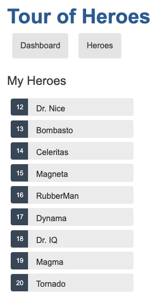
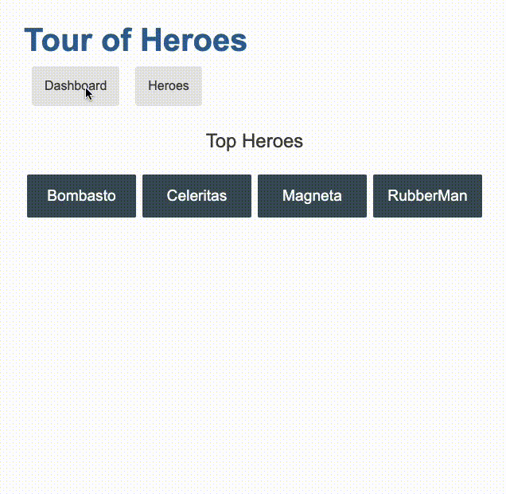
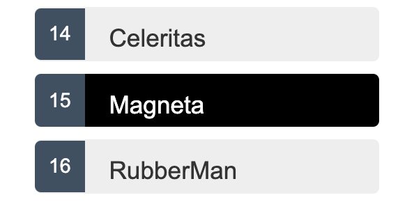
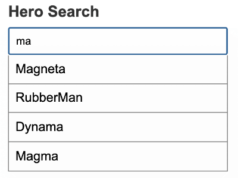

# Tutorial: Your first Angular app


## Introduction

### Build your first Angular app

This tutorial consists of lessons that introduce the Angular concepts you need to know to start coding in Angular.

You can do as many or as few as you would like and you can do them in any order.

<hr>

### Before you start

For the best experience with this tutorial, review these requirements to make sure you have what you need to be successful.

#### Your experience

The lessons in this tutorial assume that you have experience with the following:

1. Created an HTML web page by editing the HTML directly.
2. Programmed web site content in JavaScript.
3. Read Cascading Style Sheet (CSS) content and understand how selectors are used.
4. Used command-line instructions to perform tasks on your computer.

#### Your equipment

These lessons can be completed by using a local installation of the Angular tools or by using StackBlitz in a web browser. Local Angular development can be completed on Windows, MacOS or Linux based systems.

<hr>

### Conceptual preview of your first Angular app

The lessons in this tutorial create an Angular app that lists houses for rent and shows the details of individual houses. This app uses features that are common to many Angular apps.


<hr>

### Local development environment

Perform these steps in a command-line tool on the computer you want to use for this tutorial.

<hr>

### Step 1 - Identify the version of `node.js` that Angular requires

Angular requires an active LTS or maintenance LTS version of Node. Let's confirm your version of `node.js`. For information about specific version requirements, see the engines property in the [package.json file](https://unpkg.com/browse/@angular/core@15.1.5/package.json).

From a **Terminal** window:

1. Run the following command: `node --version`
2. Confirm that the version number displayed meets the requirements.

### Step 2 - Install the correct version of `node.js` for Angular

If you do not have a version of `node.js` installed, please follow the [directions for installation on nodejs.org](https://nodejs.org/en/download/)

### Step 3 - Install the latest version of Angular

With `node.js` and `npm` installed, the next step is to install the [Angular CLI](https://angular.io/cli) which provides tooling for effective Angular development.

From a **Terminal** window run the following command: `npm install -g @angular/cli`.

### Step 4 - Install integrated development environment (IDE)

You are free to use any tool you prefer to build apps with Angular. We recommend the following:

1. [Visual Studio Code](https://code.visualstudio.com/)
2. As an optional, but recommended step you can further improve your developer experience by installing the [Angular Language Service](https://marketplace.visualstudio.com/items?itemName=Angular.ng-template)

### Lesson review

In this lesson, you learned about the app that you build in this tutorial and prepared your local computer to develop Angular apps.


## Lesson 1: Hello world

This first lesson serves as the starting point from which each lesson in this tutorial adds new features to build a complete Angular app. In this lesson, we'll update the application to display the famous text, "Hello World".

**Estimated time**: ~10 minutes

**Starting code:** [live example](https://angular.io/generated/live-examples/first-app-lesson-00/stackblitz.html) / [download example](https://angular.io/generated/zips/first-app-lesson-00/first-app-lesson-00.zip)

**Completed code:** [live example](https://angular.io/generated/live-examples/first-app-lesson-01/stackblitz.html) / [download example](https://angular.io/generated/zips/first-app-lesson-01/first-app-lesson-01.zip)

<hr>

### What you'll learn

The updated app you have after this lesson confirms that you and your IDE are ready to begin creating an Angular app.

<hr>

### Step 1 - Test the default app

In this step, after you download the default starting app, you build the default Angular app. This confirms that your development environment has what you need to continue the tutorial.

In the **Terminal** pane of your IDE:

1. In your project directory, navigate to the `first-app` directory.

2. Run this command to install the dependencies needed to run the app.

   ```shell
   npm install
   ```

3. Run this command to build and serve the default app.

   ```shell
   ng serve
   ```

   The app should build without errors.

4. In a web browser on your development computer, open `http://localhost:4200`.

5. Confirm that the default web site appears in the browser.

6. You can leave `ng serve` running as you complete the next steps.

<hr>

### Step 2 - Review the files in the project

In this step, you get to know the files that make up a default Angular app.

In the **Explorer** pane of your IDE:

1. In your project directory, navigate to the `first-app` directory.

2. Open the `src` directory to see these files.

   1. In the file explorer, find the Angular app files (`/src`).

      1. `index.html` is the app's top level HTML template.
      2. `style.css` is the app's top level style sheet.
      3. `main.ts` is where the app start running.
      4. `favicon.ico` is the app's icon, just as you would find in any web site.

   2. In the file explorer, find the Angular app's component files (`/app`).

      1. `app.component.ts` is the source file that describes the `app-root` component. This is the top-level Angular component in the app. A component is the basic building block of an Angular application. The component description includes the component's code, HTML template, and styles, which can be described in this file, or in separate files.

         In this app, the styles are in a separate file while the component's code and HTML template are in this file.

      2. `app.component.css` is the style sheet for this component.

      3. New components are added to this directory.

   3. In the file explorer, find the image directory (`/assets`) that contains images used by the app.

   4. In the file explorer, find the files and directories that an Angular app needs to build and run, but they are not files that you normally interact with.

      1. `.angular` has files required to build the Angular app.
      2. `.e2e` has files used to test the app.
      3. `.node_modules` has the node.js packages that the app uses.
      4. `angular.json` describes the Angular app to the app building tools.
      5. `package.json` is used by `npm` (the node package manager) to run the finished app.
      6. `tsconfig.*` are the files that describe the app's configuration to the TypeScript compiler.

After you have reviewed the files that make up an Angular app project, continue to the next step.

<hr>

### Step 3 - Create `Hello World`

In this step, you update the Angular project files to change the displayed content.

In your IDE:

1. Open `first-app/src/index.html`.

2. In `index.html`, replace the `<title>` element with this code to update the title of the app.

   Replace in src/index.html

   ```
   content_copy<title>Homes</title>
   ```

   Then, save the changes you just made to `index.html`.

3. Next, open `first-app/src/app/app.component.ts`.

4. In `app.component.ts`, in the `@Component` definition, replace the `template` line with this code to change the text in the app component.

   Replace in src/app/app.component.ts

   ```
   content_copytemplate: `<h1>Hello world!</h1>`,
   ```

5. In `app.component.ts`, in the `AppComponent` class definition, replace the `title` line with this code to change the component title.

   Replace in src/app/app.component.ts

   ```
   content_copytitle = 'homes';
   ```

   Then, save the changes you made to `app.component.ts`.

6. If you stopped the `ng serve` command from step 1, in the **Terminal** window of your IDE, run `ng serve` again.

7. Open your browser and navigate to `localhost:4200` and confirm that the app builds without error and displays *Hello world* in the title and body of your app:

​	 


## Lesson 2: Create Home component

This tutorial lesson demonstrates how to create a new [component](https://angular.io/guide/component-overview) for your Angular app.

**Estimated time**: ~10 minutes

**Starting code:** [live example](https://angular.io/generated/live-examples/first-app-lesson-01/stackblitz.html) / [download example](https://angular.io/generated/zips/first-app-lesson-01/first-app-lesson-01.zip)

**Completed code:** [live example](https://angular.io/generated/live-examples/first-app-lesson-02/stackblitz.html) / [download example](https://angular.io/generated/zips/first-app-lesson-02/first-app-lesson-02.zip)

<hr>

### What you'll learn

Your app has a new component: `HomeComponent`.

<hr>

### Conceptual preview of Angular components

Angular apps are built around components, which are Angular's building blocks. Components contain the code, HTML layout, and CSS style information that provide the function and appearance of an element in the app. In Angular, components can contain other components. An app's functions and appearance can be divided and partitioned into components.

In Angular, components have metadata that define its properties. When you create your `HomeComponent`, you use these properties:

- `selector`: to describe how Angular refers to the component in templates.
- `standalone`: to describe whether the component requires a `NgModule`.
- `imports`: to describe the component's dependencies.
- `template`: to describe the component's HTML markup and layout.
- `styleUrls`: to list the URLs of the CSS files that the component uses in an array.

[Learn more about Components.](https://angular.io/api/core/Component)

<hr>

### Step 1 - Create the `HomeComponent`

In this step, you create a new component for your app.

In the **Terminal** pane of your IDE:

1. In your project directory, navigate to the `first-app` directory.

2. Run this command to create a new `HomeComponent`

   ```shell
   ng generate component home --standalone --inline-template --skip-tests
   ```

3. Run this command to build and serve your app.

   ```shell
   ng serve
   ```

4. Open a browser and navigate to `http://localhost:4200` to find the application.

5. Confirm that the app builds without error.

   It should render the same as it did in the previous lesson because even though you added a new component, you haven't included it in any of the app's templates, yet.

6. Leave `ng serve` running as you complete the next steps.

<hr>

### Step 2 - Add the new component to your app's layout

In this step, you add the new component, `HomeComponent` to your app's root component, `AppComponent`, so that it displays in your app's layout.

In the **Edit** pane of your IDE:

1. Open `app.component.ts` in the editor.

2. In `app.component.ts`, import `HomeComponent` by adding this line to the file level imports.

   Import HomeComponent in src/app/app.component.ts

   ```
   content_copyimport { HomeComponent } from './home/home.component';
   ```

3. In `app.component.ts`, in `@Component`, update the `imports` array property and add `HomeComponent`.

   Replace in src/app/app.component.ts

   ```
   content_copyimports: [
     HomeComponent,
   ],
   ```

4. In `app.component.ts`, in `@Component`, update the `template` property to include the following HTML code.

   Replace in src/app/app.component.ts

   ```
   content_copytemplate: `
     <main>
       <header class="brand-name">
         
       </header>
       <section class="content">
         <app-home></app-home>
       </section>
     </main>
   `,
   ```

5. Save your changes to `app.component.ts`.

6. If `ng serve` is running, the app should update. If `ng serve` is not running, start it again. *Hello world* in your app should change to *home works!* from the `HomeComponent`.

7. Check the running app in the browser and confirm that the app has been updated.

​	 

<hr>

### Step 3 - Add features to `HomeComponent`

n this step you add features to `HomeComponent`.

In the previous step, you added the default `HomeComponent` to your app's template so its default HTML appeared in the app. In this step, you add a search filter and button that is used in a later lesson. For now, that's all that `HomeComponent` has. Note that, this step just adds the search elements to the layout without any functionality, yet.

In the **Edit** pane of your IDE:

1. In the `first-app` directory, open `home.component.ts` in the editor.

2. In `home.component.ts`, in `@Component`, update the `template` property with this code.

   Replace in src/app/home/home.component.ts

   ```ts
   template: `
     <section>
       <form>
         <input type="text" placeholder="Filter by city">
         <button class="primary" type="button">Search</button>
       </form>
     </section>
   `,
   ```

3. Next, open `home.component.css` in the editor and update the content with these styles.

   Replace in src/app/home/home.component.css

   ```css
   .results {
     display: grid;
     column-gap: 14px;
     row-gap: 14px;
     grid-template-columns: repeat(auto-fill, minmax(400px, 400px));
     margin-top: 50px;
     justify-content: space-around;
   }
   
   input[type="text"] {
     border: solid 1px var(--primary-color);
     padding: 10px;
     border-radius: 8px;
     margin-right: 4px;
     display: inline-block;
     width: 30%;
   }
   
   button {
     padding: 10px;
     border: solid 1px var(--primary-color);
     background: var(--primary-color);
     color: white;
     border-radius: 8px;
   }
   
   @media (min-width: 500px) and (max-width: 768px) {
     .results {
         grid-template-columns: repeat(2, 1fr);
     }
     input[type="text"] {
         width: 70%;
     }   
   }
   
   @media (max-width: 499px) {
     .results {
         grid-template-columns: 1fr;
     }    
   }
   ```

4. Confirm that the app builds without error. You should find the filter query box and button in your app and they should be styled. Correct any errors before you continue to the next step.

​	 

<hr>

### Lesson review

In this lesson, you created a new component for your app and gave it a filter edit control and button.

If you are having any trouble with this lesson, you can review the completed code for it in the [live example](https://angular.io/generated/live-examples/first-app-lesson-02/stackblitz.html) / [download example](https://angular.io/generated/zips/first-app-lesson-02/first-app-lesson-02.zip).

<hr>


## Lesson 3: Create the application’s HousingLocation component

This tutorial lesson demonstrates how to add the `HousingLocation` component to your Angular app.

**Estimated time**: ~10 minutes

**Starting code:** [live example](https://angular.io/generated/live-examples/first-app-lesson-02/stackblitz.html) / [download example](https://angular.io/generated/zips/first-app-lesson-02/first-app-lesson-02.zip)

**Completed code:** [live example](https://angular.io/generated/live-examples/first-app-lesson-03/stackblitz.html) / [download example](https://angular.io/generated/zips/first-app-lesson-03/first-app-lesson-03.zip)

<hr>

### What you'll learn

- Your app has a new component: `HousingLocationComponent` and it displays a message confirming that the component was added to your application.

<hr>


### Step 1 - Create the `HousingLocationComponent`

In this step, you create a new component for your app.

In the **Terminal** pane of your IDE:

1. In your project directory, navigate to the `first-app` directory.

2. Run this command to create a new `HousingLocationComponent`

   ```shell
   ng generate component housingLocation --standalone --inline-template --skip-tests
   ```

3. Run this command to build and serve your app.

   ```shell
   ng serve
   ```

4. Open a browser and navigate to `http://localhost:4200` to find the application.

5. Confirm that the app builds without error.

   It should render the same as it did in the previous lesson because even though you added a new component, you haven't included it in any of the app's templates, yet.

6. Leave `ng serve` running as you complete the next steps.

<hr>

### Step 2 - Add the new component to your app's layout

In this step, you add the new component, `HousingLocationComponent` to your app's `HomeComponent`, so that it displays in your app's layout.

In the **Edit** pane of your IDE:

1. Open `home.component.ts` in the editor.

2. In `home.component.ts`, import `HousingLocationComponent` by adding this line to the file level imports.

   Import HousingLocationComponent in src/app/home/home.component.ts

   ```ts
   import { HousingLocationComponent } from '../housing-location/housing-location.component';
   ```

3. Next update the `imports` property of the `@Component` metadata by adding `HousingLocationComponent` to the array.

   Add HousingLocationComponent to imports array in src/app/home/home.component.ts

   ```ts
   imports: [
     CommonModule,
     HousingLocationComponent
   ],
   ```

4. Now the component is ready for use in the template for the `HomeComponent`. Update the `template` property of the `@Component` metadata to include a reference to the `<app-housing-location>` tag.

   Add housing location to the component template in src/app/home/home.component.ts

   ```ts
   template: `
     <section>
       <form>
         <input type="text" placeholder="Filter by city">
         <button class="primary" type="button">Search</button>
       </form>
     </section>
     <section class="results">
       <app-housing-location></app-housing-location>
     </section>
     `,
   ```

<hr>

### Step 3 - Add the styles for the component

In this step, you will copy over the pre-written styles for the `HousingLocationComponent` to your app so that the app renders properly.

1. Open `src/app/housing-location/housing-location.css`, and paste the styles below into the file:

   Add CSS styles to housing location to the component in src/app/housing-location/housing-location.component.css

   ```
   content_copy.listing {
     background: var(--accent-color);
     border-radius: 30px;
     padding-bottom: 30px;
   }
   .listing-heading {
     color: var(--primary-color);
     padding: 10px 20px 0 20px;
   }
   .listing-photo {
     height: 250px;
     width: 100%;
     object-fit: cover;
     border-radius: 30px 30px 0 0;
   }
   .listing-location {
     padding: 10px 20px 20px 20px;
   }
   .listing-location::before {
     content: url("/assets/location-pin.svg") / "";
   }
   
   section.listing a {
     padding-left: 20px;
     text-decoration: none;
     color: var(--primary-color);
   }
   section.listing a::after {
     content: "\203A";
     margin-left: 5px;
   }
   ```

2. Save your code, return to the browser and confirm that the app builds without error. You should find the message "housing-location works!" rendered to the screen.Correct any errors before you continue to the next step.

<hr>

### Lesson review

In this lesson, you created a new component for your app and added it to the app's layout.

If you are having any trouble with this lesson, you can review the completed code for it in the [live example](https://angular.io/generated/live-examples/first-app-lesson-03/stackblitz.html) / [download example](https://angular.io/generated/zips/first-app-lesson-03/first-app-lesson-03.zip).

<hr>


## First Angular app lesson 4 - Creating an interface

This tutorial lesson demonstrates how to create an interface and include it in a component of your app.

**Estimated time**: ~10 minutes

**Starting code:** [live example](https://angular.io/generated/live-examples/first-app-lesson-03/stackblitz.html) / [download example](https://angular.io/generated/zips/first-app-lesson-03/first-app-lesson-03.zip)

**Completed code:** [live example](https://angular.io/generated/live-examples/first-app-lesson-04/stackblitz.html) / [download example](https://angular.io/generated/zips/first-app-lesson-04/first-app-lesson-04.zip)

<hr>

### What you'll learn

- Your app has a new interface that it can use as a data type.
- Your app has an instance of the new interface with sample data.

<hr>

### Conceptual preview of interfaces

[Interfaces](https://www.typescriptlang.org/docs/handbook/interfaces.html) are custom data types for your app.

Angular uses TypeScript to take advantage of working in a strongly typed programming environment. Strong type checking reduces the likelihood of one element in your app sending incorrectly formatted data to another. Such type-mismatch errors are caught by the TypeScript compiler and many such errors can also be caught in your IDE.

In this lesson, you'll create an interface to define properties that represent data about a single housing location.

<hr>

### Step 1 - Create a new Angular interface

This step creates a new interface in your app.

In the **Terminal** pane of your IDE:

1. In your project directory, navigate to the `first-app` directory.

2. In the `first-app` directory, run this command to create the new interface.

   ```shell
   ng generate interface housinglocation
   ```

3. Run `ng serve` to build the app and serve it to `http://localhost:4200`.

4. In a browser, open `http://localhost:4200` to see your app.

5. Confirm that the app builds without error. Correct any errors before you continue to the next step.

<hr>

### Step 2 - Add properties to the new interface

This step adds the properties to the interface that your app needs to represent a housing location.

1. In the **Terminal** pane of your IDE, start the `ng serve` command, if it isn't already running, to build the app and serve it to `http://localhost:4200`.

2. In the **Edit** pane of your IDE, open the `src/app/housinglocation.ts` file.

3. In `housinglocation.ts`, replace the default content with the following code to make your new interface to match this example.

   Update src/app/housinglocation.ts to match this code

   ```ts
   export interface HousingLocation {
     id: number;
     name: string;
     city: string;
     state: string;
     photo: string;
     availableUnits: number;
     wifi: boolean;
     laundry: boolean;
   }
   ```

4. Save your changes and confirm the app does not display any errors. Correct any errors before you continue to the next step.

At this point, you've defined an interface that represents data about a housing location including an id, name, and location information.

<hr>

### Step 3 - Create a test house for your app

You have an interface, but you aren't using it yet.

In this step, you create an instance of the interface and assign some sample data to it. You won't see this sample data appear in your app yet. There are a few more lessons to complete before that happens.

1. In the **Terminal** pane of your IDE, run the `ng serve` command, if it isn't already running, to build the app and serve your app to `http://localhost:4200`.

2. In the **Edit** pane of your IDE, open `src/app/home/home.component.ts`.

3. In `src/app/home/home.component.ts`, add this import statement after the existing `import` statements so that `HomeComponent` can use the new interface.

   Import HomeComponent in src/app/home/home.component.ts

   ```ts
   import { HousingLocation } from '../housinglocation';
   ```

4. In `src/app/home/home.component.ts`, replace the empty `export class HomeComponent {}` definition with this code to create a single instance of the new interface in the component.

   Add sample data to src/app/home/home.component.ts

   ```ts
   export class HomeComponent {
     readonly baseUrl = 'https://angular.io/assets/images/tutorials/faa';
   
     housingLocation: HousingLocation = {
       id: 9999,
       name: 'Test Home',
       city: 'Test city',
       state: 'ST',
       photo: `${this.baseUrl}/example-house.jpg`,
       availableUnits: 99,
       wifi: true,
       laundry: false,
     };
   }
   ```

5. Confirm that your `home.component.ts` file matches like this example.

   src/app/home/home.component.ts

   ```ts
   import { Component } from '@angular/core';
   import { CommonModule } from '@angular/common';
   import { HousingLocationComponent } from '../housing-location/housing-location.component';
   import { HousingLocation } from '../housinglocation';
   
   @Component({
     selector: 'app-home',
     standalone: true,
     imports: [
       CommonModule,
       HousingLocationComponent
     ],
     template: `
       <section>
         <form>
           <input type="text" placeholder="Filter by city">
           <button class="primary" type="button">Search</button>
         </form>
       </section>
       <section class="results">
         <app-housing-location></app-housing-location>
       </section>
     `,
     styleUrls: ['./home.component.css'],
   })
   export class HomeComponent {
     readonly baseUrl = 'https://angular.io/assets/images/tutorials/faa';
   
     housingLocation: HousingLocation = {
       id: 9999,
       name: 'Test Home',
       city: 'Test city',
       state: 'ST',
       photo: `${this.baseUrl}/example-house.jpg`,
       availableUnits: 99,
       wifi: true,
       laundry: false,
     };
   }
   ```

   By adding the `housingLocation` property of type `HousingLocation` to the `HomeComponent` class, we're able to confirm that the data matches the description of the interface. If the data didn't satisfy the description of the interface, the IDE has enough information to give us helpful errors.

6. Save your changes and confirm the app does not have any errors. Open the browser and confirm that your application still displays the message "housing-location works!"

7. Correct any errors before you continue to the next step.

<hr>

### Lesson review

In this lesson, you created an interface that created a new data type for your app. This new data type makes it possible for you to specify where `HousingLocation` data is required. This new data type also makes your IDE and the TypeScript compiler ensure that `HousingLocation` data is used where it's required.

If you are having any trouble with this lesson, you can review the completed code for it in the [live example](https://angular.io/generated/live-examples/first-app-lesson-04/stackblitz.html) / [download example](https://angular.io/generated/zips/first-app-lesson-04/first-app-lesson-04.zip).

<hr>


## Lesson 5: Add an input parameter to the component

This tutorial lesson demonstrates how to create a component `@Input()` and use it to pass data to a component for customization.

**Estimated time**: ~10 minutes

**Starting code:** [live example](https://angular.io/generated/live-examples/first-app-lesson-04/stackblitz.html) / [download example](https://angular.io/generated/zips/first-app-lesson-04/first-app-lesson-04.zip)

**Completed code:** [live example](https://angular.io/generated/live-examples/first-app-lesson-05/stackblitz.html) / [download example](https://angular.io/generated/zips/first-app-lesson-05/first-app-lesson-05.zip)

<hr>

### What you'll learn

Your app's `HousingLocationComponent` template has a `HousingLocation` property to receive input.

<hr>

### Conceptual preview of Inputs

[Inputs](https://angular.io/api/core/Input) allow components to share data. The direction of the data sharing is from parent component to child component.

In this lesson, you'll define `@Input()` properties in the `HousingLocationComponent` component which will enable you to customize the data displayed in the component.

Learn more in the [Sharing data between child and parent directives and components](https://angular.io/guide/inputs-outputs) guide.

<hr>

### Step 1 - Import the Input decorator

This step imports the `Input` decorator into the class.

In the code editor:

1. Navigate to `src/app/housing-location/housing-location.component.ts`

2. Update the file imports to include `Input` and `HousingLocation`:

   Import HousingLocationComponent and Input in src/app/housing-location/housing-location.component.ts

   ```ts
   import { Component, Input } from '@angular/core';
   import { CommonModule } from '@angular/common';
   import { HousingLocation } from '../housinglocation';
   ```

<hr>

### Step 2 - Add the Input property

1. In the same file, add a property called `housingLocation` of type `HousingLocation` to the `HousingLocationComponent` class. Add an `!` after the property name and prefix it with the `@Input()` decorator:

   Import HousingLocationComponent and Input in src/app/housing-location/housing-location.component.ts

   ```ts
   export class HousingLocationComponent {
     @Input() housingLocation!: HousingLocation;
   }
   ```

   You have to add the `!` because the input is expecting the value to be passed. In this case, there is no default value. In our example application case we know that the value will be passed in - this is by design. The exclamation point is called the **non-null assertion operator** and it tells the TypeScript compiler that the value of this property won't be null or undefined.

2. Save your changes and confirm the app does not have any errors.

3. Correct any errors before you continue to the next step.

<hr>

### Lesson review

In this lesson, you created a new property decorated with the `@Input()` decorator. You also used the non-null assertion operator to notify the compiler that the value of the new property won't be `null` or `undefined`.

If you are having any trouble with this lesson, you can review the completed code for it in the [live example](https://angular.io/generated/live-examples/first-app-lesson-05/stackblitz.html) / [download example](https://angular.io/generated/zips/first-app-lesson-05/first-app-lesson-05.zip).

<hr>


## Lesson 6 - Add a property binding to a component’s template

This tutorial lesson demonstrates how to add property binding to a template and use it to pass dynamic data to components.

**Estimated time**: ~10 minutes

**Starting code:** [live example](https://angular.io/generated/live-examples/first-app-lesson-05/stackblitz.html) / [download example](https://angular.io/generated/zips/first-app-lesson-05/first-app-lesson-05.zip)

**Completed code:** [live example](https://angular.io/generated/live-examples/first-app-lesson-06/stackblitz.html) / [download example](https://angular.io/generated/zips/first-app-lesson-06/first-app-lesson-06.zip)

<hr>

### What you'll learn

- Your app has data bindings in the `HomeComponent` template.
- Your app sends data from the `HomeComponent` to the `HousingLocationComponent`.

<hr>

### Conceptual preview of Inputs

In this lesson, you'll continue the process of sharing data from the parent component to the child component by binding data to those properties in the template using property binding.

Property binding enables you to connect a variable to an `Input` in an Angular template. The data is then dynamically bound to the `Input`.

For a more in depth explanation, please refer to the [Property binding](https://angular.io/guide/property-binding) guide.

<hr>

### Step 1 - Update tag in the `HomeComponent` template

This step adds property binding to the `<app-housing-location>` tag.

In the code editor:

1. Navigate to `src/app/home/home.component.ts`

2. In the template property of the `@Component` decorator, update the code to match the code below:

   Add housingLocation property binding

   ```html
   <app-housing-location [housingLocation]="housingLocation"></app-housing-location>
   ```

   

   When adding a property binding to a component tag, we use the `[attribute] = "value"` syntax to notify Angular that the assigned value should be treated as a property from the component class and not a string value.

   The value on the right handside is the name of the property from the `HomeComponent`.

<hr>

### Step 2 - Confirm the code still works

1. Save your changes and confirm the app does not have any errors.
2. Correct any errors before you continue to the next step.

<hr>

### Lesson review

In this lesson, you added a new property binding and passed in a reference to a class property. Now, the `HousingLocationComponent` has access to data that it can use to customize the component's display.

If you are having any trouble with this lesson, you can review the completed code for it in the [live example](https://angular.io/generated/live-examples/first-app-lesson-06/stackblitz.html) / [download example](https://angular.io/generated/zips/first-app-lesson-06/first-app-lesson-06.zip).

<hr>


## Lesson 7 - Add an interpolation to a component’s template

This tutorial lesson demonstrates how to add interpolation to Angular templates in order to display dynamic data in a template.

**Estimated time**: ~10 minutes

**Starting code:** [live example](https://angular.io/generated/live-examples/first-app-lesson-06/stackblitz.html) / [download example](https://angular.io/generated/zips/first-app-lesson-06/first-app-lesson-06.zip)

**Completed code:** [live example](https://angular.io/generated/live-examples/first-app-lesson-07/stackblitz.html) / [download example](https://angular.io/generated/zips/first-app-lesson-07/first-app-lesson-07.zip)

<hr>

### What you'll learn

- Your app will display interpolated values in the `HousingLocationComponent` template.
- Your app will render a housing location data to the browser.

<hr>

### Conceptual preview of interpolation

In this step you will display values (properties and `Input` values) in a template using interpolation.

Using the `{{ expression }}` in Angular templates, you can render values from properties, `Inputs` and valid JavaScript expressions.

For a more in depth explanation, please refer to the [Displaying values with interpolation](https://angular.io/guide/interpolation) guide.

<hr>

### Step 1 - Update `HousingLocationComponent` template to include interpolated values

This step adds new HTML structure and interpolated values in the `HousingLocationComponent` template.

In the code editor:

1. Navigate to `src/app/housing-location/housing-location.component.ts`

2. In the template property of the `@Component` decorator, replace the existing HTML markup with the following code:

   Update HousingLocationComponent template

   ```ts
   template: `
     <section class="listing">
       
       <h2 class="listing-heading">{{ housingLocation.name }}</h2>
       <p class="listing-location">{{ housingLocation.city}}, {{housingLocation.state }}</p>
     </section>
     `,
   ```

   In this updated template code you have used property binding to bind the `housingLocation.photo` to the `src` attribute. The `alt` attribute uses interpolation to give more context to the alt text of the image.

   You use interpolation to include the values for `name`, `city` and `state` of the `housingLocation` property.

   <hr>
### Step 2 - Confirm the changes render in the browser

      1. Save all changes.
      2. Open the browser and confirm that the app renders the photo, city and state sample data

<hr>

### Lesson review

In this lesson, you added a new HTML structure and used Angular template syntax to render values in the `HousingLocation` template. Now, you have two important skills:

- passing data to components
- Interpolating values into a template

With these skills, your app can now share data and display dynamic values in the browser. Great work so far.

If you are having any trouble with this lesson, you can review the completed code for it in the [live example](https://angular.io/generated/live-examples/first-app-lesson-07/stackblitz.html) / [download example](https://angular.io/generated/zips/first-app-lesson-07/first-app-lesson-07.zip).

<hr>


## Lesson 8: Use *ngFor to list objects in component

This tutorial lesson demonstrates how to use `ngFor` directive in Angular templates in order to display dynamically repeated data in a template.

**Estimated time**: ~10 minutes

**Starting code:** [live example](https://angular.io/generated/live-examples/first-app-lesson-07/stackblitz.html) / [download example](https://angular.io/generated/zips/first-app-lesson-07/first-app-lesson-07.zip)

**Completed code:** [live example](https://angular.io/generated/live-examples/first-app-lesson-08/stackblitz.html) / [download example](https://angular.io/generated/zips/first-app-lesson-08/first-app-lesson-08.zip)

<hr>

### What you'll learn

- You will have added a data set to the app
- Your app will display a list of elements from the new data set using `ngFor`

<hr>

### Conceptual preview of ngFor

In Angular, `ngFor` is a specific type of [directive](https://angular.io/guide/built-in-directives) used to dynamically repeat data in a template. In plain JavaScript you would use a for loop - ngFor provides similar functionality for Angular templates.

You can utilize `ngFor` to iterate over arrays and even asynchronous values. In this lesson, you'll add a new array of data to iterate over.

For a more in depth explanation, please refer to the [Built-in directives](https://angular.io/guide/built-in-directives#ngFor) guide.

<hr>

### Step 1 - Add housing data to the `HomeComponent`

In the `HomeComponent` there is only a single housing location. In this step, you will add an array of `HousingLocation` entries.

1. In `src/app/home/home.component.ts`, remove the `housingLocation` property from the `HomeComponent` class.

2. Update the `HomeComponent` class to have a property called `housingLocationList`. Update your code to match the following code:

   Add housingLocationList property

   ```ts
   export class HomeComponent {
     readonly baseUrl = 'https://angular.io/assets/images/tutorials/faa';
   
     housingLocationList: HousingLocation[] = [
       {
         id: 0,
         name: 'Acme Fresh Start Housing',
         city: 'Chicago',
         state: 'IL',
         photo: `${this.baseUrl}/bernard-hermant-CLKGGwIBTaY-unsplash.jpg`,
         availableUnits: 4,
         wifi: true,
         laundry: true
       },
       {
         id: 1,
         name: 'A113 Transitional Housing',
         city: 'Santa Monica',
         state: 'CA',
         photo: `${this.baseUrl}/brandon-griggs-wR11KBaB86U-unsplash.jpg`,
         availableUnits: 0,
         wifi: false,
         laundry: true
       },
       {
         id: 2,
         name: 'Warm Beds Housing Support',
         city: 'Juneau',
         state: 'AK',
         photo: `${this.baseUrl}/i-do-nothing-but-love-lAyXdl1-Wmc-unsplash.jpg`,
         availableUnits: 1,
         wifi: false,
         laundry: false
       },
       {
         id: 3,
         name: 'Homesteady Housing',
         city: 'Chicago',
         state: 'IL',
         photo: `${this.baseUrl}/ian-macdonald-W8z6aiwfi1E-unsplash.jpg`,
         availableUnits: 1,
         wifi: true,
         laundry: false
       },
       {
         id: 4,
         name: 'Happy Homes Group',
         city: 'Gary',
         state: 'IN',
         photo: `${this.baseUrl}/krzysztof-hepner-978RAXoXnH4-unsplash.jpg`,
         availableUnits: 1,
         wifi: true,
         laundry: false
       },
       {
         id: 5,
         name: 'Hopeful Apartment Group',
         city: 'Oakland',
         state: 'CA',
         photo: `${this.baseUrl}/r-architecture-JvQ0Q5IkeMM-unsplash.jpg`,
         availableUnits: 2,
         wifi: true,
         laundry: true
       },
       {
         id: 6,
         name: 'Seriously Safe Towns',
         city: 'Oakland',
         state: 'CA',
         photo: `${this.baseUrl}/phil-hearing-IYfp2Ixe9nM-unsplash.jpg`,
         availableUnits: 5,
         wifi: true,
         laundry: true
       },
       {
         id: 7,
         name: 'Hopeful Housing Solutions',
         city: 'Oakland',
         state: 'CA',
         photo: `${this.baseUrl}/r-architecture-GGupkreKwxA-unsplash.jpg`,
         availableUnits: 2,
         wifi: true,
         laundry: true
       },
       {
         id: 8,
         name: 'Seriously Safe Towns',
         city: 'Oakland',
         state: 'CA',
         photo: `${this.baseUrl}/saru-robert-9rP3mxf8qWI-unsplash.jpg`,
         availableUnits: 10,
         wifi: false,
         laundry: false
       },
       {
         id: 9,
         name: 'Capital Safe Towns',
         city: 'Portland',
         state: 'OR',
         photo: `${this.baseUrl}/webaliser-_TPTXZd9mOo-unsplash.jpg`,
         availableUnits: 6,
         wifi: true,
         laundry: true
       }
     ];
   }
   ```

   

   Do not remove the `@Component` decorator, you will update that code in an upcoming step.

   <hr>

### Step 2 - Update the `HomeComponent` template to use `ngFor`

   Now the app has a dataset that you can use to display the entries in the browser using the `ngFor` directive.

   1. Update the `<app-housing-location>` tag in the template code to this:

      Add ngFor to HomeComponent template

      ```html
      <app-housing-location
        *ngFor="let housingLocation of housingLocationList"
        [housingLocation]="housingLocation">
      </app-housing-location>
      ```

      

      Note, in the code `[housingLocation] = "housingLocation"` the `housingLocation` value now refers to the variable used in the `ngFor` directive. Before this change, it refered to the property on the `HomeComponent` class.

   2. Save all changes.

   3. Refresh the browser and confirm that the app now renders a grid of housing locations.

​	 


<hr>

## Lesson review

In this lesson, you used the `ngFor` directive to repeat data dynamically in Angular templates. You also added a new array of data to be used in the Angular app. The application now dynamically renders a list of housing locations in the browser.

The app is taking shape, great job.

If you are having any trouble with this lesson, you can review the completed code for it in the [live example](https://angular.io/generated/live-examples/first-app-lesson-08/stackblitz.html) / [download example](https://angular.io/generated/zips/first-app-lesson-08/first-app-lesson-08.zip).

<hr>


## Lesson 09: Angular services

This tutorial lesson demonstrates how to create an Angular service and use dependency injection to include it in your app.

**Estimated time**: ~15 minutes

**Starting code:** [live example](https://angular.io/generated/live-examples/first-app-lesson-08/stackblitz.html) / [download example](https://angular.io/generated/zips/first-app-lesson-08/first-app-lesson-08.zip)

**Completed code:** [live example](https://angular.io/generated/live-examples/first-app-lesson-09/stackblitz.html) / [download example](https://angular.io/generated/zips/first-app-lesson-09/first-app-lesson-09.zip)

<hr>

### What you'll learn

Your app has a service to serve the data to your app. At the end of this lesson, the service reads data from local, static data. In a later lesson, you'll update the service to get data from a web service.

<hr>

### Conceptual preview of services

This tutorial introduces Angular services and dependency injection.

**Angular services**

*Angular services* provide a way for you to separate Angular app data and functions that can be used by multiple components in your app. To be used by multiple components, a service must be made *injectable*. Services that are injectable and used by a component become dependencies of that component. The component depends on those services and can't function without them.

**Dependency injection**

*Dependency injection* is the mechanism that manages the dependencies of an app's components and the services that other components can use.

<hr>

### Step 1 - Create a new service for your app

This step creates an injectable service for your app.

In the **Terminal** pane of your IDE:

1. In your project directory, navigate to the `first-app` directory.

2. In the `first-app` directory, run this command to create the new service.

   ```shell
   ng generate service housing --skip-tests
   ```

3. Run `ng serve` to build the app and serve it to `http://localhost:4200`.

4. Confirm that the app builds without error. Correct any errors before you continue to the next step.

<hr>

### Step 2 - Add static data to the new service

This step adds some sample data to your new service. In a later lesson, you'll replace the static data with a web interface to get data as you might in a real app. For now, your app's new service uses the data that has, so far, been created locally in `HomeComponent`.

In the **Edit** pane of your IDE:

1. In `src/app/home/home.component.ts`, from `HomeComponent`, copy the `housingLocationList` variable and its array value.

2. In `src/app/housing.service.ts`:

   1. Inside the `HousingService` class, paste the variable that you copied from `HomeComponent` in the previous step.

   2. Inside the `HousingService` class, paste these functions after the data you just copied. These functions allow dependencies to access the service's data.

      Service functions in src/app/housing.service.ts

      ```ts
      getAllHousingLocations(): HousingLocation[] {
        return this.housingLocationList;
      }
      
      getHousingLocationById(id: number): HousingLocation | undefined {
        return this.housingLocationList.find(housingLocation => housingLocation.id === id);
      }
      ```

      You will need these functions in a future lesson. For now, it is enough to understand that these functions return either a specific `HousingLocation` by id or the entire list.

   3. Add a file level import for the `HousingLocation`.

      Import HousingLocation type in src/app/housing.service.ts

      ```ts
      import { HousingLocation } from './housinglocation';
      ```

3. Confirm that the app builds without error. Correct any errors before you continue to the next step.

<hr>

### Step 3 - Inject the new service into `HomeComponent`

This step injects the new service into your app's `HomeComponent` so that it can read the app's data from a service. In a later lesson, you'll replace the static data with a live data source to get data as you might in a real app.

In the **Edit** pane of your IDE, in `src/app/home/home.component.ts`:

1. At the top of `src/app/home/home.component.ts`, add the `inject` to the items imported from `@angular/core`. This will import the `inject` function into the `HomeComponent` class.

   Update to src/app/home/home.component.ts

   ```ts
   import { Component, inject } from '@angular/core';
   ```

2. Add a new file level import for the `HousingService`:

   Add import to src/app/home/home.component.ts

   ```ts
   import { HousingService } from '../housing.service';
   ```

3. From `HomeComponent`, delete the `housingLocationList` array entries and assign `housingLocationList` the value of empty array (`[]`). In a few steps you will update the code to pull the data from the `HousingService`.

4. In `HomeComponent`, add the following code to inject the new service and initialize the data for the app. The `constructor` is the first function that runs when this component is created. The code in the `constructor` will assign the `housingLocationList` the value returned from the call to `getAllHousingLocations`.

   Initialize data from service in src/app/home/home.component.ts

   ```ts
   housingLocationList: HousingLocation[] = [];
   housingService: HousingService = inject(HousingService);
   
   constructor() {
     this.housingLocationList = this.housingService.getAllHousingLocations();
   }
   ```

5. Save the changes to `src/app/home/home.component.ts` and confirm your app builds without error. Correct any errors before you continue to the next step.

<hr>

### Lesson review

In this lesson, you added an Angular service to your app and injected it into the `HomeComponent` class. This compartmentalizes how your app gets its data. For now, the new service gets its data from a static array of data. In a later lesson, you'll refactor the service to get its data from an API endpoint.

If you are having any trouble with this lesson, you can review the completed code for it in the [live example](https://angular.io/generated/live-examples/first-app-lesson-09/stackblitz.html) / [download example](https://angular.io/generated/zips/first-app-lesson-09/first-app-lesson-09.zip).

<hr>


## Lesson 10: Add routes to the application

This tutorial lesson demonstrates how to add routes to your app.

**Estimated time**: ~15 minutes

**Starting code:** [live example](https://angular.io/generated/live-examples/first-app-lesson-09/stackblitz.html) / [download example](https://angular.io/generated/zips/first-app-lesson-09/first-app-lesson-09.zip)

**Completed code:** [live example](https://angular.io/generated/live-examples/first-app-lesson-10/stackblitz.html) / [download example](https://angular.io/generated/zips/first-app-lesson-10/first-app-lesson-10.zip)

<hr>

### What you'll learn

At the end of this lesson your application will have support for routing.

<hr>

### Conceptual preview of routing

This tutorial introduces routing in Angular. Routing is the ability to navigate from one component in the application to another. In [Single Page Applications (SPA)](https://angular.io/guide/router-tutorial#using-angular-routes-in-a-single-page-application), only parts of the page are updated to represent the requested view for the user.

The [Angular Router](https://angular.io/guide/router-tutorial) enables users to declare routes and specify which component should be displayed on the screen if that route is requested by the application.

In this lesson, you will enable routing in your application to navigate to the details page.

<hr>

### Step 1 - Create a default details component

1. From the terminal, enter the following command to create the `DetailsComponent`:

   ```shell
   ng generate component details --standalone --inline-template --skip-tests
   ```

   This component will represent the details page that provides more information on a given housing location.

<hr>

### Step 2 - Add routing to the application

1. In the `src/app` directory, create a file called `routes.ts`. This file is where we will define the routes in the application.

2. In `main.ts`, make the following updates to enable routing in the application:

   1. Import the routes file and the `provideRouter` function:

      Import routing details in src/main.ts

      ```ts
      import { provideRouter } from '@angular/router';
      import routeConfig from './app/routes';
      ```

   2. Update the call to `bootstrapApplication` to include the routing configuration:

      Add router configuration in src/main.ts

      ```ts
      bootstrapApplication(AppComponent,
        {
          providers: [
            provideProtractorTestingSupport(),
            provideRouter(routeConfig)
          ]
        }
      ).catch(err => console.error(err));
      ```

3. In `src/app/app.component.ts`, update the component to use routing:

   1. Add a file level import for `RoutingModule`:

      Import RouterModule in src/app/app.component.ts

      ```ts
      import { RouterModule } from '@angular/router';
      ```

   2. Add `RouterModule` to the `@Component` metadata imports

      Import RouterModule in src/app/app.component.ts

      ```ts
      imports: [
        HomeComponent,
        RouterModule,
      ],
      ```

   3. In the `template` property, replace the `<app-home></app-home>` tag with the `<router-outlet>` directive and add a link back to the home page. Your code should match this code:

      Add router-outlet in src/app/app.component.ts

      ```ts
      template: `
        <main>
          <a [routerLink]="['/']">
            <header class="brand-name">
              
            </header>
          </a>
          <section class="content">
            <router-outlet></router-outlet>
          </section>
        </main>
      `,
      ```

<hr>

### Step 3 - Add route to new component

In the previous step you removed the reference to the `<app-home>` component in the template. In this step, you will add a new route to that component.

1. In `routes.ts`, perform the following updates to create a route.

   1. Add a file level imports for the `HomeComponent`, `DetailsComponent` and the `Routes` type that you'll use in the route definitions.

      Import components and Routes

      ```ts
      import { Routes } from '@angular/router';
      import { HomeComponent } from './home/home.component';
      import { DetailsComponent } from './details/details.component';
      ```

   2. Define a variable called `routeConfig` of type `Routes` and define two routes for the app:

      Add routes to the app

      ```ts
      const routeConfig: Routes = [
        {
          path: '',
          component: HomeComponent,
          title: 'Home page'
        },
        {
          path: 'details/:id',
          component: DetailsComponent,
          title: 'Home details'
        }
      ];
      
      export default routeConfig;
      ```

      The entries in the `routeConfig` array represent the routes in the application. The first entry navigates to the `HomeComponent` whenever the url matches `''`. The second entry uses some special formatting that will be revisited in a future lesson.

2. Save all changes and confirm that the application works in the browser. The application should still display the list of housing locations.

<hr>

### Lesson review

In this lesson, you enabled routing in your app as well as defined new routes. Now your app can support navigation between views. In the next lesson, you will learn to navigate to the "details" page for a given housing location.

You are making great progress with your app, well done.

If you are having any trouble with this lesson, you can review the completed code for it in the [live example](https://angular.io/generated/live-examples/first-app-lesson-10/stackblitz.html) / [download example](https://angular.io/generated/zips/first-app-lesson-10/first-app-lesson-10.zip).

<hr>


## Lesson 11 - Integrate details page into application

This tutorial lesson demonstrates how to connect the details page to your app.

**Estimated time**: ~15 minutes

**Starting code:** [live example](https://angular.io/generated/live-examples/first-app-lesson-10/stackblitz.html) / [download example](https://angular.io/generated/zips/first-app-lesson-10/first-app-lesson-10.zip)

**Completed code:** [live example](https://angular.io/generated/live-examples/first-app-lesson-11/stackblitz.html) / [download example](https://angular.io/generated/zips/first-app-lesson-11/first-app-lesson-11.zip)

<hr>

### What you'll learn

At the end of this lesson your application will have support for routing to the details page.

<hr>

### Conceptual preview of routing with route parameters

Each housing location has specific details that should be displayed when a user navigates to the details page for that item. To accomplish this goal, you will need to use route parameters.

Route parameters enable you to include dynamic information as a part of your route URL. To identify which housing location a user has clicked on you will use the `id` property of the `HousingLocation` type.

<hr>

### Step 1 - Create a new service for your app

In lesson 10, you added a second route to `src/app/routes.ts` which includes a special segment that identifies the route parameter, `id`:

```javascript
'details/:id'
```

In this case, `:id` is dynamic and will change based on how the route is requested by the code.

1. In `src/app/housing-location/housing-location.component.ts`, add an anchor tag to the `section` element and include the `routerLink` directive:

   Add anchor with a routerLink directive to housing-location.component.ts

   ```ts
   template: `
     <section class="listing">
       
       <h2 class="listing-heading">{{ housingLocation.name }}</h2>
       <p class="listing-location">{{ housingLocation.city}}, {{housingLocation.state }}</p>
       <a [routerLink]="['/details', housingLocation.id]">Learn More</a>
     </section>
   `,
   ```

   The `routerLink` directive enables Angular's router to create dynamic links in the application. The value assigned to the `routerLink` is an array with two entries: the static portion of the path and the dynamic data.

   For the `routerLink` to work in the template, add a file level import of `RouterLink` and `RouterOutlet` from '@angular/router', then update the component `imports` array to include both `RouterLink` and `RouterOutlet`.

2. At this point you can confirm that the routing is working in your app. In the browser, refresh the home page and click the "Learn More" button for a housing location.

<hr>

### Step 2 - Get route parameters

In this step, you will get the route parameter in the `DetailsComponent`. Currently, the app displays `details works!`. Next you'll update the code to display the `id` value passed using the route parameters.

1. In `src/app/details/details.component.ts` update the template to import the functions, classes and services that you'll need to use in the `DetailsComponent`:

   Update file level imports

   ```ts
   import { Component, inject } from '@angular/core';
   import { CommonModule } from '@angular/common';
   import { ActivatedRoute } from '@angular/router';
   import { HousingService } from '../housing.service';
   import { HousingLocation } from '../housinglocation';
   ```

2. Update the `template` property of the `@Component` decorator to display the value `housingLocationId`:

   ```ts
   template: `<p>details works! {{ housingLocationId }}</p>`,
   ```

3. Update the body of the `DetailsComponent` with the following code:

   ```ts
   export class DetailsComponent {
       route: ActivatedRoute = inject(ActivatedRoute);
       housingLocationId = -1;
       constructor() {
           this.housingLocationId = Number(this.route.snapshot.params['id']);
       }
   }
   ```

   This code gives the `DetailsComponent` access to the `ActivatedRoute` router feature that enables you to have access to the data about the current route. In the `constructor`, the code converts the `id` parameter acquired from the route from a string to a number.

4. Save all changes.

5. In the browser, click on one of the housing location's "Learn More" links and confirm that the numeric value displayed on the page matches the `id` property for that location in the data.

<hr>

### Step 3 - Customize the `DetailComponent`

Now that routing is working properly in the application this is a great time to update the template of the `DetailsComponent` to display the specific data represented by the housing location for the route parameter.

To access the data you will add a call to the `HousingService`.

1. Update the template code to match the following code:

   Update the DetailsComponent template in src/app/details/details.component.ts

   ```ts
   template: `
     <article>
       
       <section class="listing-description">
         <h2 class="listing-heading">{{housingLocation?.name}}</h2>
         <p class="listing-location">{{housingLocation?.city}}, {{housingLocation?.state}}</p>
       </section>
       <section class="listing-features">
         <h2 class="section-heading">About this housing location</h2>
         <ul>
           <li>Units available: {{housingLocation?.availableUnits}}</li>
           <li>Does this location have wifi: {{housingLocation?.wifi}}</li>
           <li>Does this location have laundry: {{housingLocation?.laundry}}</li>
         </ul>
       </section>
     </article>
   `,
   ```

   Notice that the `housingLocation` properties are being accessed with the **optional chaining operator** `?`. This ensures that if the `housingLocation` value is null or undefined the application doesn't crash.

2. Update the body of the `DetailsComponent` class to match the following code:

   Update the DetailsComponent class in src/app/details/details.component.ts

   ```ts
   export class DetailsComponent {
   
     route: ActivatedRoute = inject(ActivatedRoute);
     housingService = inject(HousingService);
     housingLocation: HousingLocation | undefined;
   
     constructor() {
       const housingLocationId = Number(this.route.snapshot.params['id']);
       this.housingLocation = this.housingService.getHousingLocationById(housingLocationId);
     }
   
   }
   ```

   Now the component has the code to display the correct information based on the selected housing location. The `constructor` now includes a call to the `HousingService` to pass the route parameter as an argument to the `getHousingLocationById` service function.

3. Copy the following styles into the `src/app/details/details.component.css` file:

   Add styles for the DetailsComponent

   ```css
   .listing-photo {
     height: 600px;
     width: 50%;
     object-fit: cover;
     border-radius: 30px;
     float: right;
   }
   
   .listing-heading {
     font-size: 48pt;
     font-weight: bold;
     margin-bottom: 15px;
   }
   
   .listing-location::before {
     content: url('/assets/location-pin.svg') / '';
   }
   
   .listing-location {
     font-size: 24pt;
     margin-bottom: 15px;
   }
   
   .listing-features > .section-heading {
     color: var(--secondary-color);
     font-size: 24pt;
     margin-bottom: 15px;
   }
   
   .listing-features {
     margin-bottom: 20px;
   }
   
   .listing-features li {
     font-size: 14pt;
   }
   
   li {
     list-style-type: none;
   }
   
   .listing-apply .section-heading {
     font-size: 18pt;
     margin-bottom: 15px;
   }
   
   label, input {
     display: block;
   }
   label {
     color: var(--secondary-color);
     font-weight: bold;
     text-transform: uppercase;
     font-size: 12pt;
   }
   input {
     font-size: 16pt;
     margin-bottom: 15px;
     padding: 10px;
     width: 400px;
     border-top: none;
     border-right: none;
     border-left: none;
     border-bottom: solid .3px;
   }
   @media (max-width: 1024px) {
     .listing-photo {
       width: 100%;
       height: 400px;
     }
   }
   ```

4. Save your changes.

5. In the browser refresh the page and confirm that when you click on the "Learn More" link for a given housing location the details page displays the correct information based on the data for that selected item.

​	 

<hr>

### Step 4 - Add navigation to the `HomeComponent`

In a previous lesson you updated the `AppComponent` template to include a `routerLink`. Adding that code updated your app to enable navigation back to the `HomeComponent` whenever the logo is clicked.

1. Confirm that your code matches the following:

   Add routerLink to AppComponent

   ```ts
   template: `
     <main>
       <a [routerLink]="['/']">
         <header class="brand-name">
           
         </header>
       </a>
       <section class="content">
         <router-outlet></router-outlet>
       </section>
     </main>
   `,
   ```

   Your code may already be up-to-date but confirm to be sure.

<hr>

### Lesson Review

In this lesson you updated your app to:

- use route parameters to pass data to a route
- use the `routerLink` directive to use dynamic data to create a route
- use route parameter to retrieve data from the `HousingService` to display specific housing location information.

Really great work so far.

If you are having any trouble with this lesson, you can review the completed code for it in the [live example](https://angular.io/generated/live-examples/first-app-lesson-11/stackblitz.html) / [download example](https://angular.io/generated/zips/first-app-lesson-11/first-app-lesson-11.zip).

<hr>


## Lesson 12: Adding a form to your Angular app

This tutorial lesson demonstrates how to add a form that collects user data to an Angular app. This lesson starts with a functional Angular app and shows how to add a form to it.

The data that the form collects is sent only to the app's service, which writes it to the browser's console. Using a REST API to send and receive the form's data is not covered in this lesson.

**Estimated time**: ~15 minutes

**Starting code:** [live example](https://angular.io/generated/live-examples/first-app-lesson-11/stackblitz.html) / [download example](https://angular.io/generated/zips/first-app-lesson-11/first-app-lesson-11.zip)

**Completed code:** [live example](https://angular.io/generated/live-examples/first-app-lesson-12/stackblitz.html) / [download example](https://angular.io/generated/zips/first-app-lesson-12/first-app-lesson-12.zip)

<hr>

### What you'll learn

- Your app has a form into which users can enter data that is sent to your app's service.
- The service writes the data from the form to the browser's console log.

<hr>

### Step 1 - Add a method to send form data

This step adds a method to your app's service that receives the form data to send to the data's destination. In this example, the method writes the data from the form to the browser's console log.

In the **Edit** pane of your IDE:

1. In `src/app/housing.service.ts`, inside the `HousingService` class, paste this method at the bottom of the class definition.

   Submit method in src/app/housing.service.ts

   ```ts
   submitApplication(firstName: string, lastName: string, email: string) {
     console.log(`Homes application received: firstName: ${firstName}, lastName: ${lastName}, email: ${email}.`);
   }
   ```

2. Confirm that the app builds without error. Correct any errors before you continue to the next step.

<hr>

### Step 2 - Add the form functions to the details page

This step adds the code to the details page that handles the form's interactions.

In the **Edit** pane of your IDE, in `src/app/details/details.component.ts`:

1. After the `import` statements at the top of the file, add the following code to import the Angular form classes.

   Forms imports in src/app/details/details.component.ts

   ```ts
   import { FormControl, FormGroup, ReactiveFormsModule } from '@angular/forms';
   ```

2. In the `DetailsComponent` decorator metadata, update the `imports` property with the following code:

   imports directive in src/app/details/details.component.ts

   ```ts
   imports: [
     CommonModule,
     ReactiveFormsModule
   ],
   ```

3. In the `DetailsComponent` class, before the `constructor()` method, add the following code to create the form object.

   template directive in src/app/details/details.component.ts

   ```ts
   applyForm = new FormGroup({
     firstName: new FormControl(''),
     lastName: new FormControl(''),
     email: new FormControl('')
   });
   ```

   In Angular, `FormGroup` and `FormControl` are types that enable you to build forms. The `FormControl` type can provide a default value and shape the form data. In this example `firstName` is a `string` and the default value is empty string.

4. In the `DetailsComponent` class, after the `constructor()` method, add the following code to handle the **Apply now** click.

   template directive in src/app/details/details.component.ts

   ```ts
   submitApplication() {
     this.housingService.submitApplication(
       this.applyForm.value.firstName ?? '',
       this.applyForm.value.lastName ?? '',
       this.applyForm.value.email ?? ''
     );
   }
   ```

   This button does not exist yet - you will add it in the next step. In the above code, the `FormControl`s may return `null`. This code uses **the nullish coalescing operator** to default to empty string if the value is `null`.

5. Confirm that the app builds without error. Correct any errors before you continue to the next step.

<hr>

### Step 3 - Add the form's markup to the details page

This step adds the markup to the details page that displays the form.

In the **Edit** pane of your IDE, in `src/app/details/details.component.ts`:

1. In the `DetailsComponent` decorator metadata, update the `template` HTML to match the following code to add the form's markup.

   template directive in src/app/details/details.component.ts

   ```ts
   template: `
     <article>
       
       <section class="listing-description">
         <h2 class="listing-heading">{{housingLocation?.name}}</h2>
         <p class="listing-location">{{housingLocation?.city}}, {{housingLocation?.state}}</p>
       </section>
       <section class="listing-features">
         <h2 class="section-heading">About this housing location</h2>
         <ul>
           <li>Units available: {{housingLocation?.availableUnits}}</li>
           <li>Does this location have wifi: {{housingLocation?.wifi}}</li>
           <li>Does this location have laundry: {{housingLocation?.laundry}}</li>
         </ul>
       </section>
       <section class="listing-apply">
         <h2 class="section-heading">Apply now to live here</h2>
         <form [formGroup]="applyForm" (submit)="submitApplication()">
           <label for="first-name">First Name</label>
           <input id="first-name" type="text" formControlName="firstName">
   
           <label for="last-name">Last Name</label>
           <input id="last-name" type="text" formControlName="lastName">
   
           <label for="email">Email</label>
           <input id="email" type="email" formControlName="email">
           <button type="submit" class="primary">Apply now</button>
         </form>
       </section>
     </article>
   `,
   ```

   The template now includes an event handler `(submit)="submitApplication()"`. Angular uses parentheses syntax around the event name to define events in the template code. The code on the right hand side of the equals sign is the code that should be executed when this event is triggered. You can bind to browser events and custom events.

2. Confirm that the app builds without error. Correct any errors before you continue to the next step.

​	 


<hr>

### Step 4 - Test your app's new form

This step tests the new form to see that when the form data is submitted to the app, the form data appears in the console log.

1. In the **Terminal** pane of your IDE, run `ng serve`, if it isn't already running.
2. In your browser, open your app at `http://localhost:4200`.
3. Right click on the app in the browser and from the context menu, choose **Inspect**.
4. In the developer tools window, choose the **Console** tab. Make sure that the developer tools window is visible for the next steps
5. In your app:
   1. Select a housing location and click **Learn more**, to see details about the house.
   2. In the house's details page, scroll to the bottom to find the new form.
   3. Enter data into the form's fields - any data is fine.
   4. Choose **Apply now** to submit the data.
6. In the developer tools window, review the log output to find your form data.

<hr>

### Lesson review

In this lesson, you updated your app to:

- add a form using Angular's forms feature
- connect the data captured in the form to a component using an event handler

If you are having any trouble with this lesson, you can review the completed code for it in the [live example](https://angular.io/generated/live-examples/first-app-lesson-12/stackblitz.html) / [download example](https://angular.io/generated/zips/first-app-lesson-12/first-app-lesson-12.zip).

<hr>


## Lesson 13: Add the search feature to your app

This tutorial lesson demonstrates how to add a search functionality to your Angular app.

The app will enable users to search through the data provided by your app and display only the results that match the entered term.

**Estimated time**: ~15 minutes

**Starting code:** [live example](https://angular.io/generated/live-examples/first-app-lesson-12/stackblitz.html) / [download example](https://angular.io/generated/zips/first-app-lesson-12/first-app-lesson-12.zip)

**Completed code:** [live example](https://angular.io/generated/live-examples/first-app-lesson-13/stackblitz.html) / [download example](https://angular.io/generated/zips/first-app-lesson-13/first-app-lesson-13.zip)

<hr>

### What you'll learn

- Your app will use data from a form to search for matching housing locations
- Your app will display only the matching housing locations

<hr>

### Step 1 - Update the home component properties

In this step, you'll update the `HomeComponent` class to store data in a new array property that you will use for filtering.

1. In `src/app/home/home.component.ts`, add new property to the class called `filteredLocationList`.

   Add the filtered results property

   ```ts
   filteredLocationList: HousingLocation[] = [];
   ```

   The `filteredLocationList` hold the values that match the search criteria entered by the user.

2. The `filteredLocationList` should contain the total set of housing locations values by default when the page loads. Update the `constructor` for the `HomeComponent` to set the value.

   Set the value of filteredLocationList

   ```ts
   constructor() {
     this.housingLocationList = this.housingService.getAllHousingLocations();
     this.filteredLocationList = this.housingLocationList;
   }
   ```

<hr>

### Step 2 - Update the home component template

The `HomeComponent` already contains an input field that you will use to capture input from the user. That string text will be used to filter the results.

1. Update the `HomeComponent` template to include a template variable in the `input` element called `#filter`.

   Add a template variable to HomeComponent's template

   ```html
   <input type="text" placeholder="Filter by city" #filter>
   ```

   This example uses a [template reference variable](https://angular.io/guide/template-reference-variables) to get access to the `input` element as its value.

2. Next, update the component template to attach an event handler to the "Search" button.

   Bind the click event

   ```html
   <button class="primary" type="button" (click)="filterResults(filter.value)">Search</button>
   ```

   By binding to the `click` event on the `button` element, you are able to call the `filterResults` function. The argument to the function is the `value` property of the `filter` template variable. Specifically, the `.value` property from the `input` HTML element.

3. The last template update is to the `ngFor` directive. Update the `ngFor` value to iterate over values from the `filteredLocationList` array.

   Update the ngFor directive value

   ```html
   <app-housing-location *ngFor="let housingLocation of filteredLocationList" [housingLocation]="housingLocation"></app-housing-location>
   ```

<hr>

### Step 3 - Implement the event handler function

The template has been updated to bind the `filterResults` function to the `click` event. Next, your task is to implement the `filterResults` function in the `HomeComponent` class.

1. Update the `HomeComponent` class to include the implementation of the `filterResults` function.

   Add the filterResults function implementation

   ```ts
   filterResults(text: string) {
     if (!text) {
       this.filteredLocationList = this.housingLocationList;
     }
   
     this.filteredLocationList = this.housingLocationList.filter(
       housingLocation => housingLocation?.city.toLowerCase().includes(text.toLowerCase())
     );
   }
   ```

   This function uses the `String` `filter` function to compare the value of the `text` parameter against the `housingLocation.city` property. You can update this function to match against any property or multiple properties for a fun exercise.

2. Save your code.

3. Refresh the browser and confirm that you can search the housing location data by city when you click the "Search" button after entering text.

​	 

<hr>

### Lesson review

In this lesson, you updated your app to:

- use template variables to interact with template values
- add search functionality using event binding and array functions

If you are having any trouble with this lesson, you can review the completed code for it in the [live example](https://angular.io/generated/live-examples/first-app-lesson-13/stackblitz.html) / [download example](https://angular.io/generated/zips/first-app-lesson-13/first-app-lesson-13.zip).

<hr>


## Lesson 14: Add HTTP communication to your app

This tutorial demonstrates how to integrate HTTP and an API into your app.

Up until this point your app has read data from a static array in an Angular service. The next step is to use a JSON server that your app will communicate with over HTTP. The HTTP request will simulate the experience of working with data from a server.

**Estimated time**: ~15 minutes

**Starting code:** [live example](https://angular.io/generated/live-examples/first-app-lesson-13/stackblitz.html) / [download example](https://angular.io/generated/zips/first-app-lesson-13/first-app-lesson-13.zip)

**Completed code:** [live example](https://angular.io/generated/live-examples/first-app-lesson-14/stackblitz.html) / [download example](https://angular.io/generated/zips/first-app-lesson-14/first-app-lesson-14.zip)

<hr>

### What you'll learn

Your app will use data from a JSON server

<hr>

### Step 1 - Configure the JSON server

JSON Server is an open source tool used to create mock REST APIs. You'll use it to serve the housing location data that is currently stored in the housing service.

1. Install `json-server` from npm by using the following command.

   ```bash
   npm install -g json-server
   ```

   

2. In the root directory of your project, create a file called `db.json`. This is where you will store the data for the `json-server`.

3. Open `db.json` and copy the following code into the file

   ```json
   {
   "locations": [
   {
   "id": 0,
   "name": "Acme Fresh Start Housing",
   "city": "Chicago",
   "state": "IL",
   "photo": "https://angular.io/assets/images/tutorials/faa/bernard-hermant-CLKGGwIBTaY-unsplash.jpg",
   "availableUnits": 4,
   "wifi": true,
   "laundry": true
   },
   {
   "id": 1,
   "name": "A113 Transitional Housing",
   "city": "Santa Monica",
   "state": "CA",
   "photo": "https://angular.io/assets/images/tutorials/faa/brandon-griggs-wR11KBaB86U-unsplash.jpg",
   "availableUnits": 0,
   "wifi": false,
   "laundry": true
   },
   {
   "id": 2,
   "name": "Warm Beds Housing Support",
   "city": "Juneau",
   "state": "AK",
   "photo": "https://angular.io/assets/images/tutorials/faa/i-do-nothing-but-love-lAyXdl1-Wmc-unsplash.jpg",
   "availableUnits": 1,
   "wifi": false,
   "laundry": false
   },
   {
   "id": 3,
   "name": "Homesteady Housing",
   "city": "Chicago",
   "state": "IL",
   "photo": "https://angular.io/assets/images/tutorials/faa/ian-macdonald-W8z6aiwfi1E-unsplash.jpg",
   "availableUnits": 1,
   "wifi": true,
   "laundry": false
   },
   {
   "id": 4,
   "name": "Happy Homes Group",
   "city": "Gary",
   "state": "IN",
   "photo": "https://angular.io/assets/images/tutorials/faa/krzysztof-hepner-978RAXoXnH4-unsplash.jpg",
   "availableUnits": 1,
   "wifi": true,
   "laundry": false
   },
   {
   "id": 5,
   "name": "Hopeful Apartment Group",
   "city": "Oakland",
   "state": "CA",
   "photo": "https://angular.io/assets/images/tutorials/faa/r-architecture-JvQ0Q5IkeMM-unsplash.jpg",
   "availableUnits": 2,
   "wifi": true,
   "laundry": true
   },
   {
   "id": 6,
   "name": "Seriously Safe Towns",
   "city": "Oakland",
   "state": "CA",
   "photo": "https://angular.io/assets/images/tutorials/faa/phil-hearing-IYfp2Ixe9nM-unsplash.jpg",
   "availableUnits": 5,
   "wifi": true,
   "laundry": true
   },
   {
   "id": 7,
   "name": "Hopeful Housing Solutions",
   "city": "Oakland",
   "state": "CA",
   "photo": "https://angular.io/assets/images/tutorials/faa/r-architecture-GGupkreKwxA-unsplash.jpg",
   "availableUnits": 2,
   "wifi": true,
   "laundry": true
   },
   {
   "id": 8,
   "name": "Seriously Safe Towns",
   "city": "Oakland",
   "state": "CA",
   "photo": "https://angular.io/assets/images/tutorials/faa/saru-robert-9rP3mxf8qWI-unsplash.jpg",
   "availableUnits": 10,
   "wifi": false,
   "laundry": false
   },
   {
   "id": 9,
   "name": "Capital Safe Towns",
   "city": "Portland",
   "state": "OR",
   "photo": "https://angular.io/assets/images/tutorials/faa/webaliser-_TPTXZd9mOo-unsplash.jpg",
   "availableUnits": 6,
   "wifi": true,
   "laundry": true
   }
   ]
   }
   ```

   

4. Save this file.

5. Time to test your configuration. From the command line, at the root of your project run the following commands.

   ```bash
   content_copyjson-server --watch db.json
   ```

6. In your web browser, navigate to the `http://localhost:3000/locations` and confirm that the response includes the data stored in `db.json`.

If you have any trouble with your configuration, you can find more details in the [official documentation](https://www.npmjs.com/package/json-server).

<hr>

### Step 2 - Update service to use web server instead of local array

The data source has been configured, the next step is to update your web app to connect to it use the data.

1. In `src/app/housing.service.ts`, make the following changes:

   1. Update the code to remove `housingLocationList` property and the array containing the data.

   2. Add a string property called `url` and set its value to `'http://localhost:3000/locations'`

      ```ts
      url = 'http://localhost:3000/locations';
      ```

      This code will result in errors in the rest of the file because it depends on the `housingLocationList` property. We're going to update the service methods next.

   3. Update the `getAllHousingLocations` function to make a call to the web server you configured.

      ```ts
      async getAllHousingLocations(): Promise<HousingLocation[]> {
        const data = await fetch(this.url);
        return await data.json() ?? [];
      }
      ```

      The code now uses asynchronous code to make a **GET** request over HTTP.

      For this example, the code uses `fetch`. For more advanced use cases consider using `HttpClient` provided by Angular.

   4. Update the `getHousingLocationsById` function to make a call to the web server you configured.

      ```ts
      async getHousingLocationById(id: number): Promise<HousingLocation | undefined> {
        const data = await fetch(`${this.url}/${id}`);
        return await data.json() ?? {};
      }
      ```

   5. Once all the updates are complete, your updated service should match the following code.

      Final version of housing.service.ts

      ```ts
      import { Injectable } from '@angular/core';
      import { HousingLocation } from './housinglocation';
      
      @Injectable({
        providedIn: 'root'
      })
      export class HousingService {
      
        url = 'http://localhost:3000/locations';
      
        async getAllHousingLocations(): Promise<HousingLocation[]> {
          const data = await fetch(this.url);
          return await data.json() ?? [];
        }
      
        async getHousingLocationById(id: number): Promise<HousingLocation | undefined> {
          const data = await fetch(`${this.url}/${id}`);
          return await data.json() ?? {};
        }
      
        submitApplication(firstName: string, lastName: string, email: string) {
          console.log(firstName, lastName, email);
        }
      }
      ```

<hr>

### Step 3 - Update the components to use asynchronous calls to the housing service

The server is now reading data from the HTTP request but the components that rely on the service now have errors because they were programmed to use the synchronous version of the service.

1. In `src/app/home/home.component.ts`, update the `constructor` to use the new asynchronous version of the `getAllHousingLocations` method.

   ```ts
   constructor() {
     this.housingService.getAllHousingLocations().then((housingLocationList: HousingLocation[]) => {
       this.housingLocationList = housingLocationList;
       this.filteredLocationList = housingLocationList;
     });
   }
   ```

2. In `src/app/details/details.component.ts`, update the `constructor` to use the new asynchronous version of the `getHousingLocationById` method.

   ```ts
   constructor() {
     const housingLocationId = parseInt(this.route.snapshot.params['id'], 10);
     this.housingService.getHousingLocationById(housingLocationId).then(housingLocation => {
       this.housingLocation = housingLocation;
     });
   }
   ```

3. Save your code.

4. Open the application in the browser and confirm that it runs without any errors.

<hr>

### Lesson review

In this lesson, you updated your app to:

- use a local web server (`json-server`)
- use asynchronous service methods to retrieve data.

Congratulations! You've successfully completed this tutorial and are ready to continue your journey with building even more complex Angular Apps. If you would like to learn more, please consider completing some of Angular's other developer [tutorials](https://angular.io/tutorial) and [guides](https://angular.io/guide/developer-guide-overview).

<hr>


# Tutorial:  Tour of Heroes


## Introduction

### Tour of Heroes application and tutorial


**GETTING STARTED**

In this tutorial, you build your own Angular application from the start. This is a good way to experience a typical development process as you learn Angular application-design concepts, tools, and terminology.

If you're new to Angular, try the [**Try it now**](https://angular.io/start) quick-start application first. **Try it now** is based on a ready-made partially completed project. You can edit the application in StackBlitz and see the results in real time.

**Try it now** covers the same major topics —components, template syntax, routing, services, and accessing data using HTTP— in a condensed format, following best practices.


This *Tour of Heroes* tutorial provides an introduction to the fundamentals of Angular and shows you how to:

- Set up your local Angular development environment.
- Use the [Angular CLI](https://angular.io/cli) to develop an application.

The *Tour of Heroes* application that you build helps a staffing agency manage its stable of heroes. The application has many of the features that you'd expect to find in any data-driven application.


The finished application:

- Gets a list of heroes
- Displays the heroes in a list
- Edits a selected hero's details
- Navigates between different views of heroic data


This tutorial helps you gain confidence that Angular can do whatever you need it to do by showing you how to:

- Use Angular [directives](https://angular.io/guide/glossary#directive) to show and hide elements and display lists of hero data.
- Create Angular [components](https://angular.io/guide/glossary#component) to display hero details and show an array of heroes.
- Use one-way [data binding](https://angular.io/guide/glossary#data-binding) for read-only data.
- Add editable fields to update a model with two-way data binding.
- Bind component methods to user events, like keystrokes and clicks.
- Enable users to select a hero from a list and edit that hero in the details view.
- Format data with [pipes](https://angular.io/guide/glossary#pipe).
- Create a shared [service](https://angular.io/guide/glossary#service) to assemble the heroes.
- Use [routing](https://angular.io/guide/glossary#router) to navigate among different views and their components.


**SOLUTION**

After you complete all tutorial steps, the final application looks like this example.

[live example](https://angular.io/generated/live-examples/toh-pt6/stackblitz.html) / [download example](https://angular.io/generated/zips/toh-pt6/toh-pt6.zip).

<hr>

### Design your new application

Here's an image of where this tutorial leads, showing the Dashboard view and the most heroic heroes:

 


You can click the **Dashboard** and **Heroes** links in the dashboard to navigate between the views.

If you click the dashboard hero "Magneta," the router opens a "Hero Details" view where you can change the hero's name.

 


Clicking the "Back" button returns you to the Dashboard. Links at the top take you to either of the main views. If you click "Heroes," the application displays the "Heroes" list view.

 


When you click a different hero name, the read-only mini detail beneath the list reflects the new choice.

You can click the "View Details" button to drill into the editable details of the selected hero.

The following diagram illustrates the navigation options.

 


Here's the application in action:

 


<hr>


## Create a new project

Use the `ng new` command to start creating your **Tour of Heroes** application.

This tutorial:

1. Sets up your environment.
2. Creates a new workspace and initial application project.
3. Serves the application.
4. Makes changes to the new application.

To view the application's code, see the [live example](https://angular.io/generated/live-examples/toh-pt0/stackblitz.html) / [download example](https://angular.io/generated/zips/toh-pt0/toh-pt0.zip).

<hr>

### Set up your environment

To set up your development environment, follow the instructions in [Local Environment Setup](https://angular.io/guide/setup-local).

<hr>

### Create a new workspace and an initial application

You develop applications in the context of an Angular [workspace](https://angular.io/guide/glossary#workspace). A *workspace* contains the files for one or more [projects](https://angular.io/guide/glossary#project). A *project* is the set of files that make up an application or a library.

To create a new workspace and an initial project:

1. Ensure that you aren't already in an Angular workspace directory. For example, if you're in the Getting Started workspace from an earlier exercise, navigate to its parent.

2. Run `ng new` followed by the application name as shown here:

   ```shell
   ng new angular-tour-of-heroes
   ```

3. `ng new` prompts you for information about features to include in the initial project. Accept the defaults by pressing the Enter or Return key.

`ng new` installs the necessary `npm` packages and other dependencies that Angular requires. This can take a few minutes.

`ng new` also creates the following workspace and starter project files:

- A new workspace, with a root directory named `angular-tour-of-heroes`
- An initial skeleton application project in the `src/app` subdirectory
- Related configuration files

The initial application project contains a simple application that's ready to run.

<hr>

### Serve the application

Go to the workspace directory and launch the application.

```shell
cd angular-tour-of-heroes
ng serve --open
```

The `ng serve` command:

- Builds the application
- Starts the development server
- Watches the source files
- Rebuilds the application as you make changes

The `--open` flag opens a browser to `http://localhost:4200`.

You should see the application running in your browser.

<hr>

### Angular components

The page you see is the *application shell*. The shell is controlled by an Angular **component** named `AppComponent`.

*Components* are the fundamental building blocks of Angular applications. They display data on the screen, listen for user input, and take action based on that input.

<hr>

### Make changes to the application

Open the project in your favorite editor or IDE. Navigate to the `src/app` directory to edit the starter application. In the IDE, locate these files, which make up the `AppComponent` that you just created:

| FILES                | DETAILS                                          |
| :------------------- | :----------------------------------------------- |
| `app.component.ts`   | The component class code, written in TypeScript. |
| `app.component.html` | The component template, written in HTML.         |
| `app.component.css`  | The component's private CSS styles.              |


**When you ran `ng new`, Angular created test specifications for your new application. Unfortunately, making these changes breaks your newly created specifications.**

**That won't be a problem because Angular testing is outside the scope of this tutorial and won't be used.**

**To learn more about testing with Angular, see [Testing](https://angular.io/guide/testing).**


#### Change the application title

Open the `app.component.ts` and change the `title` property value to 'Tour of Heroes'.

app.component.ts (class title property)

```ts
title = 'Tour of Heroes';
```

Open `app.component.html` and delete the default template that `ng new` created. Replace it with the following line of HTML.

app.component.html (template)

```html
<h1>{{title}}</h1>
```

The double curly braces are Angular's *interpolation binding* syntax. This interpolation binding presents the component's `title` property value inside the HTML header tag.

The browser refreshes and displays the new application title.


#### Add application styles

Most apps strive for a consistent look across the application. `ng new` created an empty `styles.css` for this purpose. Put your application-wide styles there.

Open `src/styles.css` and add the code below to the file.

src/styles.css (excerpt)

```css
/* Application-wide Styles */
h1 {
  color: #369;
  font-family: Arial, Helvetica, sans-serif;
  font-size: 250%;
}
h2, h3 {
  color: #444;
  font-family: Arial, Helvetica, sans-serif;
  font-weight: lighter;
}
body {
  margin: 2em;
}
body, input[type="text"], button {
  color: #333;
  font-family: Cambria, Georgia, serif;
}
button {
  background-color: #eee;
  border: none;
  border-radius: 4px;
  cursor: pointer;
  color: black;
  font-size: 1.2rem;
  padding: 1rem;
  margin-right: 1rem;
  margin-bottom: 1rem;
  margin-top: 1rem;
}
button:hover {
  background-color: black;
  color: white;
}
button:disabled {
  background-color: #eee;
  color: #aaa;
  cursor: auto;
}

/* everywhere else */
* {
  font-family: Arial, Helvetica, sans-serif;
}
```

<hr>

### Summary

- You created the initial application structure using `ng new`.
- You learned that Angular components display data
- You used the double curly braces of interpolation to display the application title

<hr>


## 1. The hero editor

The application now has a basic title. Next, create a new component to display hero information and place that component in the application shell.

For the sample application that this page describes, see the [live example](https://angular.io/generated/live-examples/toh-pt1/stackblitz.html) / [download example](https://angular.io/generated/zips/toh-pt1/toh-pt1.zip).

<hr>

### Create the heroes component

Use `ng generate` to create a new component named `heroes`.

```shell
ng generate component heroes
```

`ng generate` creates a new directory , `src/app/heroes/`, and generates the three files of the `HeroesComponent` along with a test file.

The `HeroesComponent` class file is as follows:

app/heroes/heroes.component.ts (initial version)

```ts
import { Component } from '@angular/core';

@Component({
  selector: 'app-heroes',
  templateUrl: './heroes.component.html',
  styleUrls: ['./heroes.component.css']
})
export class HeroesComponent {
}
```


You always import the `Component` symbol from the Angular core library and annotate the component class with `@Component`.

`@Component` is a decorator function that specifies the Angular metadata for the component.

`ng generate` created three metadata properties:

| PROPERTIES    | DETAILS                                             |
| :------------ | :-------------------------------------------------- |
| `selector`    | The component's CSS element selector.               |
| `templateUrl` | The location of the component's template file.      |
| `styleUrls`   | The location of the component's private CSS styles. |

The [CSS element selector](https://developer.mozilla.org/docs/Web/CSS/Type_selectors), `'app-heroes'`, matches the name of the HTML element that identifies this component within a parent component's template.

Always `export` the component class so you can `import` it elsewhere … like in the `AppModule`.


#### Add a `hero` property

Add a `hero` property to the `HeroesComponent` for a hero named, `Windstorm`.

heroes.component.ts (hero property)

```ts
hero = 'Windstorm';
```

#### Show the hero

Open the `heroes.component.html` template file. Delete the default text that `ng generate` created and replace it with a data binding to the new `hero` property.

heroes.component.html

```html
<h2>{{hero}}</h2>
```

<hr>

### Show the `HeroesComponent` view

To display the `HeroesComponent`, you must add it to the template of the shell `AppComponent`.

Remember that `app-heroes` is the [element selector](https://angular.io/tutorial/tour-of-heroes/toh-pt1#selector) for the `HeroesComponent`. Add an `<app-heroes>` element to the `AppComponent` template file, just below the title.

src/app/app.component.html

```html
<h1>{{title}}</h1>
<app-heroes></app-heroes>
```

If `ng serve` is still running, the browser should refresh and display both the application title and the hero's name.

<hr>

### Create a `Hero` interface

A real hero is more than a name.

Create a `Hero` interface in its own file in the `src/app` directory . Give it `id` and `name` properties.

src/app/hero.ts

```ts
export interface Hero {
  id: number;
  name: string;
}
```

Return to the `HeroesComponent` class and import the `Hero` interface.

Refactor the component's `hero` property to be of type `Hero`. Initialize it with an `id` of `1` and the name `Windstorm`.

The revised `HeroesComponent` class file should look like this:

src/app/heroes/heroes.component.ts

```ts
import { Component } from '@angular/core';
import { Hero } from '../hero';

@Component({
  selector: 'app-heroes',
  templateUrl: './heroes.component.html',
  styleUrls: ['./heroes.component.css']
})
export class HeroesComponent {
  hero: Hero = {
    id: 1,
    name: 'Windstorm'
  };
}
```

The page no longer displays properly because you changed the hero from a string to **an object**.

<hr>

### Show the hero object

Update the binding in the template to announce the hero's name and show both `id` and `name` in a details display like this:

heroes.component.html (HeroesComponent template)

```html
<h2>{{hero.name}} Details</h2>
<div><span>id: </span>{{hero.id}}</div>
<div><span>name: </span>{{hero.name}}</div>
```

The browser refreshes and displays the hero's information.

<hr>

### Format with the `UppercasePipe`

Edit the `hero.name` binding like this:

src/app/heroes/heroes.component.html

```html
<h2>{{hero.name | uppercase}} Details</h2>
```

The browser refreshes and now the hero's name is displayed in capital letters.

The word `uppercase` in the interpolation binding after the pipe `|` character, activates the built-in `UppercasePipe`.

[Pipes](https://angular.io/guide/pipes) are a good way to format strings, currency amounts, dates, and other display data. Angular ships with several built-in pipes, and you can create your own.

<hr>

### Edit the hero

Users should be able to edit the hero's name in an `<input>` text box.

The text box should both *display* the hero's `name` property and *update* that property as the user types. That means data flows from the component class *out to the screen* and from the screen *back to the class*.

To automate that data flow, set up a two-way data binding between the `<input>` form element and the `hero.name` property.


#### Two-way binding

Refactor the details area in the `HeroesComponent` template so it looks like this:

src/app/heroes/heroes.component.html (HeroesComponent's template)

```html
<div>
  <label for="name">Hero name: </label>
  <input id="name" [(ngModel)]="hero.name" placeholder="name">
</div>
```

`[(ngModel)]` is Angular's two-way data binding syntax.

Here it binds the `hero.name` property to the HTML text box so that data can flow *in both directions*. Data can flow from the `hero.name` property to the text box and from the text box back to the `hero.name`.


#### The missing `FormsModule`

Notice that the application stopped working when you added `[(ngModel)]`.

To see the error, open the browser development tools and look in the console for a message like

```shell
Template parse errors:
Can't bind to 'ngModel' since it isn't a known property of 'input'.
```

Although `ngModel` is a valid Angular directive, it isn't available by default.

It belongs to the optional `FormsModule` and you must *opt in* to using it.

<hr>

### `AppModule`

Angular needs to know how the pieces of your application fit together and what other files and libraries the application requires. This information is called *metadata*.

Some of the metadata is in the `@Component` decorators that you added to your component classes. Other critical metadata is in [`@NgModule`](https://angular.io/guide/ngmodules) decorators.

The most important `@NgModule` decorator annotates the top-level **AppModule** class.

`ng new` created an `AppModule` class in `src/app/app.module.ts` when it created the project. This is where you *opt in* to the `FormsModule`.


#### Import `FormsModule`

Open `app.module.ts` and import the `FormsModule` symbol from the `@angular/forms` library.

app.module.ts (FormsModule symbol import)

```ts
import { FormsModule } from '@angular/forms'; // <-- NgModel lives here
```

Add `FormsModule` to the `imports` array in `@NgModule`. The `imports` array contains the list of external modules that the application needs.

app.module.ts (@NgModule imports)

```ts
imports: [
  BrowserModule,
  FormsModule
],
```

When the browser refreshes, the application should work again. You can edit the hero's name and see the changes reflected immediately in the `<h2>` above the text box.


#### Declare `HeroesComponent`

Every component must be declared in *exactly one* [NgModule](https://angular.io/guide/ngmodules).


*You* didn't declare the `HeroesComponent`. Why did the application work?

It worked because the `ng generate` declared `HeroesComponent` in `AppModule` when it created that component.

Open `src/app/app.module.ts` and find `HeroesComponent` imported near the top.

src/app/app.module.ts

```ts
import { HeroesComponent } from './heroes/heroes.component';
```

The `HeroesComponent` is declared in the `@NgModule.declarations` array.

src/app/app.module.ts

```ts
declarations: [
  AppComponent,
  HeroesComponent
],
```

`AppModule` declares both application components, `AppComponent` and `HeroesComponent`.

<hr>

### Summary

- You used `ng generate` to create a second `HeroesComponent`.
- You displayed the `HeroesComponent` by adding it to the `AppComponent` shell.
- You applied the `UppercasePipe` to format the name.
- You used two-way data binding with the `ngModel` directive.
- You learned about the `AppModule`.
- You imported the `FormsModule` in the `AppModule` so that Angular would recognize and apply the `ngModel` directive.
- You learned the importance of declaring components in the `AppModule`.

<hr>


## 2. Display a  list

### Display a selection list

This tutorial shows you how to:

- Expand the Tour of Heroes application to display a list of heroes.
- Allow users to select a hero and display the hero's details.

For the sample application that this page describes, see the [live example](https://angular.io/generated/live-examples/toh-pt2/stackblitz.html) / [download example](https://angular.io/generated/zips/toh-pt2/toh-pt2.zip).

<hr>

### Create mock heroes

The first step is to create some heroes to display.

Create a file called `mock-heroes.ts` in the `src/app/` directory. Define a `HEROES` constant as an array of ten heroes and export it. The file should look like this.

src/app/mock-heroes.ts

```ts
import { Hero } from './hero';

export const HEROES: Hero[] = [
  { id: 12, name: 'Dr. Nice' },
  { id: 13, name: 'Bombasto' },
  { id: 14, name: 'Celeritas' },
  { id: 15, name: 'Magneta' },
  { id: 16, name: 'RubberMan' },
  { id: 17, name: 'Dynama' },
  { id: 18, name: 'Dr. IQ' },
  { id: 19, name: 'Magma' },
  { id: 20, name: 'Tornado' }
];
```

<hr>

### Displaying heroes

Open the `HeroesComponent` class file and import the mock `HEROES`.

src/app/heroes/heroes.component.ts (import HEROES)

```ts
import { HEROES } from '../mock-heroes';
```

In `HeroesComponent` class, define a component property called `heroes` to expose the `HEROES` array for binding.

src/app/heroes/heroes.component.ts

```ts
export class HeroesComponent {

  heroes = HEROES;
}
```


#### List heroes with `*ngFor`

Open the `HeroesComponent` template file and make the following changes:

1. Add an `<h2>` at the top.
2. Below the `<h2>`, add a `<ul>` element.
3. In the `<ul>` element, insert an `<li>`.
4. Place a `<button>` inside the `<li>` that displays properties of a `hero` inside `<span>` elements.
5. Add CSS classes to style the component.

to look like this:

heroes.component.html (heroes template)

```html
<h2>My Heroes</h2>
<ul class="heroes">
  <li>
    <button type="button">
      <span class="badge">{{hero.id}}</span>
      <span class="name">{{hero.name}}</span>
    </button>
  </li>
</ul>
```

That displays an error since the `hero` property doesn't exist. To have access to each individual hero and list them all, add an `*ngFor` to the `<li>` to iterate through the list of heroes:

```html
<li *ngFor="let hero of heroes">
```

The [`*ngFor`](https://angular.io/guide/built-in-directives#ngFor) is Angular's *repeater* directive. It repeats the host element for each element in a list.

The syntax in this example is as follows:

| SYNTAX   | DETAILS                                                      |
| :------- | :----------------------------------------------------------- |
| `<li>`   | The host element.                                            |
| `heroes` | Holds the mock heroes list from the `HeroesComponent` class, the mock heroes list. |
| `hero`   | Holds the current hero object for each iteration through the list. |


**Don't forget to put the asterisk `*` in front of `ngFor`. It's a critical part of the syntax.**


After the browser refreshes, the list of heroes appears.


**INTERACTIVE ELEMENTS**

Inside the `<li>` element, add a `<button>` element to wrap the hero's details, and then make the hero clickable. To improve accessibility, use HTML elements that are inherently interactive instead of adding an event listener to a non-interactive element. In this case, the interactive `<button>` element is used instead of adding an event to the `<li>` element.

For more details on accessibility, see [Accessibility in Angular](https://angular.io/guide/accessibility).


#### Style the heroes

The heroes list should be attractive and should respond visually when users hover over and select a hero from the list.

In the [first tutorial](https://angular.io/tutorial/tour-of-heroes/toh-pt0#app-wide-styles), you set the basic styles for the entire application in `styles.css`. That style sheet didn't include styles for this list of heroes.

You could add more styles to `styles.css` and keep growing that style sheet as you add components.

You may prefer instead to define private styles for a specific component. This keeps everything a component needs, such as the code, the HTML, and the CSS, together in one place.

This approach makes it easier to re-use the component somewhere else and deliver the component's intended appearance even if the global styles are different.

You define private styles either inline in the `@Component.styles` array or as style sheet files identified in the `@Component.styleUrls` array.

When the `ng generate` created the `HeroesComponent`, it created an empty `heroes.component.css` style sheet for the `HeroesComponent` and pointed to it in `@Component.styleUrls` like this.

src/app/heroes/heroes.component.ts (@Component)

```ts
@Component({
  selector: 'app-heroes',
  templateUrl: './heroes.component.html',
  styleUrls: ['./heroes.component.css']
})
```

Open the `heroes.component.css` file and paste in the private CSS styles for the `HeroesComponent` from the [final code review](https://angular.io/tutorial/tour-of-heroes/toh-pt2#final-code-review).


**Styles and style sheets identified in `@Component` metadata are scoped to that specific component. The `heroes.component.css` styles apply only to the `HeroesComponent` and don't affect the outer HTML or the HTML in any other component.**


<hr>


### Viewing details

When the user clicks a hero in the list, the component should display the selected hero's details at the bottom of the page.

The code in this section listens for the hero item click event and display/update the hero details.


#### Add a click event binding

Add a click event binding to the `<button>` in the `<li>` like this:

heroes.component.html (template excerpt)

```html
<li *ngFor="let hero of heroes">
  <button type="button" (click)="onSelect(hero)">
  <!-- ... -->
```

This is an example of Angular's [event binding](https://angular.io/guide/event-binding) syntax.

The parentheses around `click` tell Angular to listen for the `<button>` element's `click` event. When the user clicks in the `<button>`, Angular executes the `onSelect(hero)` expression.

In the next section, define an `onSelect()` method in `HeroesComponent` to display the hero that was defined in the `*ngFor` expression.


#### Add the click event handler

Rename the component's `hero` property to `selectedHero` but don't assign any value to it since there is no *selected hero* when the application starts.

Add the following `onSelect()` method, which assigns the clicked hero from the template to the component's `selectedHero`.

src/app/heroes/heroes.component.ts (onSelect)

```ts
selectedHero?: Hero;
onSelect(hero: Hero): void {
  this.selectedHero = hero;
}
```


#### Add a details section

Currently, you have a list in the component template. To show details about a hero when you click their name in the list, add a section in the template that displays their details. Add the following to `heroes.component.html` beneath the list section:

heroes.component.html (selected hero details)

```html
<div *ngIf="selectedHero">
  <h2>{{selectedHero.name | uppercase}} Details</h2>
  <div>id: {{selectedHero.id}}</div>
  <div>
    <label for="hero-name">Hero name: </label>
    <input id="hero-name" [(ngModel)]="selectedHero.name" placeholder="name">
  </div>
</div>
```

The hero details should only be displayed when a hero is selected. When a component is created initially, there is no selected hero. Add the `*ngIf` directive to the `<div>` that wraps the hero details. This directive tells Angular to render the section only when the `selectedHero` is defined after it has been selected by clicking on a hero.

**Don't forget the asterisk `*` character in front of `ngIf`. It's a critical part of the syntax.**


#### Style the selected hero

To help identify the selected hero, you can use the `.selected` CSS class in the [styles you added earlier](https://angular.io/tutorial/tour-of-heroes/toh-pt2#styles). To apply the `.selected` class to the `<li>` when the user clicks it, use class binding.

 

Angular's [class binding](https://angular.io/guide/class-binding) can add and remove a CSS class conditionally. Add `[class.some-css-class]="some-condition"` to the element you want to style.

Add the following `[class.selected]` binding to the `<button>` in the `HeroesComponent` template:

heroes.component.html (toggle the 'selected' CSS class)

```html
[class.selected]="hero === selectedHero"
```

When the current row hero is the same as the `selectedHero`, Angular adds the `selected` CSS class. When the two heroes are different, Angular removes the class.

The finished `<li>` looks like this:

heroes.component.html (list item hero)

```html
<li *ngFor="let hero of heroes">
  <button [class.selected]="hero === selectedHero" type="button" (click)="onSelect(hero)">
    <span class="badge">{{hero.id}}</span>
    <span class="name">{{hero.name}}</span>
  </button>
</li>
```

<hr>

### Summary

- The Tour of Heroes application displays a list of heroes with a detail view.
- The user can select a hero and see that hero's details.
- You used `*ngFor` to display a list.
- You used `*ngIf` to conditionally include or exclude a block of HTML.
- You can toggle a CSS style class with a `class` binding.

<hr>


## 3. Create a feature component


### Create a feature component

At the moment, the `HeroesComponent` displays both the list of heroes and the selected hero's details.

Keeping all features in one component as the application grows won't be maintainable. This tutorial splits up large components into smaller subcomponents, each focused on a specific task or workflow.

The first step is to move the hero details into a separate, reusable `HeroDetailComponent` and end up with:

- A `HeroesComponent` that presents the list of heroes.
- A `HeroDetailComponent` that presents the details of a selected hero.

For the sample application that this page describes, see the [live example](https://angular.io/generated/live-examples/toh-pt3/stackblitz.html) / [download example](https://angular.io/generated/zips/toh-pt3/toh-pt3.zip).

<hr>

### Make the `HeroDetailComponent`

Use this `ng generate` command to create a new component named `hero-detail`.

```shell
ng generate component hero-detail
```

The command scaffolds the following:

- Creates a directory `src/app/hero-detail`.

Inside that directory, four files are created:

- A CSS file for the component styles.
- An HTML file for the component template.
- A TypeScript file with a component class named `HeroDetailComponent`.
- A test file for the `HeroDetailComponent` class.

The command also adds the `HeroDetailComponent` as a declaration in the `@NgModule` decorator of the `src/app/app.module.ts` file.


#### Write the template

Cut the HTML for the hero detail from the bottom of the `HeroesComponent` template and paste it over the boilerplate content in the `HeroDetailComponent` template.

The pasted HTML refers to a `selectedHero`. The new `HeroDetailComponent` can present *any* hero, not just a selected hero. Replace `selectedHero` with `hero` everywhere in the template.

When you're done, the `HeroDetailComponent` template should look like this:

src/app/hero-detail/hero-detail.component.html

```html
<div *ngIf="hero">

  <h2>{{hero.name | uppercase}} Details</h2>
  <div><span>id: </span>{{hero.id}}</div>
  <div>
    <label for="hero-name">Hero name: </label>
    <input id="hero-name" [(ngModel)]="hero.name" placeholder="name">
  </div>

</div>
```


#### Add the `@Input()` hero property

The `HeroDetailComponent` template binds to the component's `hero` property which is of type `Hero`.

Open the `HeroDetailComponent` class file and import the `Hero` symbol.

src/app/hero-detail/hero-detail.component.ts (import Hero)

```ts
import { Hero } from '../hero';
```

The `hero` property [must be an `Input` property](https://angular.io/guide/inputs-outputs), annotated with the `@Input()` decorator, because the *external* `HeroesComponent` [binds to it](https://angular.io/tutorial/tour-of-heroes/toh-pt3#heroes-component-template) like this.

```html
<app-hero-detail [hero]="selectedHero"></app-hero-detail>
```

Amend the `@angular/core` import statement to include the `Input` symbol.

src/app/hero-detail/hero-detail.component.ts (import Input)

```ts
import { Component, Input } from '@angular/core';
```

Add a `hero` property, preceded by the `@Input()` decorator.

src/app/hero-detail/hero-detail.component.ts

```ts
@Input() hero?: Hero;
```

That's the only change you should make to the `HeroDetailComponent` class. There are no more properties. There's no presentation logic. This component only receives a hero object through its `hero` property and displays it.

<hr>

### Show the `HeroDetailComponent`

The `HeroesComponent` used to display the hero details on its own, before you removed that part of the template. This section guides you through delegating logic to the `HeroDetailComponent`.

The two components have a parent/child relationship. The parent, `HeroesComponent`, controls the child, `HeroDetailComponent` by sending it a new hero to display whenever the user selects a hero from the list.

You don't need to change the `HeroesComponent` *class*, instead change its *template*.


#### Update the `HeroesComponent` template

The `HeroDetailComponent` selector is `'app-hero-detail'`. Add an `<app-hero-detail>` element near the bottom of the `HeroesComponent` template, where the hero detail view used to be.

Bind the `HeroesComponent.selectedHero` to the element's `hero` property like this.

heroes.component.html (HeroDetail binding)

```html
<app-hero-detail [hero]="selectedHero"></app-hero-detail>
```

`[hero]="selectedHero"` is an Angular [property binding](https://angular.io/guide/property-binding).

It's a *one-way* data binding from the `selectedHero` property of the `HeroesComponent` to the `hero` property of the target element, which maps to the `hero` property of the `HeroDetailComponent`.

Now when the user clicks a hero in the list, the `selectedHero` changes. When the `selectedHero` changes, the *property binding* updates `hero` and the `HeroDetailComponent` displays the new hero.

The revised `HeroesComponent` template should look like this:

heroes.component.html

```html
<h2>My Heroes</h2>

<ul class="heroes">
  <li *ngFor="let hero of heroes">
    <button [class.selected]="hero === selectedHero" type="button" (click)="onSelect(hero)">
      <span class="badge">{{hero.id}}</span>
      <span class="name">{{hero.name}}</span>
    </button>
  </li>
</ul>

<app-hero-detail [hero]="selectedHero"></app-hero-detail>
```

The browser refreshes and the application starts working again as it did before.

<hr>

### What changed?

As [before](https://angular.io/tutorial/tour-of-heroes/toh-pt2), whenever a user clicks on a hero name, the hero detail appears below the hero list. Now the `HeroDetailComponent` is presenting those details instead of the `HeroesComponent`.

Refactoring the original `HeroesComponent` into two components yields benefits, both now and in the future:

1. You reduced the `HeroesComponent` responsibilities.
2. You can evolve the `HeroDetailComponent` into a rich hero editor without touching the parent `HeroesComponent`.
3. You can evolve the `HeroesComponent` without touching the hero detail view.
4. You can re-use the `HeroDetailComponent` in the template of some future component.

<hr>

### Summary

- You created a separate, reusable `HeroDetailComponent`.
- You used a [property binding](https://angular.io/guide/property-binding) to give the parent `HeroesComponent` control over the child `HeroDetailComponent`.
- You used the [`@Input` decorator](https://angular.io/guide/inputs-outputs) to make the `hero` property available for binding by the external `HeroesComponent`.

<hr>


## 4. Add services

### Add services

The Tour of Heroes `HeroesComponent` is getting and displaying fake data.

Refactoring the `HeroesComponent` focuses on supporting the view and making it easier to unit-test with a mock service.

For the sample application that this page describes, see the [live example](https://angular.io/generated/live-examples/toh-pt4/stackblitz.html) / [download example](https://angular.io/generated/zips/toh-pt4/toh-pt4.zip).

<hr>

### Why services

Components shouldn't fetch or save data directly, and they certainly shouldn't knowingly present fake data. They should focus on presenting data and delegate data access to a service.

This tutorial creates a `HeroService` that all application classes can use to get heroes. Instead of creating that service with the [`new`keyword](https://developer.mozilla.org/docs/Web/JavaScript/Reference/Operators/new), use the [*dependency injection*](https://angular.io/guide/dependency-injection) that Angular supports to inject it into the `HeroesComponent` constructor.

Services are a great way to share information among classes that *don't know each other*. Create a `HeroService` next and inject it in the `HeroesComponent`, to provide hero data.

<hr>

### Create the `HeroService`

Run `ng generate` to create a service called `hero`.

```shell
ng generate service hero
```

The command generates a skeleton `HeroService` class in `src/app/hero.service.ts` as follows:

src/app/hero.service.ts (new service)

```ts
import { Injectable } from '@angular/core';

@Injectable({
  providedIn: 'root',
})
export class HeroService {

  constructor() { }

}
```

#### `@Injectable()` services

Notice that the new service imports the Angular `Injectable` symbol and annotates the class with the `@Injectable()` decorator. This marks the class as one that participates in the *dependency injection system*. The `HeroService` class is going to provide an injectable service, and it can also have its own injected dependencies. It doesn't have any dependencies yet.

The `@Injectable()` decorator accepts a metadata object for the service, the same way the `@Component()` decorator did for your component classes.


#### Get hero data

The `HeroService` could get hero data from anywhere such as a web service, local storage, or a mock data source.

Removing data access from components means you can change your mind about the implementation anytime, without touching any components. They don't know how the service works.

The implementation in *this* tutorial continues to deliver *mock heroes*.

Import the `Hero` and `HEROES`.

src/app/hero.service.ts

```ts
import { Hero } from './hero';
import { HEROES } from './mock-heroes';
```

Add a `getHeroes` method to return the *mock heroes*.

src/app/hero.service.ts

```ts
getHeroes(): Hero[] {
  return HEROES;
}
```

<hr>

### Provide the `HeroService`

You must make the `HeroService` available to the dependency injection system before Angular can *inject* it into the `HeroesComponent` by registering a *provider*. A provider is something that can create or deliver a service. In this case, it instantiates the `HeroService` class to provide the service.

To make sure that the `HeroService` can provide this service, register it with the *injector*. The *injector* is the object that chooses and injects the provider where the application requires it.

By default, `ng generate service` registers a provider with the *root injector* for your service by including provider metadata, that's `providedIn: 'root'` in the `@Injectable()` decorator.

```typescript
@Injectable({
  providedIn: 'root',
})
```

When you provide the service at the root level, Angular creates a single, shared instance of `HeroService` and injects into any class that asks for it. Registering the provider in the `@Injectable` metadata also allows Angular to optimize an application by removing the service if it isn't used.


**To learn more about providers, see the [Providers section](https://angular.io/guide/providers). To learn more about injectors, see the [Dependency Injection guide](https://angular.io/guide/dependency-injection).**


The `HeroService` is now ready to plug into the `HeroesComponent`.


**This is an interim code sample that allows you to provide and use the `HeroService`. At this point, the code differs from the `HeroService` in the [final code review](https://angular.io/tutorial/tour-of-heroes/toh-pt4#final-code-review).**

<hr>

### Update `HeroesComponent`

Open the `HeroesComponent` class file.

Delete the `HEROES` import, because you won't need that anymore. Import the `HeroService` instead.

src/app/heroes/heroes.component.ts (import HeroService)

```ts
import { HeroService } from '../hero.service';
```

Replace the definition of the `heroes` property with a declaration.

src/app/heroes/heroes.component.ts

```ts
heroes: Hero[] = [];
```


#### Inject the `HeroService`

Add a private `heroService` parameter of type `HeroService` to the constructor.

src/app/heroes/heroes.component.ts

```ts
constructor(private heroService: HeroService) {}
```

The parameter simultaneously defines a private `heroService` property and identifies it as a `HeroService` injection site.

When Angular creates a `HeroesComponent`, the [Dependency Injection](https://angular.io/guide/dependency-injection) system sets the `heroService` parameter to the singleton instance of `HeroService`.

#### Add `getHeroes()`

Create a method to retrieve the heroes from the service.

src/app/heroes/heroes.component.ts

```ts
getHeroes(): void {
  this.heroes = this.heroService.getHeroes();
}
```


#### Call it in `ngOnInit()`

While you could call `getHeroes()` in the constructor, that's not the best practice.

Reserve the constructor for minimal initialization such as wiring constructor parameters to properties. The constructor shouldn't *do anything*. It certainly shouldn't call a function that makes HTTP requests to a remote server as a *real* data service would.

Instead, call `getHeroes()` inside the [*ngOnInit lifecycle hook*](https://angular.io/guide/lifecycle-hooks) and let Angular call `ngOnInit()` at an appropriate time *after* constructing a `HeroesComponent` instance.

src/app/heroes/heroes.component.ts

```ts
ngOnInit(): void {
  this.getHeroes();
}
```

#### See it run

After the browser refreshes, the application should run as before, showing a list of heroes and a hero detail view when you click a hero name.

<hr>

### Observable data

The `HeroService.getHeroes()` method has a *synchronous signature*, which implies that the `HeroService` can fetch heroes synchronously. The `HeroesComponent` consumes the `getHeroes()` result as if heroes could be fetched synchronously.

src/app/heroes/heroes.component.ts

```ts
this.heroes = this.heroService.getHeroes();	
```

This approach won't work in a real application that uses asynchronous calls. It works now because your service synchronously returns *mock heroes*.

If `getHeroes()` can't return immediately with hero data, it shouldn't be synchronous, because that would block the browser as it waits to return data.

`HeroService.getHeroes()` must have an *asynchronous signature* of some kind.

In this tutorial, `HeroService.getHeroes()` returns an `Observable` so that it can use the Angular `HttpClient.get` method to fetch the heroes and have [`HttpClient.get()`](https://angular.io/guide/understanding-communicating-with-http) return an `Observable`.


#### Observable `HeroService`

`Observable` is one of the key classes in the [RxJS library](https://rxjs.dev/).

In [the tutorial on HTTP](https://angular.io/tutorial/tour-of-heroes/toh-pt6), you can see how Angular's `HttpClient` methods return RxJS `Observable` objects. This tutorial simulates getting data from the server with the RxJS `of()` function.

Open the `HeroService` file and import the `Observable` and `of` symbols from RxJS.

src/app/hero.service.ts (Observable imports)

```ts
import { Observable, of } from 'rxjs';
```

Replace the `getHeroes()` method with the following:

src/app/hero.service.ts

```ts
getHeroes(): Observable<Hero[]> {
  const heroes = of(HEROES);
  return heroes;
}
```

`of(HEROES)` returns an `Observable<Hero[]>` that emits *a single value*, the array of mock heroes.


**The [HTTP tutorial](https://angular.io/tutorial/tour-of-heroes/toh-pt6) shows you how to call `HttpClient.get<Hero[]>()`, which also returns an `Observable<Hero[]>` that emits *a single value*, an array of heroes from the body of the HTTP response.**


#### Subscribe in `HeroesComponent`

The `HeroService.getHeroes` method used to return a `Hero[]`. Now it returns an `Observable<Hero[]>`.

You need to adjust your application to work with that change to `HeroesComponent`.

Find the `getHeroes` method and replace it with the following code. the new code is shown side-by-side with the current version for comparison.

heroes.component.ts (Observable)

```ts
getHeroes(): void {
  this.heroService.getHeroes()
      .subscribe(heroes => this.heroes = heroes);
}
```


`Observable.subscribe()` is the critical difference.

The previous version assigns an array of heroes to the component's `heroes` property. The assignment occurs *synchronously*, as if the server could return heroes instantly or the browser could freeze the UI while it waited for the server's response.

That *won't work* when the `HeroService` is actually making requests of a remote server.

The new version waits for the `Observable` to emit the array of heroes, which could happen now or several minutes from now. The `subscribe()` method passes the emitted array to the callback, which sets the component's `heroes` property.

This asynchronous approach *works* when the `HeroService` requests heroes from the server.

<hr>

### Show messages

This section guides you through the following:

- Adding a `MessagesComponent` that displays application messages at the bottom of the screen
- Creating an injectable, application-wide `MessageService` for sending messages to be displayed
- Injecting `MessageService` into the `HeroService`
- Displaying a message when `HeroService` fetches heroes successfully


#### Create `MessagesComponent`

Use `ng generate` to create the `MessagesComponent`.

```shell
ng generate component messages
```

`ng generate` creates the component files in the `src/app/messages` directory and declares the `MessagesComponent` in `AppModule`.

Edit the `AppComponent` template to display the `MessagesComponent`.

src/app/app.component.html

```html
<h1>{{title}}</h1>
<app-heroes></app-heroes>
<app-messages></app-messages>
```

You should see the default paragraph from `MessagesComponent` at the bottom of the page.


#### Create the `MessageService`

Use `ng generate` to create the `MessageService` in `src/app`.

```shell
ng generate service message
```

Open `MessageService` and replace its contents with the following.

src/app/message.service.ts

```ts
import { Injectable } from '@angular/core';

@Injectable({
  providedIn: 'root',
})
export class MessageService {
  messages: string[] = [];

  add(message: string) {
    this.messages.push(message);
  }

  clear() {
    this.messages = [];
  }
}
```

The service exposes its cache of `messages` and two methods:

- One to `add()` a message to the cache.
- Another to `clear()` the cache.


#### Inject it into the `HeroService`

In `HeroService`, import the `MessageService`.

src/app/hero.service.ts (import MessageService)

```ts
import { MessageService } from './message.service';
```

Edit the constructor with a parameter that declares a private `messageService` property. Angular injects the singleton `MessageService` into that property when it creates the `HeroService`.

src/app/hero.service.ts

```ts
constructor(private messageService: MessageService) { }
```

**This is an example of a typical *service-in-service* scenario in which you inject the `MessageService` into the `HeroService` which is injected into the `HeroesComponent`.**


#### Send a message from `HeroService`

Edit the `getHeroes()` method to send a message when the heroes are fetched.

src/app/hero.service.ts

```ts
getHeroes(): Observable<Hero[]> {
  const heroes = of(HEROES);
  this.messageService.add('HeroService: fetched heroes');
  return heroes;
}
```


#### Display the message from `HeroService`

The `MessagesComponent` should display all messages, including the message sent by the `HeroService` when it fetches heroes.

Open `MessagesComponent` and import the `MessageService`.

src/app/messages/messages.component.ts (import MessageService)

```ts
import { MessageService } from '../message.service';
```

Edit the constructor with a parameter that declares a **public** `messageService` property. Angular injects the singleton `MessageService` into that property when it creates the `MessagesComponent`.

src/app/messages/messages.component.ts

```ts
constructor(public messageService: MessageService) {}
```

The `messageService` property **must be public** because you're going to bind to it in the template.


**Angular only binds to *public* component properties.**


#### Bind to the `MessageService`

Replace the `MessagesComponent` template created by `ng generate` with the following.

src/app/messages/messages.component.html

```html
<div *ngIf="messageService.messages.length">

  <h2>Messages</h2>
  <button type="button" class="clear"
          (click)="messageService.clear()">Clear messages</button>
  <div *ngFor='let message of messageService.messages'> {{message}} </div>

</div>
```

This template binds directly to the component's `messageService`.

|                                                              | DETAILS                                                      |
| :----------------------------------------------------------- | :----------------------------------------------------------- |
| `*ngIf`                                                      | Only displays the messages area if there are messages to show. |
| `*ngFor`                                                     | Presents the list of messages in repeated `<div>` elements.  |
| Angular [event binding](https://angular.io/guide/event-binding) | Binds the button's click event to `MessageService.clear()`.  |

The messages look better after you add the private CSS styles to `messages.component.css` as listed in one of the ["final code review"](https://angular.io/tutorial/tour-of-heroes/toh-pt4#final-code-review) tabs below.

<hr>

### Add MessageService to HeroesComponent

The following example shows how to display a history of each time the user clicks on a hero. This helps when you get to the next section on [Routing](https://angular.io/tutorial/tour-of-heroes/toh-pt5).

src/app/heroes/heroes.component.ts

```ts
import { Component, OnInit } from '@angular/core';

import { Hero } from '../hero';
import { HeroService } from '../hero.service';
import { MessageService } from '../message.service';

@Component({
  selector: 'app-heroes',
  templateUrl: './heroes.component.html',
  styleUrls: ['./heroes.component.css']
})
export class HeroesComponent implements OnInit {

  selectedHero?: Hero;

  heroes: Hero[] = [];

  constructor(private heroService: HeroService, private messageService: MessageService) { }

  ngOnInit(): void {
    this.getHeroes();
  }

  onSelect(hero: Hero): void {
    this.selectedHero = hero;
    this.messageService.add(`HeroesComponent: Selected hero id=${hero.id}`);
  }

  getHeroes(): void {
    this.heroService.getHeroes()
        .subscribe(heroes => this.heroes = heroes);
  }
}
```

Refresh the browser to see the list of heroes, and scroll to the bottom to see the messages from the HeroService. Each time you click a hero, a new message appears to record the selection. Use the **Clear messages** button to clear the message history.

<hr>

### Summary

- You refactored data access to the `HeroService` class.
- You registered the `HeroService` as the *provider* of its service at the root level so that it can be injected anywhere in the application.
- You used [Angular Dependency Injection](https://angular.io/guide/dependency-injection) to inject it into a component.
- You gave the `HeroService` `get data` method an asynchronous signature.
- You discovered `Observable` and the RxJS `Observable` library.
- You used RxJS `of()` to return `Observable<Hero[]>`, an observable of mock heroes.
- The component's `ngOnInit` lifecycle hook calls the `HeroService` method, not the constructor.
- You created a `MessageService` for loosely coupled communication between classes.
- The `HeroService` injected into a component is created with another injected service, `MessageService`.

<hr>


## 5.  Add navigation

### Add navigation with routing

The Tour of Heroes application has new requirements:

- Add a *Dashboard* view
- Add the ability to navigate between the *Heroes* and *Dashboard* views
- When users click a hero name in either view, navigate to a detail view of the selected hero
- When users click a *deep link* in an email, open the detail view for a particular hero

For the sample application that this page describes, see the [live example](https://angular.io/generated/live-examples/toh-pt5/stackblitz.html) / [download example](https://angular.io/generated/zips/toh-pt5/toh-pt5.zip).

When you're done, users can navigate the application like this:

.png) 

<hr>

### Add the `AppRoutingModule`

In Angular, the best practice is to load and configure the router in a separate, top-level module. The router is dedicated to routing and imported by the root `AppModule`.

By convention, the module class name is `AppRoutingModule` and it belongs in the `app-routing.module.ts` in the `src/app` directory.

Run `ng generate` to create the application routing module.

```shell
ng generate module app-routing --flat --module=app
```

| PARAMETER      | DETAILS                                                      |
| :------------- | :----------------------------------------------------------- |
| `--flat`       | Puts the file in `src/app` instead of its own directory.     |
| `--module=app` | Tells `ng generate` to register it in the `imports` array of the `AppModule`. |

The file that `ng generate` creates looks like this:

src/app/app-routing.module.ts (generated)

```ts
import { NgModule } from '@angular/core';
import { CommonModule } from '@angular/common';

@NgModule({
  imports: [
    CommonModule
  ],
  declarations: []
})
export class AppRoutingModule { }
```

Replace it with the following:

src/app/app-routing.module.ts (updated)

```ts
import { NgModule } from '@angular/core';
import { RouterModule, Routes } from '@angular/router';
import { HeroesComponent } from './heroes/heroes.component';

const routes: Routes = [
  { path: 'heroes', component: HeroesComponent }
];

@NgModule({
  imports: [RouterModule.forRoot(routes)],
  exports: [RouterModule]
})
export class AppRoutingModule { }
```

First, the `app-routing.module.ts` file imports `RouterModule` and `Routes` so the application can have routing capability. The next import, `HeroesComponent`, gives the Router somewhere to go once you configure the routes.

Notice that the `CommonModule` references and `declarations` array are unnecessary, so are no longer part of `AppRoutingModule`. The following sections explain the rest of the `AppRoutingModule` in more detail.


#### Routes

The next part of the file is where you configure your routes. *Routes* tell the Router which view to display when a user clicks a link or pastes a URL into the browser address bar.

Since `app-routing.module.ts` already imports `HeroesComponent`, you can use it in the `routes` array:

src/app/app-routing.module.ts

```ts
const routes: Routes = [
  { path: 'heroes', component: HeroesComponent }
];
```

A typical Angular `Route` has two properties:

| PROPERTIES  | DETAILS                                                      |
| :---------- | :----------------------------------------------------------- |
| `path`      | A string that matches the URL in the browser address bar.    |
| `component` | The component that the router should create when navigating to this route. |

This tells the router to match that URL to `path: 'heroes'` and display the `HeroesComponent` when the URL is something like `localhost:4200/heroes`.


#### `RouterModule.forRoot()`

The `@NgModule` metadata initializes the router and starts it listening for browser location changes.

The following line adds the `RouterModule` to the `AppRoutingModule` `imports` array and configures it with the `routes` in one step by calling `RouterModule.forRoot()`:

src/app/app-routing.module.ts

```ts
imports: [ RouterModule.forRoot(routes) ],
```


**The method is called `forRoot()` because you configure the router at the application's root level. The `forRoot()` method supplies the service providers and directives needed for routing, and performs the initial navigation based on the current browser URL.**


Next, `AppRoutingModule` exports `RouterModule` to be available throughout the application.

src/app/app-routing.module.ts (exports array)

```ts
exports: [ RouterModule ]
```

<hr>

### Add `RouterOutlet`

Open the `AppComponent` template and replace the `<app-heroes>` element with a `<router-outlet>` element.

src/app/app.component.html (router-outlet)

```html
<h1>{{title}}</h1>
<router-outlet></router-outlet>
<app-messages></app-messages>
```

The `AppComponent` template no longer needs `<app-heroes>` because the application only displays the `HeroesComponent` when the user navigates to it.

The `<router-outlet>` tells the router where to display routed views.


**The `RouterOutlet` is one of the router directives that became available to the `AppComponent` because `AppModule` imports `AppRoutingModule` which exported `RouterModule`. The `ng generate` command you ran at the start of this tutorial added this import because of the `--module=app` flag. If you didn't use the `ng generate` command to create `app-routing.module.ts`, import `AppRoutingModule` into `app.module.ts` and add it to the `imports` array of the `NgModule`.**


#### Try it

If you're not still serving your application, run `ng serve` to see your application in the browser.

The browser should refresh and display the application title but not the list of heroes.

Look at the browser's address bar. The URL ends in `/`. The route path to `HeroesComponent` is `/heroes`.

Append `/heroes` to the URL in the browser address bar. You should see the familiar heroes overview/detail view.

Remove `/heroes` from the URL in the browser address bar. The browser should refresh and display the application title but not the list of heroes.

<hr>

### Add a navigation link using `routerLink`

Ideally, users should be able to click a link to navigate rather than pasting a route URL into the address bar.

Add a `<nav>` element and, within that, an anchor element that, when clicked, triggers navigation to the `HeroesComponent`. The revised `AppComponent` template looks like this:

src/app/app.component.html (heroes RouterLink)

```html
<h1>{{title}}</h1>
<nav>
  <a routerLink="/heroes">Heroes</a>
</nav>
<router-outlet></router-outlet>
<app-messages></app-messages>
```

A [`routerLink` attribute](https://angular.io/tutorial/tour-of-heroes/toh-pt5#routerlink) is set to `"/heroes"`, the string that the router matches to the route to `HeroesComponent`. The `routerLink` is the selector for the [`RouterLink` directive](https://angular.io/api/router/RouterLink) that turns user clicks into router navigations. It's another of the public directives in the `RouterModule`.

The browser refreshes and displays the application title and heroes link, but not the heroes list.

Click the link. The address bar updates to `/heroes` and the list of heroes appears.


**Make this and future navigation links look better by adding private CSS styles to `app.component.css` as listed in the [final code review](https://angular.io/tutorial/tour-of-heroes/toh-pt5#appcomponent) below.**

<hr>

### Add a dashboard view

Routing makes more sense when your application has more than one view, yet the *Tour of Heroes* application has only the heroes view.

To add a `DashboardComponent`, run `ng generate` as shown here:

```shell
ng generate component dashboard
```

`ng generate` creates the files for the `DashboardComponent` and declares it in `AppModule`.

Replace the default content in these files as shown here:

src/app/dashboard/dashboard.component.html

```html
<h2>Top Heroes</h2>
<div class="heroes-menu">
  <a *ngFor="let hero of heroes">
    {{hero.name}}
  </a>
</div>
```

src/app/dashboard/dashboard.component.ts

```ts
import { Component, OnInit } from '@angular/core';
import { Hero } from '../hero';
import { HeroService } from '../hero.service';

@Component({
  selector: 'app-dashboard',
  templateUrl: './dashboard.component.html',
  styleUrls: [ './dashboard.component.css' ]
})
export class DashboardComponent implements OnInit {
  heroes: Hero[] = [];

  constructor(private heroService: HeroService) { }

  ngOnInit(): void {
    this.getHeroes();
  }

  getHeroes(): void {
    this.heroService.getHeroes()
      .subscribe(heroes => this.heroes = heroes.slice(1, 5));
  }
}
```

src/app/dashboard/dashboard.component.css

```css
/* DashboardComponent's private CSS styles */

h2 {
  text-align: center;
}

.heroes-menu {
  padding: 0;
  margin: auto;
  max-width: 1000px;

  /* flexbox */
  display: flex;
  flex-direction: row;
  flex-wrap: wrap;
  justify-content: space-around;
  align-content: flex-start;
  align-items: flex-start;
}

a {
  background-color: #3f525c;
  border-radius: 2px;
  padding: 1rem;
  font-size: 1.2rem;
  text-decoration: none;
  display: inline-block;
  color: #fff;
  text-align: center;
  width: 100%;
  min-width: 70px;
  margin: .5rem auto;
  box-sizing: border-box;

  /* flexbox */
  order: 0;
  flex: 0 1 auto;
  align-self: auto;
}

@media (min-width: 600px) {
  a {
    width: 18%;
    box-sizing: content-box;
  }
}

a:hover {
  background-color: #000;
}
```

The *template* presents a grid of hero name links.

- The `*ngFor` repeater creates as many links as are in the component's `heroes` array.
- The links are styled as colored blocks by the `dashboard.component.css`.
- The links don't go anywhere yet.

The *class* is like the `HeroesComponent` class.

- It defines a `heroes` array property
- The constructor expects Angular to inject the `HeroService` into a private `heroService` property
- The `ngOnInit()` lifecycle hook calls `getHeroes()`

This `getHeroes()` returns the sliced list of heroes at positions 1 and 5, returning only Heroes two, three, four, and five.

```ts
getHeroes(): void {
  this.heroService.getHeroes()
    .subscribe(heroes => this.heroes = heroes.slice(1, 5));
}
```


#### Add the dashboard route

To navigate to the dashboard, the router needs an appropriate route.

Import the `DashboardComponent` in the `app-routing.module.ts` file.

src/app/app-routing.module.ts (import DashboardComponent)

```ts
import { DashboardComponent } from './dashboard/dashboard.component';
```

Add a route to the `routes` array that matches a path to the `DashboardComponent`.

src/app/app-routing.module.ts

```ts
{ path: 'dashboard', component: DashboardComponent },
```


#### Add a default route

When the application starts, the browser's address bar points to the web site's root. That doesn't match any existing route so the router doesn't navigate anywhere. The space below the `<router-outlet>` is blank.

To make the application navigate to the dashboard automatically, add the following route to the `routes` array.

src/app/app-routing.module.ts

```ts
{ path: '', redirectTo: '/dashboard', pathMatch: 'full' },
```

This route redirects a URL that fully matches the empty path to the route whose path is `'/dashboard'`.

After the browser refreshes, the router loads the `DashboardComponent` and the browser address bar shows the `/dashboard` URL.


#### Add dashboard link to the shell

The user should be able to navigate between the `DashboardComponent` and the `HeroesComponent` by clicking links in the navigation area near the top of the page.

Add a dashboard navigation link to the `AppComponent` shell template, just above the *Heroes* link.

src/app/app.component.html

```html
<h1>{{title}}</h1>
<nav>
  <a routerLink="/dashboard">Dashboard</a>
  <a routerLink="/heroes">Heroes</a>
</nav>
<router-outlet></router-outlet>
<app-messages></app-messages>
```

After the browser refreshes you can navigate freely between the two views by clicking the links.

<hr>

### Navigating to hero details

The `HeroDetailComponent` displays details of a selected hero. At the moment the `HeroDetailComponent` is only visible at the bottom of the `HeroesComponent`

The user should be able to get to these details in three ways.

1. By clicking a hero in the dashboard.
2. By clicking a hero in the heroes list.
3. By pasting a "deep link" URL into the browser address bar that identifies the hero to display.

This section enables navigation to the `HeroDetailComponent` and liberates it from the `HeroesComponent`.


#### Delete *hero details* from `HeroesComponent`

When the user clicks a hero in `HeroesComponent`, the application should navigate to the `HeroDetailComponent`, replacing the heroes list view with the hero detail view. The heroes list view should no longer show hero details as it does now.

Open the `heroes/heroes.component.html` and delete the `<app-hero-detail>` element from the bottom.

Clicking a hero item now does nothing. You can fix that after you enable routing to the `HeroDetailComponent`.


#### Add a *hero detail* route

A URL like `~/detail/11` would be a good URL for navigating to the *Hero Detail* view of the hero whose `id` is `11`.

Open `app-routing.module.ts` and import `HeroDetailComponent`.

src/app/app-routing.module.ts (import HeroDetailComponent)

```ts
import { HeroDetailComponent } from './hero-detail/hero-detail.component';
```

Then add a *parameterized* route to the `routes` array that matches the path pattern to the *hero detail* view.

src/app/app-routing.module.ts

```ts
{ path: 'detail/:id', component: HeroDetailComponent },
```

The colon `:` character in the `path` indicates that `:id` is a placeholder for a specific hero `id`.

At this point, all application routes are in place.

src/app/app-routing.module.ts (all routes)

```ts
const routes: Routes = [
  { path: '', redirectTo: '/dashboard', pathMatch: 'full' },
  { path: 'dashboard', component: DashboardComponent },
  { path: 'detail/:id', component: HeroDetailComponent },
  { path: 'heroes', component: HeroesComponent }
];
```


#### `DashboardComponent` hero links

The `DashboardComponent` hero links do nothing at the moment.

Now that the router has a route to `HeroDetailComponent`, fix the dashboard hero links to navigate using the *parameterized* dashboard route.

src/app/dashboard/dashboard.component.html (hero links)

```ts
<a *ngFor="let hero of heroes"
  routerLink="/detail/{{hero.id}}">
  {{hero.name}}
</a>
```

You're using Angular [interpolation binding](https://angular.io/guide/interpolation) within the `*ngFor` repeater to insert the current iteration's `hero.id` into each [`routerLink`](https://angular.io/tutorial/tour-of-heroes/toh-pt5#routerlink).


#### `HeroesComponent` hero links

The hero items in the `HeroesComponent` are `<li>` elements whose click events are bound to the component's `onSelect()` method.

src/app/heroes/heroes.component.html (list with onSelect)

```html
<ul class="heroes">
  <li *ngFor="let hero of heroes">
    <button type="button" (click)="onSelect(hero)" [class.selected]="hero === selectedHero">
      <span class="badge">{{hero.id}}</span>
      <span class="name">{{hero.name}}</span>
    </button>
  </li>
</ul>
```

Remove the inner HTML of `<li>`. Wrap the badge and name in an anchor `<a>` element. Add a `routerLink` attribute to the anchor that's the same as in the dashboard template.

src/app/heroes/heroes.component.html (list with links)

```html
<ul class="heroes">
  <li *ngFor="let hero of heroes">
    <a routerLink="/detail/{{hero.id}}">
      <span class="badge">{{hero.id}}</span> {{hero.name}}
    </a>
  </li>
</ul>
```

Be sure to fix the private style sheet in `heroes.component.css` to make the list look as it did before. Revised styles are in the [final code review](https://angular.io/tutorial/tour-of-heroes/toh-pt5#heroescomponent) at the bottom of this guide.


##### Remove dead code - optional

While the `HeroesComponent` class still works, the `onSelect()` method and `selectedHero` property are no longer used.

It's nice to tidy things up for your future self. Here's the class after pruning away the dead code.

src/app/heroes/heroes.component.ts (cleaned up)

```ts
export class HeroesComponent implements OnInit {
  heroes: Hero[] = [];

  constructor(private heroService: HeroService) { }

  ngOnInit(): void {
    this.getHeroes();
  }

  getHeroes(): void {
    this.heroService.getHeroes()
    .subscribe(heroes => this.heroes = heroes);
  }
}
```

<hr>

### Routable `HeroDetailComponent`

The parent `HeroesComponent` used to set the `HeroDetailComponent.hero` property and the `HeroDetailComponent` displayed the hero.

`HeroesComponent` doesn't do that anymore. Now the router creates the `HeroDetailComponent` in response to a URL such as `~/detail/12`.

The `HeroDetailComponent` needs a new way to get the hero to display. This section explains the following:

- Get the route that created it
- Extract the `id` from the route
- Get the hero with that `id` from the server using the `HeroService`

Add the following imports:

src/app/hero-detail/hero-detail.component.ts

```ts
import { ActivatedRoute } from '@angular/router';
import { Location } from '@angular/common';

import { HeroService } from '../hero.service';
```


Inject the `ActivatedRoute`, `HeroService`, and `Location` services into the constructor, saving their values in private fields:

src/app/hero-detail/hero-detail.component.ts

```
content_copyconstructor(
  private route: ActivatedRoute,
  private heroService: HeroService,
  private location: Location
) {}
```

The [`ActivatedRoute`](https://angular.io/api/router/ActivatedRoute) holds information about the route to this instance of the `HeroDetailComponent`. This component is interested in the route's parameters extracted from the URL. The "id" parameter is the `id` of the hero to display.

The [`HeroService`](https://angular.io/tutorial/tour-of-heroes/toh-pt4) gets hero data from the remote server and this component uses it to get the hero-to-display.

The [`location`](https://angular.io/api/common/Location) is an Angular service for interacting with the browser. This service lets you navigate back to the previous view.


#### Extract the `id` route parameter

In the `ngOnInit()` [lifecycle hook](https://angular.io/guide/lifecycle-hooks#oninit) call `getHero()` and define it as follows.

src/app/hero-detail/hero-detail.component.ts

```
content_copyngOnInit(): void {
  this.getHero();
}

getHero(): void {
  const id = Number(this.route.snapshot.paramMap.get('id'));
  this.heroService.getHero(id)
    .subscribe(hero => this.hero = hero);
}
```

The `route.snapshot` is a static image of the route information shortly after the component was created.

The `paramMap` is a dictionary of route parameter values extracted from the URL. The `"id"` key returns the `id` of the hero to fetch.

Route parameters are always strings. The JavaScript `Number` function converts the string to a number, which is what a hero `id` should be.

The browser refreshes and the application crashes with a compiler error. `HeroService` doesn't have a `getHero()` method. Add it now.


#### Add `HeroService.getHero()`

Open `HeroService` and add the following `getHero()` method with the `id` after the `getHeroes()` method:

src/app/hero.service.ts (getHero)

```ts
getHero(id: number): Observable<Hero> {
  // For now, assume that a hero with the specified `id` always exists.
  // Error handling will be added in the next step of the tutorial.
  const hero = HEROES.find(h => h.id === id)!;
  this.messageService.add(`HeroService: fetched hero id=${id}`);
  return of(hero);
}
```


**IMPORTANT:**
**The backtick ( ``` ) characters define a JavaScript template literal for embedding the `id`.**


Like [`getHeroes()`](https://angular.io/tutorial/tour-of-heroes/toh-pt4#observable-heroservice), `getHero()` has an asynchronous signature. It returns a *mock hero* as an `Observable`, using the RxJS `of()` function.

You can rewrite `getHero()` as a real `Http` request without having to change the `HeroDetailComponent` that calls it.

##### Try it

The browser refreshes and the application is working again. You can click a hero in the dashboard or in the heroes list and navigate to that hero's detail view.

If you paste `localhost:4200/detail/12` in the browser address bar, the router navigates to the detail view for the hero with `id: 12`, **Dr Nice**.


#### Find the way back

By clicking the browser's back button, you can go back to the previous page. This could be the hero list or dashboard view, depending upon which sent you to the detail view.

It would be nice to have a button on the `HeroDetail` view that can do that.

Add a *go back* button to the bottom of the component template and bind it to the component's `goBack()` method.

src/app/hero-detail/hero-detail.component.html (back button)

```
content_copy<button type="button" (click)="goBack()">go back</button>
```

Add a `goBack()` *method* to the component class that navigates backward one step in the browser's history stack using the `Location` service that you [used to inject](https://angular.io/tutorial/tour-of-heroes/toh-pt5#hero-detail-ctor).

src/app/hero-detail/hero-detail.component.ts (goBack)

```
content_copygoBack(): void {
  this.location.back();
}
```

Refresh the browser and start clicking. Users can now navigate around the application using the new buttons.

The details look better when you add the private CSS styles to `hero-detail.component.css` as listed in one of the ["final code review"](https://angular.io/tutorial/tour-of-heroes/toh-pt5#final-code-review) tabs below.

<hr>

### Summary

- You added the Angular router to navigate among different components
- You turned the `AppComponent` into a navigation shell with `<a>` links and a `<router-outlet>`
- You configured the router in an `AppRoutingModule`
- You defined routes, a redirect route, and a parameterized route
- You used the `routerLink` directive in anchor elements
- You refactored a tightly coupled main/detail view into a routed detail view
- You used router link parameters to navigate to the detail view of a user-selected hero
- You shared the `HeroService` with other components

<hr>


## 6. Get data from a server

### Get data from a server

This tutorial adds the following data persistence features with help from Angular's `HttpClient`.

- The `HeroService` gets hero data with HTTP requests
- Users can add, edit, and delete heroes and save these changes over HTTP
- Users can search for heroes by name

For the sample application that this page describes, see the [live example](https://angular.io/generated/live-examples/toh-pt6/stackblitz.html) / [download example](https://angular.io/generated/zips/toh-pt6/toh-pt6.zip).

<hr>

### Enable HTTP services

`HttpClient` is Angular's mechanism for communicating with a remote server over HTTP.

Make `HttpClient` available everywhere in the application in two steps. First, add it to the root `AppModule` by importing it:

src/app/app.module.ts (HttpClientModule import)

```ts
import { HttpClientModule } from '@angular/common/http';
```

Next, still in the `AppModule`, add `HttpClientModule` to the `imports` array:

src/app/app.module.ts (imports array excerpt)

```ts
@NgModule({
  imports: [
    HttpClientModule,
  ],
})
```

<hr>

### Simulate a data server

This tutorial sample mimics communication with a remote data server by using the [In-memory Web API](https://github.com/angular/angular/tree/main/packages/misc/angular-in-memory-web-api) module.

After installing the module, the application makes requests to and receive responses from the `HttpClient`. The application doesn't know that the *In-memory Web API* is intercepting those requests, applying them to an in-memory data store, and returning simulated responses.

By using the In-memory Web API, you won't have to set up a server to learn about `HttpClient`.

**IMPORTANT**:
The In-memory Web API module has nothing to do with HTTP in Angular.

If you're reading this tutorial to learn about `HttpClient`, you can [skip over](https://angular.io/tutorial/tour-of-heroes/toh-pt6#import-heroes) this step. If you're coding along with this tutorial, stay here and add the In-memory Web API now.

Install the In-memory Web API package from npm with the following command:

```shell
npm install angular-in-memory-web-api --save
```

Generate the class `src/app/in-memory-data.service.ts` with the following command:

```shell
ng generate service InMemoryData
```

Replace the default contents of `in-memory-data.service.ts` with the following:

src/app/in-memory-data.service.ts

```ts
import { Injectable } from '@angular/core';
import { InMemoryDbService } from 'angular-in-memory-web-api';
import { Hero } from './hero';

@Injectable({
  providedIn: 'root',
})
export class InMemoryDataService implements InMemoryDbService {
  createDb() {
    const heroes = [
      { id: 12, name: 'Dr. Nice' },
      { id: 13, name: 'Bombasto' },
      { id: 14, name: 'Celeritas' },
      { id: 15, name: 'Magneta' },
      { id: 16, name: 'RubberMan' },
      { id: 17, name: 'Dynama' },
      { id: 18, name: 'Dr. IQ' },
      { id: 19, name: 'Magma' },
      { id: 20, name: 'Tornado' }
    ];
    return {heroes};
  }

  // Overrides the genId method to ensure that a hero always has an id.
  // If the heroes array is empty,
  // the method below returns the initial number (11).
  // if the heroes array is not empty, the method below returns the highest
  // hero id + 1.
  genId(heroes: Hero[]): number {
    return heroes.length > 0 ? Math.max(...heroes.map(hero => hero.id)) + 1 : 11;
  }
}
```

In the `AppModule`, import the `HttpClientInMemoryWebApiModule` and the `InMemoryDataService` class, which you create next.

src/app/app.module.ts (In-memory Web API imports)

```ts
import { HttpClientInMemoryWebApiModule } from 'angular-in-memory-web-api';
import { InMemoryDataService } from './in-memory-data.service';
```

After the `HttpClientModule`, add the `HttpClientInMemoryWebApiModule` to the `AppModule` `imports` array and configure it with the `InMemoryDataService`.

src/app/app.module.ts (imports array excerpt)

```ts
HttpClientModule,

// The HttpClientInMemoryWebApiModule module intercepts HTTP requests
// and returns simulated server responses.
// Remove it when a real server is ready to receive requests.
HttpClientInMemoryWebApiModule.forRoot(
  InMemoryDataService, { dataEncapsulation: false }
)
```

The `forRoot()` configuration method takes an `InMemoryDataService` class that primes the in-memory database.

The `in-memory-data.service.ts` file takes over the function of `mock-heroes.ts`. Don't delete `mock-heroes.ts` yet. You still need it for a few more steps of this tutorial.

After the server is ready, detach the In-memory Web API so the application's requests can go through to the server.

<hr>

### Heroes and HTTP

In the `HeroService`, import `HttpClient` and `HttpHeaders`:

src/app/hero.service.ts (import HTTP symbols)

```ts
import { HttpClient, HttpHeaders } from '@angular/common/http';
```

Still in the `HeroService`, inject `HttpClient` into the constructor in a private property called `http`.

src/app/hero.service.ts

```ts
constructor(
  private http: HttpClient,
  private messageService: MessageService) { }
```

Notice that you keep injecting the `MessageService` but since your application calls it so frequently, wrap it in a private `log()` method:

src/app/hero.service.ts

```ts
/** Log a HeroService message with the MessageService */
private log(message: string) {
  this.messageService.add(`HeroService: ${message}`);
}
```

Define the `heroesUrl` of the form `:base/:collectionName` with the address of the heroes resource on the server. Here `base` is the resource to which requests are made, and `collectionName` is the heroes data object in the `in-memory-data-service.ts`.

src/app/hero.service.ts

```ts
private heroesUrl = 'api/heroes';  // URL to web api
```


#### Get heroes with `HttpClient`

The current `HeroService.getHeroes()` uses the RxJS `of()` function to return an array of mock heroes as an `Observable<Hero[]>`.

src/app/hero.service.ts (getHeroes with RxJs 'of()')

```ts
getHeroes(): Observable<Hero[]> {
  const heroes = of(HEROES);
  return heroes;
}
```

Convert that method to use `HttpClient` as follows:

src/app/hero.service.ts

```ts
/** GET heroes from the server */
getHeroes(): Observable<Hero[]> {
  return this.http.get<Hero[]>(this.heroesUrl)
}
```

Refresh the browser. The hero data should successfully load from the mock server.

You've swapped `of()` for `http.get()` and the application keeps working without any other changes because both functions return an `Observable<Hero[]>`.


#### `HttpClient` methods return one value

All `HttpClient` methods return an RxJS `Observable` of something.

HTTP is a request/response protocol. You make a request, it returns a single response.

In general, an observable *can* return more than one value over time. An observable from `HttpClient` always emits a single value and then completes, never to emit again.

This particular call to `HttpClient.get()` returns an `Observable<Hero[]>`, which is *an observable of hero arrays*. In practice, it only returns a single hero array.


#### `HttpClient.get()` returns response data

`HttpClient.get()` returns the body of the response as an untyped JSON object by default. Applying the optional type specifier, `<Hero[]>` , adds TypeScript capabilities, which reduce errors during compile time.

The server's data API determines the shape of the JSON data. The *Tour of Heroes* data API returns the hero data as an array.


**Other APIs may bury the data that you want within an object. You might have to dig that data out by processing the `Observable` result with the RxJS `map()` operator.**

**Although not discussed here, there's an example of `map()` in the `getHeroNo404()` method included in the sample source code.**


#### Error handling

Things go wrong, especially when you're getting data from a remote server. The `HeroService.getHeroes()` method should catch errors and do something appropriate.

To catch errors, you **"pipe" the observable** result from `http.get()` through an RxJS `catchError()` operator.

Import the `catchError` symbol from `rxjs/operators`, along with some other operators to use later.

src/app/hero.service.ts

```ts
import { catchError, map, tap } from 'rxjs/operators';
```

Now extend the observable result with the `pipe()` method and give it a `catchError()` operator.

src/app/hero.service.ts

```ts
getHeroes(): Observable<Hero[]> {
  return this.http.get<Hero[]>(this.heroesUrl)
    .pipe(
      catchError(this.handleError<Hero[]>('getHeroes', []))
    );
}
```

The `catchError()` operator intercepts an **`Observable` that failed**. The operator then passes the error to the error handling function.

The following `handleError()` method reports the error and then returns an innocuous result so that the application keeps working.


##### `handleError`

The following `handleError()` can be shared by many `HeroService` methods so it's generalized to meet their different needs.

Instead of handling the error directly, it returns an error handler function to `catchError`. This function is configured with both the name of the operation that failed and a safe return value.

src/app/hero.service.ts

```ts
/**
 * Handle Http operation that failed.
 * Let the app continue.
 *
 * @param operation - name of the operation that failed
 * @param result - optional value to return as the observable result
 */
private handleError<T>(operation = 'operation', result?: T) {
  return (error: any): Observable<T> => {

    // TODO: send the error to remote logging infrastructure
    console.error(error); // log to console instead

    // TODO: better job of transforming error for user consumption
    this.log(`${operation} failed: ${error.message}`);

    // Let the app keep running by returning an empty result.
    return of(result as T);
  };
}
```

After reporting the error to the console, the handler constructs a friendly message and returns a safe value so the application can keep working.

Because each service method returns a different kind of `Observable` result, `handleError()` takes a type parameter to return the safe value as the type that the application expects.


#### Tap into the Observable

The `getHeros()` method taps into the flow of observable values and sends a message, using the `log()` method, to the message area at the bottom of the page.

The RxJS `tap()` operator enables this ability by looking at the observable values, doing something with those values, and passing them along. The `tap()` callback doesn't access the values themselves.

Here is the final version of `getHeroes()` with the `tap()` that logs the operation.

src/app/hero.service.ts

```
content_copy/** GET heroes from the server */
getHeroes(): Observable<Hero[]> {
  return this.http.get<Hero[]>(this.heroesUrl)
    .pipe(
      tap(_ => this.log('fetched heroes')),
      catchError(this.handleError<Hero[]>('getHeroes', []))
    );
}
```


#### Get hero by id

Most web APIs support a *get by id* request in the form `:baseURL/:id`.

Here, the *base URL* is the `heroesURL` defined in the [Heroes and HTTP](https://angular.io/tutorial/tour-of-heroes/toh-pt6#heroes-and-http) section in `api/heroes` and *id* is the number of the hero that you want to retrieve. For example, `api/heroes/11`.

Update the `HeroService` `getHero()` method with the following to make that request:

src/app/hero.service.ts

```
content_copy/** GET hero by id. Will 404 if id not found */
getHero(id: number): Observable<Hero> {
  const url = `${this.heroesUrl}/${id}`;
  return this.http.get<Hero>(url).pipe(
    tap(_ => this.log(`fetched hero id=${id}`)),
    catchError(this.handleError<Hero>(`getHero id=${id}`))
  );
}
```

`getHero()` has three significant differences from `getHeroes()`:

- `getHero()` constructs a request URL with the desired hero's id
- The server should respond with a single hero rather than an array of heroes
- `getHero()` returns an `Observable<Hero>`, which is an observable of `Hero` *objects* rather than an observable of `Hero` *arrays*.

<hr>

### Update heroes

Edit a hero's name in the hero detail view. As you type, the hero name updates the heading at the top of the page, yet when you click **Go back**, your changes are lost.

If you want changes to persist, you must write them back to the server.

At the end of the hero detail template, add a save button with a `click` event binding that invokes a new component method named `save()`.

src/app/hero-detail/hero-detail.component.html (save)

```html
<button type="button" (click)="save()">save</button>
```

In the `HeroDetail` component class, add the following `save()` method, which persists hero name changes using the hero service `updateHero()` method and then navigates back to the previous view.

src/app/hero-detail/hero-detail.component.ts (save)

```ts
save(): void {
  if (this.hero) {
    this.heroService.updateHero(this.hero)
      .subscribe(() => this.goBack());
  }
}
```


#### Add `HeroService.updateHero()`

The structure of the `updateHero()` method is like that of `getHeroes()`, but it uses `http.put()` to persist the changed hero on the server. Add the following to the `HeroService`.

src/app/hero.service.ts (update)

```ts
/** PUT: update the hero on the server */
updateHero(hero: Hero): Observable<any> {
  return this.http.put(this.heroesUrl, hero, this.httpOptions).pipe(
    tap(_ => this.log(`updated hero id=${hero.id}`)),
    catchError(this.handleError<any>('updateHero'))
  );
}
```

The `HttpClient.put()` method takes three parameters:

- The URL
- The data to update, which is the modified hero in this case
- Options

The URL is unchanged. The heroes web API knows which hero to update by looking at the hero's `id`.

The heroes web API expects a special header in HTTP save requests. That header is in the `httpOptions` constant defined in the `HeroService`. Add the following to the `HeroService` class.

src/app/hero.service.ts

```ts
httpOptions = {
  headers: new HttpHeaders({ 'Content-Type': 'application/json' })
};
```

Refresh the browser, change a hero name and save your change. The `save()` method in `HeroDetailComponent` navigates to the previous view. The hero now appears in the list with the changed name.

<hr>

### Add a new hero

To add a hero, this application only needs the hero's name. You can use an `<input>` element paired with an add button.

Insert the following into the `HeroesComponent` template, after the heading:

src/app/heroes/heroes.component.html (add)

```html
<div>
  <label for="new-hero">Hero name: </label>
  <input id="new-hero" #heroName />

  <!-- (click) passes input value to add() and then clears the input -->
  <button type="button" class="add-button" (click)="add(heroName.value); heroName.value=''">
    Add hero
  </button>
</div>
```

In response to a click event, call the component's click handler, `add()`, and then clear the input field so that it's ready for another name. Add the following to the `HeroesComponent` class:

src/app/heroes/heroes.component.ts (add)

```ts
add(name: string): void {
  name = name.trim();
  if (!name) { return; }
  this.heroService.addHero({ name } as Hero)
    .subscribe(hero => {
      this.heroes.push(hero);
    });
}
```

When the given name isn't blank, the handler creates an object based on the hero's name. The handler passes the object name to the service's `addHero()` method.

When `addHero()` creates a new object, the `subscribe()` callback receives the new hero and pushes it into to the `heroes` list for display.

Add the following `addHero()` method to the `HeroService` class.

src/app/hero.service.ts (addHero)

```ts
/** POST: add a new hero to the server */
addHero(hero: Hero): Observable<Hero> {
  return this.http.post<Hero>(this.heroesUrl, hero, this.httpOptions).pipe(
    tap((newHero: Hero) => this.log(`added hero w/ id=${newHero.id}`)),
    catchError(this.handleError<Hero>('addHero'))
  );
}
```

`addHero()` differs from `updateHero()` in two ways:

- It calls `HttpClient.post()` instead of `put()`
- It expects the server to create an id for the new hero, which it returns in the `Observable<Hero>` to the caller

Refresh the browser and add some heroes.

<hr>

### Delete a hero

Each hero in the heroes list should have a delete button.

Add the following button element to the `HeroesComponent` template, after the hero name in the repeated `<li>` element.

src/app/heroes/heroes.component.html

```html
<button type="button" class="delete" title="delete hero"
  (click)="delete(hero)">x</button>
```

The HTML for the list of heroes should look like this:

src/app/heroes/heroes.component.html (list of heroes)

```html
<ul class="heroes">
  <li *ngFor="let hero of heroes">
    <a routerLink="/detail/{{hero.id}}">
      <span class="badge">{{hero.id}}</span> {{hero.name}}
    </a>
    <button type="button" class="delete" title="delete hero"
      (click)="delete(hero)">x</button>
  </li>
</ul>
```

To position the delete button at the far right of the hero entry, add some CSS from the [final review code](https://angular.io/tutorial/tour-of-heroes/toh-pt6#heroescomponent) to the `heroes.component.css`.

Add the `delete()` handler to the component class.

src/app/heroes/heroes.component.ts (delete)

```ts
delete(hero: Hero): void {
  this.heroes = this.heroes.filter(h => h !== hero);
  this.heroService.deleteHero(hero.id).subscribe();
}
```

Although the component delegates hero deletion to the `HeroService`, it remains responsible for updating its own list of heroes. The component's `delete()` method immediately removes the *hero-to-delete* from that list, anticipating that the `HeroService` succeeds on the server.

There's really nothing for the component to do with the `Observable` returned by `heroService.deleteHero()` **but it must subscribe anyway**.

Next, add a `deleteHero()` method to `HeroService` like this.

src/app/hero.service.ts (delete)

```ts
/** DELETE: delete the hero from the server */
deleteHero(id: number): Observable<Hero> {
  const url = `${this.heroesUrl}/${id}`;

  return this.http.delete<Hero>(url, this.httpOptions).pipe(
    tap(_ => this.log(`deleted hero id=${id}`)),
    catchError(this.handleError<Hero>('deleteHero'))
  );
}
```

Notice the following key points:

- `deleteHero()` calls `HttpClient.delete()`
- The URL is the heroes resource URL plus the `id` of the hero to delete
- You don't send data as you did with `put()` and `post()`
- You still send the `httpOptions`

Refresh the browser and try the new delete capability.


**If you neglect to `subscribe()`, the service can't send the delete request to the server. As a rule, an `Observable` *does nothing* until something subscribes.**

**Confirm this for yourself by temporarily removing the `subscribe()`, clicking Dashboard, then clicking Heroes. This shows the full list of heroes again.**

<hr>

### Search by name

In this last exercise, you learn to chain `Observable` operators together so you can reduce the number of similar HTTP requests to consume network bandwidth economically.


#### Add a heroes search feature to the Dashboard

As the user types a name into a search box, your application makes repeated HTTP requests for heroes filtered by that name. Your goal is to issue only as many requests as necessary.

##### `HeroService.searchHeroes()`

Start by adding a `searchHeroes()` method to the `HeroService`.

src/app/hero.service.ts

```
content_copy/* GET heroes whose name contains search term */
searchHeroes(term: string): Observable<Hero[]> {
  if (!term.trim()) {
    // if not search term, return empty hero array.
    return of([]);
  }
  return this.http.get<Hero[]>(`${this.heroesUrl}/?name=${term}`).pipe(
    tap(x => x.length ?
       this.log(`found heroes matching "${term}"`) :
       this.log(`no heroes matching "${term}"`)),
    catchError(this.handleError<Hero[]>('searchHeroes', []))
  );
}
```

The method returns immediately with an empty array if there is no search term. The rest of it closely resembles `getHeroes()`, the only significant difference being the URL, which includes a query string with the search term.


#### Add search to the dashboard

Open the `DashboardComponent` template and add the hero search element, `<app-hero-search>`, to the bottom of the markup.

src/app/dashboard/dashboard.component.html

```html
<h2>Top Heroes</h2>
<div class="heroes-menu">
  <a *ngFor="let hero of heroes"
      routerLink="/detail/{{hero.id}}">
      {{hero.name}}
  </a>
</div>

<app-hero-search></app-hero-search>
```

This template looks a lot like the `*ngFor` repeater in the `HeroesComponent` template.

For this to work, the next step is to add a component with a selector that matches `<app-hero-search>`.


#### Create `HeroSearchComponent`

Run `ng generate` to create a `HeroSearchComponent`.

```shell
ng generate component hero-search
```

`ng generate` creates the three `HeroSearchComponent` files and adds the component to the `AppModule` declarations.

Replace the `HeroSearchComponent` template with an `<input>` and a list of matching search results, as follows.

src/app/hero-search/hero-search.component.html

```html
<div id="search-component">
  <label for="search-box">Hero Search</label>
  <input #searchBox id="search-box" (input)="search(searchBox.value)" />

  <ul class="search-result">
    <li *ngFor="let hero of heroes$ | async" >
      <a routerLink="/detail/{{hero.id}}">
        {{hero.name}}
      </a>
    </li>
  </ul>
</div>
```

Add private CSS styles to `hero-search.component.css` as listed in the [final code review](https://angular.io/tutorial/tour-of-heroes/toh-pt6#herosearchcomponent) below.

As the user types in the search box, an input event binding calls the component's `search()` method with the new search box value.


#### `AsyncPipe`

The `*ngFor` repeats hero objects. Notice that the `*ngFor` iterates over a list called `heroes$`, not `heroes`. The `$` is a convention that indicates `heroes$` is an `Observable`, not an array.

src/app/hero-search/hero-search.component.html

```html
<li *ngFor="let hero of heroes$ | async" >
```

Since `*ngFor` can't do anything with an `Observable`, use the pipe `|` character followed by `async`. This identifies Angular's `AsyncPipe` and subscribes to an `Observable` automatically so you won't have to do so in the component class.


#### Edit the `HeroSearchComponent` class

Replace the `HeroSearchComponent` class and metadata as follows.

src/app/hero-search/hero-search.component.ts

```ts
import { Component, OnInit } from '@angular/core';

import { Observable, Subject } from 'rxjs';

import {
   debounceTime, distinctUntilChanged, switchMap
 } from 'rxjs/operators';

import { Hero } from '../hero';
import { HeroService } from '../hero.service';

@Component({
  selector: 'app-hero-search',
  templateUrl: './hero-search.component.html',
  styleUrls: [ './hero-search.component.css' ]
})
export class HeroSearchComponent implements OnInit {
  heroes$!: Observable<Hero[]>;
  private searchTerms = new Subject<string>();

  constructor(private heroService: HeroService) {}

  // Push a search term into the observable stream.
  search(term: string): void {
    this.searchTerms.next(term);
  }

  ngOnInit(): void {
    this.heroes$ = this.searchTerms.pipe(
      // wait 300ms after each keystroke before considering the term
      debounceTime(300),

      // ignore new term if same as previous term
      distinctUntilChanged(),

      // switch to new search observable each time the term changes
      switchMap((term: string) => this.heroService.searchHeroes(term)),
    );
  }
}
```

Notice the declaration of `heroes$` as an `Observable`:

src/app/hero-search/hero-search.component.ts

```ts
heroes$!: Observable<Hero[]>;
```

Set this in [`ngOnInit()`](https://angular.io/tutorial/tour-of-heroes/toh-pt6#search-pipe). Before you do, focus on the definition of `searchTerms`.


#### The `searchTerms` RxJS subject

The `searchTerms` property is an RxJS `Subject`.

src/app/hero-search/hero-search.component.ts

```ts
private searchTerms = new Subject<string>();

// Push a search term into the observable stream.
search(term: string): void {
  this.searchTerms.next(term);
}
```

A `Subject` is both a source of observable values and an `Observable` itself. You can subscribe to a `Subject` as you would any `Observable`.

You can also push values into that `Observable` by calling its `next(value)` method as the `search()` method does.

The event binding to the text box's `input` event calls the `search()` method.

src/app/hero-search/hero-search.component.html

```html
<input #searchBox id="search-box" (input)="search(searchBox.value)" />
```

Every time the user types in the text box, the binding calls `search()` with the text box value as a *search term*. The `searchTerms` becomes an `Observable` emitting a steady stream of search terms.


#### Chaining RxJS operators

Passing a new search term directly to the `searchHeroes()` after every user keystroke creates excessive HTTP requests, which taxes server resources and burns through data plans.

Instead, the `ngOnInit()` method pipes the `searchTerms` observable through a sequence of RxJS operators that reduce the number of calls to the `searchHeroes()`. Ultimately, this returns an observable of timely hero search results where each one is a `Hero[]`.

Here's a closer look at the code.

src/app/hero-search/hero-search.component.ts

```ts
this.heroes$ = this.searchTerms.pipe(
  // wait 300ms after each keystroke before considering the term
  debounceTime(300),

  // ignore new term if same as previous term
  distinctUntilChanged(),

  // switch to new search observable each time the term changes
  switchMap((term: string) => this.heroService.searchHeroes(term)),
);
```

Each operator works as follows:

- `debounceTime(300)` waits until the flow of new string events pauses for 300 milliseconds before passing along the latest string. Requests aren't likely to happen more frequently than 300 ms.
- `distinctUntilChanged()` ensures that a request is sent only if the filter text changed.
- `switchMap()` calls the search service for each search term that makes it through `debounce()` and `distinctUntilChanged()`. It cancels and discards previous search observables, returning only the latest search service observable.


**With the [`switchMap`operator](https://www.learnrxjs.io/learn-rxjs/operators/transformation/switchmap), every qualifying key event can trigger an `HttpClient.get()` method call. Even with a 300 ms pause between requests, you could have many HTTP requests in flight, and they may not return in the order sent.**

**`switchMap()` preserves the original request order while returning only the observable from the most recent HTTP method call. Results from prior calls are canceled and discarded.**

**Canceling a previous `searchHeroes()` Observable doesn't actually cancel a pending HTTP request. Unwanted results are discarded before they reach your application code.**

Remember that the component *class* doesn't subscribe to the `heroes$` *observable*. That's the job of the [`AsyncPipe`](https://angular.io/tutorial/tour-of-heroes/toh-pt6#asyncpipe) in the template.


**Try it**

Run the application again. In the *Dashboard*, enter some text in the search box. Enter characters that match any existing hero names, and look for something like this.

 

<hr>

### Summary

You're at the end of your journey, and you've accomplished a lot.

- You added the necessary dependencies to use HTTP in the application
- You refactored `HeroService` to load heroes from a web API
- You extended `HeroService` to support `post()`, `put()`, and `delete()` methods
- You updated the components to allow adding, editing, and deleting of heroes
- You configured an in-memory web API
- You learned how to use observables

This concludes the "Tour of Heroes" tutorial. You're ready to learn more about Angular development in the fundamentals section, starting with the [Architecture](https://angular.io/guide/architecture) guide.

<hr>


   


   

   

   

   


