# 										React Base


##  1.hello react


react.js: react核心库

react-dom.js：提供操作DOM的react扩展库

babel.min.js：解析JSX语法代码转为JS代码的库


start up

```html
<!DOCTYPE html>
<html lang="en">

<head>
    <meta charset="UTF-8">
    <meta name="viewport" content="width=device-width, initial-scale=1.0">
    <title>Document</title>
</head>

<body>
    <!-- 准备好一个容器 -->
    <div id="test"></div>

    <!-- 引入react核心库 -->
    <script type="text/javascript" src="../js/react.development.js"></script>
    <!-- 引入react-dom，用于支持react操作dom -->
    <script src="../js/react-dom.development.js"></script>
    <!-- 引入babel，用于将jsx转为js -->
    <script src="../js/babel.min.js"></script>

    <!-- 此处一定要写babel -->
    <script type="text/babel">
        // 1.创建虚拟dom
        const VDOM = <h1>Hello React</h1> // 此处一定不要写引号，因为不是字符串
        // 2.渲染虚拟dom到页面
        ReactDOM.render(VDOM, document.getElementById("test"));
    </script>
</body>

</html>
```


注意：

1.react.js 核心库应先于 react-dom.js 引入

2.type="text/babel"( in-browser Babel transformer)

3.jsx中标签不可带引号

4.准备渲染容器


## 2.jsx


本质是

```
React.createElement(component, props, ...children)
```

方法的语法糖


注意：

1.它不是字符串, 也不是HTML/XML标签

2.它最终产生的就是一个JS对象


CASE:


JSX

```html
<!DOCTYPE html>
<html lang="en">

<head>
    <meta charset="UTF-8">
    <meta name="viewport" content="width=device-width, initial-scale=1.0">
    <title>Document</title>
</head>

<body>
    <!-- 准备好一个容器 -->
    <div id="test"></div>

    <!-- 引入react核心库 -->
    <script type="text/javascript" src="../js/react.development.js"></script>
    <!-- 引入react-dom，用于支持react操作dom -->
    <script src="../js/react-dom.development.js"></script>
    <!-- 引入babel，用于将jsx转为js -->
    <script src="../js/babel.min.js"></script>

    <!-- 此处一定要写babel -->
    <script type="text/babel">
        // 1.创建虚拟dom
        const VDOM = ( // 此处一定不要写引号，因为不是字符串
            <h1 id="title">
                <span>Hello React</span>
            </h1>
        )
        // 2.渲染虚拟dom到页面
        ReactDOM.render(VDOM, document.getElementById("test"));
    </script>
</body>

</html>
```

(这里的括号并无副作用，仅仅只是让标签对其规整)


JS

```html
<!DOCTYPE html>
<html lang="en">

<head>
    <meta charset="UTF-8">
    <meta name="viewport" content="width=device-width, initial-scale=1.0">
    <title>Document</title>
</head>

<body>
    <!-- 准备好一个容器 -->
    <div id="test"></div>

    <!-- 引入react核心库 -->
    <script type="text/javascript" src="../js/react.development.js"></script>
    <!-- 引入react-dom，用于支持react操作dom -->
    <script src="../js/react-dom.development.js"></script>

    <script type="text/javascript">
        // 1.创建虚拟dom
        const VDOM = React.createElement('h1', { id: 'title' }, 
                     	React.createElement('span', {}, 'Hello React'));
        // 2.渲染虚拟dom到页面
        ReactDOM.render(VDOM, document.getElementById("test"));
    </script>
</body>

</html>
```


### VDOM


VDOM: 

1.本质是Object类型的对象。

2.虚拟dom是react内部在用，无需真实dom上那么多属性。

3.虚拟dom最终会被react转化为真实dom，呈现在页面上。


1. *{$$typeof: Symbol(react.element), type: 'h1', key: null, ref: null, props: {…}, …}*

2. 1. **$$typeof**: Symbol(react.element)
   2. **key**: null
   3. **props**: {id: 'title', children: {…}}
   4. **ref**: null
   5. **type**: "h1"
   6. **_owner**: null
   7. **_store**: {validated: false}
   8. **_self**: null
   9. **_source**: null
   10. [[Prototype]]: Object


### JSX RULES


1.定义虚拟dom时，不要写引号

2.标签中混入js表达式时，要用 { }

3.样式的类名指定不要用class，而是className

4.内联样式要用 style={{ key:value }} 的形式去写

5.虚拟dom必须只有一个根标签

6.标签必须闭合

7.标签首字母

​	(1)若小写字母开头，则将该标签转为html中同名元素,若html中无该标签对应的同名元素，则报错。

​	(2)若大写字母开头，react就去渲染对应的组件，若组件没有定义,则报错。


CASE:

```html
<!DOCTYPE html>
<html lang="en">

<head>
    <meta charset="UTF-8">
    <meta name="viewport" content="width=device-width, initial-scale=1.0">
    <title>Document</title>
    <style>
        .title {
            background-color: orange;
            width: 200px;
        }
    </style>
</head>

<body>
    <!-- 准备好一个容器 -->
    <div id="test"></div>
    <div id="demo"></div>

    <!-- 引入react核心库 -->
    <script type="text/javascript" src="../js/react.development.js"></script>
    <!-- 引入react-dom，用于支持react操作dom -->
    <script src="../js/react-dom.development.js"></script>
    <!-- 引入babel，用于将jsx转为js -->
    <script src="../js/babel.min.js"></script>

    <!-- 此处一定要写babel -->
    <script type="text/babel">
        const myId = "xXxzZ";
        const myData = "HelLo,rEaCt";

        // 1.创建虚拟dom
        const VDOM = (
            <div>
                <h2 className="title" id={myId.toLowerCase()}>
                    <span style={{ color: 'white', fontSize: '30px' }}>{myData.toLocaleLowerCase()}</span>
                </h2>
                <h2 className="title" id={myId.toUpperCase()}>
                    <span style={{ color: 'white', fontSize: '30px' }}>{myData.toLocaleLowerCase()}</span>
                </h2>
                <input type="text" />
            </div>
        )
        // 2.渲染虚拟dom到页面
        ReactDOM.render(VDOM, document.getElementById("test"));
    </script>
</body>

</html>
```


JSX CASE

```
<!DOCTYPE html>
<html lang="en">

<head>
    <meta charset="UTF-8">
    <meta name="viewport" content="width=device-width, initial-scale=1.0">
    <title>Document</title>
</head>

<body>
    <!-- 准备好一个容器 -->
    <div id="test"></div>
    <div id="demo"></div>

    <!-- 引入react核心库 -->
    <script type="text/javascript" src="../js/react.development.js"></script>
    <!-- 引入react-dom，用于支持react操作dom -->
    <script src="../js/react-dom.development.js"></script>
    <!-- 引入babel，用于将jsx转为js -->
    <script src="../js/babel.min.js"></script>

    <!-- 此处一定要写babel -->
    <script type="text/babel">
        // 模拟一些数据
        const data = ['Angular', 'React', 'Vue']
        // 1.创建虚拟dom
        const VDOM = (
            <div>
                <h1>前端js框架列表</h1>
                <ul>
                    {
                        data.map((item, index) => {
                            return <li key={index}>{item}</li>
                        })
                    }
                </ul>
            </div>
        )
        // 2.渲染虚拟dom到页面
        ReactDOM.render(VDOM, document.getElementById("test"));
    </script>
</body>

</html>
```


注意：

一定注意区分 js语句 与 js表达式

<li>标签需要一个独立的key，注意上方的key为index不合理

（索引值是会变化的，而key值需要的是一个固定且唯一的值，在对数据乱序使用时会出现key不合理，进而引发页面数据错误）


# React Components


## 1.函数式组件


```html
<!DOCTYPE html>
<html lang="en">

<head>
    <meta charset="UTF-8">
    <meta name="viewport" content="width=device-width, initial-scale=1.0">
    <title>Document</title>
</head>

<body>
    <!-- 准备好一个容器 -->
    <div id="test"></div>
    <!-- 引入react核心库 -->
    <script type="text/javascript" src="../js/react.development.js"></script>
    <!-- 引入react-dom，用于支持react操作dom -->
    <script src="../js/react-dom.development.js"></script>
    <!-- 引入babel，用于将jsx转为js -->
    <script src="../js/babel.min.js"></script>

    <!-- 此处一定要写babel -->
    <script type="text/babel">
        // 1.创建函数式组件
        function MyComponent() {
            console.log(this);  // 此处的this是undefined，因为babel编译后开启了严格模式
            return <h2>函数式组件</h2>
        }
        // 2.渲染组件到页面
        ReactDOM.render(<MyComponent />, document.getElementById('test'));
    </script>
</body>

</html>
```

执行了 ReactDOM.render(...)之后发生了:

1.React解析组件标签，找到了组件

2.发现组件是使用函数定义的，随后调用该函数，将返回的虚拟DOM转为真实DOM，随后呈现在页面中


## 2.类式组件


```html
<!DOCTYPE html>
<html lang="en">

<head>
    <meta charset="UTF-8">
    <meta name="viewport" content="width=device-width, initial-scale=1.0">
    <title>Document</title>
</head>

<body>
    <!-- 准备好一个容器 -->
    <div id="test"></div>
    <div id="demo"></div>

    <!-- 引入react核心库 -->
    <script type="text/javascript" src="../js/react.development.js"></script>
    <!-- 引入react-dom，用于支持react操作dom -->
    <script src="../js/react-dom.development.js"></script>
    <!-- 引入babel，用于将jsx转为js -->
    <script src="../js/babel.min.js"></script>

    <!-- 此处一定要写babel -->
    <script type="text/babel">
        // 1.创建类式组件
        class MyComponent extends React.Component {
            render() {
                // render放在MyComponent的原型对象上，供实例使用
                // render中的this是MyComponent的实例对象,MyComponent组件实例对象

                console.log("render,this:",this);
                return <h2>类式组件</h2>
            }
        }
        // 2.渲染组件到页面
        ReactDOM.render(<MyComponent />, document.getElementById('test'));
        /*
            执行了 ReactDOM.render(...)之后发生了:

            1.React解析组件标签，找到了组件
            2.发现组件是使用类定义的，随后new出该类的实例，并通过该实例，调用到原型上的render方法
            3.将render返回的虚拟dom转为真实dom，随后呈现在页面中

        */
    </script>
</body>

</html>
```


执行了 ReactDOM.render(...)之后发生了:

​      1.React解析组件标签，找到了组件

​      2.发现组件是使用类定义的，随后new出该类的实例，并通过该实例，调用到原型上的render方法

​      3.将render返回的虚拟dom转为真实dom，随后呈现在页面中


## 3.组件实例的三大核心属性


#### 1.state


```html
<!DOCTYPE html>
<html lang="en">

<head>
    <meta charset="UTF-8">
    <meta name="viewport" content="width=device-width, initial-scale=1.0">
    <title>Document</title>
</head>

<body>
    <!-- 准备好一个容器 -->
    <div id="test"></div>

    <!-- 引入react核心库 -->
    <script type="text/javascript" src="../js/react.development.js"></script>
    <!-- 引入react-dom，用于支持react操作dom -->
    <script src="../js/react-dom.development.js"></script>
    <!-- 引入babel，用于将jsx转为js -->
    <script src="../js/babel.min.js"></script>

    <!-- 此处一定要写babel -->
    <script type="text/babel">
        // 1.创建类式组件
        class Weather extends React.Component {
            // 构造器调用1次
            constructor() {
                console.log('constructor');
                super();
                // 初始化状态
                this.state = {
                    isHot: true,
                    wind: '微风'
                };
                // 解决changeWeather中this指向问题 
                this.changeWeatherProp = this.changeWeather.bind(this);
            }

            // changeWeather 调用n次,n为点击次数
            changeWeather() {
                console.log('changeWeather');
                // changeWeather放在Weather的原型对象上，供实例使用
                // 由于changeWeather是作为onClick的回调，所以不是通过实例调用的，而是直接调用的
                // 类中的方法默认开启了局部的严格模式，所以changeWeather中的this为undefined

                // console.log(this);
                const isHot = this.state.isHot;
                // isHot = !isHot;  //  "isHot" is read-only

                // 注意：state不可直接更改，要借助内置API更改
                // 且更新是一种合并，不是替换
                this.setState({
                    isHot: !isHot
                })
            }

            // render调用1+n次，n为状态更新的次数
            render() {
                console.log('render:', this);
                // console.log(this.__proto__);
                // 读取状态
                const { isHot, wind } = this.state;
                return <h1 onClick={this.changeWeatherProp}>今天天气很{isHot ? '炎热' : '凉爽'},{wind}</h1>
                // return <h1 onClick={this.__proto__.changeWeather}>今天天气很{isHot ? '炎热' : '凉爽'}</h1>
            }
        }
        // 2.渲染组件到页面
        ReactDOM.render(<Weather />, document.getElementById('test'))


    </script>
</body>

</html>
```


```html
<!DOCTYPE html>
<html lang="en">

<head>
    <meta charset="UTF-8">
    <meta name="viewport" content="width=device-width, initial-scale=1.0">
    <title>Document</title>
</head>

<body>
    <!-- 准备好一个容器 -->
    <div id="test"></div>

    <!-- 引入react核心库 -->
    <script type="text/javascript" src="../js/react.development.js"></script>
    <!-- 引入react-dom，用于支持react操作dom -->
    <script src="../js/react-dom.development.js"></script>
    <!-- 引入babel，用于将jsx转为js -->
    <script src="../js/babel.min.js"></script>

    <!-- 此处一定要写babel -->
    <script type="text/babel">
        // 1.创建类式组件
        class Weather extends React.Component {
            // 初始化状态 
            state = {
                isHot: true,
                wind: '微风'
            };

            // 自定义方法
            changeWeather = () => {
                // 箭头函数本身没有this，如果使用了this，会使用箭头函数外的this
                const isHot = this.state.isHot;
                this.setState({
                    isHot: !isHot
                })
            }

            render() {
                console.log(this);
                const { isHot, wind } = this.state;
                return <h1 onClick={this.changeWeather}>今天天气很{isHot ? '炎热' : '凉爽'},{wind}</h1>
            }
        }
        // 2.渲染组件到页面
        ReactDOM.render(<Weather />, document.getElementById('test'))

    </script>
</body>

</html>
```


1.state 的值是一个对象

2.通过更新组件的state来更新对应的页面显示(render)


注意:

1.组件中render中的this为组件的实例对象

2.组件自定义方法作为事件的回调使用，其中的this为 undefined

​		一、强制绑定this

​		二、使用箭头函数

3.state不能直接修改


#### 2.props


```html
<!DOCTYPE html>
<html lang="en">

<head>
    <meta charset="UTF-8">
    <meta name="viewport" content="width=device-width, initial-scale=1.0">
    <title>Document</title>
</head>

<body>
    <!-- 准备好一个容器 -->
    <div id="test"></div>
    <div id="test2"></div>
    <div id="test3"></div>

    <!-- 引入react核心库 -->
    <script type="text/javascript" src="../js/react.development.js"></script>
    <!-- 引入react-dom，用于支持react操作dom -->
    <script src="../js/react-dom.development.js"></script>
    <!-- 引入babel，用于将jsx转为js -->
    <script src="../js/babel.min.js"></script>

    <!-- 此处一定要写babel -->
    <script type="text/babel">
        class Person extends React.Component {
            render() {
                // console.log(this);
                const { name, gender, age } = this.props
                return (
                    <ul>
                        <li>姓名:{name}</li>
                        <li>性别:{gender}</li>
                        <li>年龄:{age * 1 + 1}</li>
                    </ul>
                )
            }
        }

        ReactDOM.render(<Person name="jerry" age="19" gender="男" />, document.getElementById('test'));
        ReactDOM.render(<Person name="tom" age="18" gender="男" />, document.getElementById('test2'));
        const p = {
            name: 'John',
            age: 17,
            gender: 'male'
        }
        // console.log("@", ...p);
        // ReactDOM.render(<Person {...p} />, document.getElementById('test3'));
        // 批量传递标签属性
        ReactDOM.render(<Person {...p} />, document.getElementById('test3'));
    </script>
</body>

</html>
```


```html
<!DOCTYPE html>
<html lang="en">

<head>
    <meta charset="UTF-8">
    <meta name="viewport" content="width=device-width, initial-scale=1.0">
    <title>Document</title>
</head>

<body>
    <!-- 准备好一个容器 -->
    <div id="test"></div>
    <div id="test2"></div>
    <div id="test3"></div>

    <!-- 引入react核心库 -->
    <script type="text/javascript" src="../js/react.development.js"></script>
    <!-- 引入react-dom，用于支持react操作dom -->
    <script src="../js/react-dom.development.js"></script>
    <!-- 引入babel，用于将jsx转为js -->
    <script src="../js/babel.min.js"></script>
    <!-- 引入prop-types，用于对组件标签属性进行限制 -->
    <script src="../js/prop-types.js"></script>
    <!-- 此处一定要写babel -->
    <script type="text/babel">
        class Person extends React.Component {
            render() {
                console.log(this);
                const { name, gender, age } = this.props
                // props 是只读的
                // name = 'jack' // props是只读的
                // this.props = {};
                return (
                    <ul>
                        <li>姓名:{name}</li>
                        <li>性别:{gender}</li>
                        <li>年龄:{age * 1 + 1}</li>
                    </ul>
                )
            }
        }
        // 标签属性进行类型、必要性的限制
        Person.propTypes = {
            name: PropTypes.string.isRequired,  // 限制name必传，且为字符串
            gender: PropTypes.string,   // 限制gender为字符串
            age: PropTypes.number,  // 限制age为数值
            speak: PropTypes.func   // 限制speak为函数
        }
        Person.defaultProps = {
            gender: '男', // 性别默认值 男
            age: 18
        }

        ReactDOM.render(<Person name="jerry" speak={speak} age={19} />, document.getElementById('test'));
        ReactDOM.render(<Person name="tom" age={18} gender="男" />, document.getElementById('test2'));
        const p = {
            name: 'John',
            age: 17,
            gender: 'male'
        }
        // console.log("@", ...p);
        // ReactDOM.render(<Person {...p} />, document.getElementById('test3'));
        // 批量传递标签属性
        ReactDOM.render(<Person {...p} />, document.getElementById('test3'));

        function speak() {
            console.log("我说话了");
        }
    </script>
</body>

</html>
```


```html
<!DOCTYPE html>
<html lang="en">

<head>
    <meta charset="UTF-8">
    <meta name="viewport" content="width=device-width, initial-scale=1.0">
    <title>Document</title>
</head>

<body>
    <!-- 准备好一个容器 -->
    <div id="test"></div>
    <div id="test2"></div>
    <div id="test3"></div>

    <!-- 引入react核心库 -->
    <script type="text/javascript" src="../js/react.development.js"></script>
    <!-- 引入react-dom，用于支持react操作dom -->
    <script src="../js/react-dom.development.js"></script>
    <!-- 引入babel，用于将jsx转为js -->
    <script src="../js/babel.min.js"></script>
    <!-- 引入prop-types，用于对组件标签属性进行限制 -->
    <script src="../js/prop-types.js"></script>
    <!-- 此处一定要写babel -->
    <script type="text/babel">

        class Person extends React.Component {
            // constructor(props) {
            //     // 构造器是否接收props,是否传递给super，取决于是否希望在构造器中通过this访问props
            //     // console.log(props);
            //     // super(props)
            //     super()
            //     console.log('constructor', this);
            //     console.log('constructor', this.props);     // undefined
            //     console.log('constructor', props);          // 
            // }

            static propTypes = {
                name: PropTypes.string.isRequired,  // 限制name必传，且为字符串
                gender: PropTypes.string,   // 限制gender为字符串
                age: PropTypes.number,  // 限制age为数值
                speak: PropTypes.func   // 限制speak为函数
            }
            static defaultProps = {
                gender: '男', // 性别默认值 男
                age: 18
            }

            state = {}

            render() {
                console.log('render:', this);
                console.log('render:', this.props);
                const { name, gender, age } = this.props
                return (
                    <ul>
                        <li>姓名:{name}</li>
                        <li>性别:{gender}</li>
                        <li>年龄:{age * 1 + 1}</li>
                    </ul>
                )
            }
        }

        ReactDOM.render(<Person name="jerry" />, document.getElementById('test'));
    </script>
</body>

</html>
```


```html
<!DOCTYPE html>
<html lang="en">

<head>
    <meta charset="UTF-8">
    <meta name="viewport" content="width=device-width, initial-scale=1.0">
    <title>Document</title>
</head>

<body>
    <!-- 准备好一个容器 -->
    <div id="test"></div>
    <div id="test2"></div>
    <div id="test3"></div>

    <!-- 引入react核心库 -->
    <script type="text/javascript" src="../js/react.development.js"></script>
    <!-- 引入react-dom，用于支持react操作dom -->
    <script src="../js/react-dom.development.js"></script>
    <!-- 引入babel，用于将jsx转为js -->
    <script src="../js/babel.min.js"></script>
    <!-- 引入prop-types，用于对组件标签属性进行限制 -->
    <script src="../js/prop-types.js"></script>
    <!-- 此处一定要写babel -->
    <script type="text/babel">

        function Person(props) {
            const { name, age, sex } = props
            return (
                <ul>
                    <li>姓名:{name}</li>
                    <li>性别:{sex}</li>
                    <li>年龄:{age}</li>
                </ul>
            )
        }
        Person.propTypes = {
            name: PropTypes.string.isRequired,  // 限制name必传，且为字符串
            gender: PropTypes.string,   // 限制gender为字符串
            age: PropTypes.number,  // 限制age为数值
            speak: PropTypes.func   // 限制speak为函数
        }
        Person.defaultProps = {
            sex: '男', // 性别默认值 男
            age: 18
        }


        ReactDOM.render(<Person name="jerry" />, document.getElementById('test'));
    </script>
</body>

</html>
```


1.props算是标签属性可以批量传递

2.propTypes 是 react底层属性

   PropTypes 是引入库prop-types 产生的全局变量


#### 3.refs


```html
<!DOCTYPE html>
<html lang="en">

<head>
    <meta charset="UTF-8">
    <meta name="viewport" content="width=device-width, initial-scale=1.0">
    <title>Document</title>
</head>

<body>
    <!-- 准备好一个容器 -->
    <div id="test"></div>

    <!-- 引入react核心库 -->
    <script type="text/javascript" src="../js/react.development.js"></script>
    <!-- 引入react-dom，用于支持react操作dom -->
    <script src="../js/react-dom.development.js"></script>
    <!-- 引入babel，用于将jsx转为js -->
    <script src="../js/babel.min.js"></script>

    <!-- 此处一定要写babel -->
    <script type="text/babel">
        // 创建组件
        class Demo extends React.Component {

            // 展示左侧输入框的数据
            showData = () => {
                console.log(this);
                const { value } = this.refs.input1;
                alert(value);
            }
            // 展示右侧输入框的数据
            showData2 = () => {
                const { value } = this.refs.input2;
                alert(value);
            }

            render() {
                return (
                    <div>
                        <input ref="input1" type="text" placeholder="点击按钮提示数据" /> &nbsp;
                        <button ref="btn1" onClick={this.showData}>点我提示左侧的数据</button> &nbsp;
                        <input ref="input2" onBlur={this.showData2} type="text" placeholder="失去焦点提示数据" />
                    </div>
                )
            }
        }

        // 渲染组件到页面
        ReactDOM.render(<Demo />, document.getElementById('test'));
    </script>
</body>

</html>
```


```html
<!DOCTYPE html>
<html lang="en">

<head>
    <meta charset="UTF-8">
    <meta name="viewport" content="width=device-width, initial-scale=1.0">
    <title>Document</title>
</head>

<body>
    <!-- 准备好一个容器 -->
    <div id="test"></div>
    <div id="test2"></div>
    <div id="test3"></div>

    <!-- 引入react核心库 -->
    <script type="text/javascript" src="../js/react.development.js"></script>
    <!-- 引入react-dom，用于支持react操作dom -->
    <script src="../js/react-dom.development.js"></script>
    <!-- 引入babel，用于将jsx转为js -->
    <script src="../js/babel.min.js"></script>

    <!-- 此处一定要写babel -->
    <script type="text/babel">
        // 创建组件
        class Demo extends React.Component {

            // 展示左侧输入框的数据
            showData = () => {
                console.log(this);
                const { input1 } = this;
                alert(input1.value);
            }
            // 展示右侧输入框的数据
            showData2 = () => {
                const { input2 } = this;
                alert(input2.value);
            }

            render() {
                return (
                    <div>
                        <input ref={currentNode => this.input1 = currentNode} type="text" placeholder="点击按钮提示数据" /> &nbsp;
                        <button onClick={this.showData}>点我提示左侧的数据</button> &nbsp;
                        <input ref={currentNode => this.input2 = currentNode} onBlur={this.showData2} type="text" placeholder="失去焦点提示数据" />
                    </div>
                )
            }
        }

        // 渲染组件到页面
        ReactDOM.render(<Demo />, document.getElementById('test'));
    </script>
</body>

</html>
```


```html
<!DOCTYPE html>
<html lang="en">

<head>
    <meta charset="UTF-8">
    <meta name="viewport" content="width=device-width, initial-scale=1.0">
    <title>Document</title>
</head>

<body>
    <!-- 准备好一个容器 -->
    <div id="test"></div>

    <!-- 引入react核心库 -->
    <script type="text/javascript" src="../js/react.development.js"></script>
    <!-- 引入react-dom，用于支持react操作dom -->
    <script src="../js/react-dom.development.js"></script>
    <!-- 引入babel，用于将jsx转为js -->
    <script src="../js/babel.min.js"></script>

    <!-- 此处一定要写babel -->
    <script type="text/babel">
        // 创建组件
        class Demo extends React.Component {
            state = {
                isHot: true
            }

            showInfo = () => {
                const { input1 } = this;
                alert(input1.value);
            }
            changeWeather = () => {
                // 获取原来的状态
                const { isHot } = this.state;
                // 更新状态
                this.setState({ isHot: !isHot });
            }
            // defining the ref callback as a bound method on the class
            saveInput = (currentNode) => {
                this.input1 = currentNode;
                console.log("ref:", currentNode);
            }

            render() {
                const { isHot } = this.state;
                return (
                    <div>
                        <h2>今天天气很{isHot ? '炎热' : '凉爽'}</h2>
                        {/*<input ref={(currentNode) => {
                            this.input1 = currentNode;
                            console.log("ref:", currentNode);
                        }} type="text" />*/}
                        <input ref={this.saveInput} type="text" />
                        <br />
                        <br />
                        <button onClick={this.showInfo}>点我提示输入的数据</button>
                        <button onClick={this.changeWeather}>点我切换天气</button>
                    </div>
                )
            }
        }

        // 渲染组件到页面
        ReactDOM.render(<Demo />, document.getElementById('test'));
    </script>
</body>

</html>
```


```html
<!DOCTYPE html>
<html lang="en">

<head>
    <meta charset="UTF-8">
    <meta name="viewport" content="width=device-width, initial-scale=1.0">
    <title>Document</title>
</head>

<body>
    <!-- 准备好一个容器 -->
    <div id="test"></div>

    <!-- 引入react核心库 -->
    <script type="text/javascript" src="../js/react.development.js"></script>
    <!-- 引入react-dom，用于支持react操作dom -->
    <script src="../js/react-dom.development.js"></script>
    <!-- 引入babel，用于将jsx转为js -->
    <script src="../js/babel.min.js"></script>

    <!-- 此处一定要写babel -->
    <script type="text/babel">
        // 创建组件
        class Demo extends React.Component {
            // 调用后可以返回一个容器，该容器可以存储被ref所标识的节点
            // 该容器只能单用不能复用
            myRef = React.createRef()
            myRef2 = React.createRef()

            showData = () => {
                alert(this.myRef.current.value);
            }
            showData2 = () => {
                alert(this.myRef2.current.value);
            }


            render() {
                return (
                    <div>
                        <input ref={this.myRef} type="text" placeholder="点击按钮提示数据" />
                        <button onClick={this.showData}>点我提示左侧</button>
                        <input ref={this.myRef2} onBlur={this.showData2} type="text" placeholder="失去焦点提示数据" />

                    </div>
                )
            }
        }

        // 渲染组件到页面
        ReactDOM.render(<Demo />, document.getElementById('test'));
    </script>
</body>

</html>
```


***Caveats with callback refs***

If the `ref` callback is defined as an inline function, it will get called twice during updates, first with `null` and then again with the DOM element. This is because a new instance of the function is created with each render, so React needs to clear the old ref and set up the new one. You can avoid this by defining the `ref` callback as a bound method on the class, but note that it shouldn’t matter in most cases.


## 4.react中的事件处理


```
1.通过onXxx属性指定事件处理函数(注意大小写)
    1)React使用的是自定义(合成)事件, 而不是使用的原生DOM事件		---> 为了更好的兼容性
    2)React中的事件是通过事件委托方式处理的(委托给组件最外层的元素)	---> 为了高效
2.通过event.target得到发生事件的DOM元素对象  --->不要过度的使用ref
```


## 5.非受控组件和受控组件


### 非受控组件

随用随取

```html
<!DOCTYPE html>
<html lang="en">

<head>
    <meta charset="UTF-8">
    <meta name="viewport" content="width=device-width, initial-scale=1.0">
    <title>Document</title>
</head>

<body>
    <!-- 准备好一个容器 -->
    <div id="test"></div>

    <!-- 引入react核心库 -->
    <script type="text/javascript" src="../js/react.development.js"></script>
    <!-- 引入react-dom，用于支持react操作dom -->
    <script src="../js/react-dom.development.js"></script>
    <!-- 引入babel，用于将jsx转为js -->
    <script src="../js/babel.min.js"></script>

    <!-- 此处一定要写babel -->
    <script type="text/babel">
        // 创建组件
        class Login extends React.Component {

            handleSubmit = (event) => {
                event.preventDefault(); // 阻止表单提交
                const { username, password } = this;
                // console.log(username.value);
                alert(`用户名:${username.value}, 密码:${password.value}`);
                // debugger;
            }

            render() {
                return (
                    <form action="http://www.baidu.com" onSubmit={this.handleSubmit}>
                        用户名:<input ref={c => this.username = c} type="text" name="username" />
                        密码:<input ref={c => this.password = c} type="password" name="password" />
                        <button>登录</button>
                    </form>
                )
            }
        }
        //渲染组件
        ReactDOM.render(<Login />, document.getElementById('test'))
    </script>
</body>

</html>
```


### 受控组件

页面中所有输入类的dom随着输入能把输入值维护到状态中，等需要用的时候从状态中取出来。

(双向数据绑定)


```html
<!DOCTYPE html>
<html lang="en">

<head>
    <meta charset="UTF-8">
    <meta name="viewport" content="width=device-width, initial-scale=1.0">
    <title>Document</title>
</head>

<body>
    <!-- 准备好一个容器 -->
    <div id="test"></div>

    <!-- 引入react核心库 -->
    <script type="text/javascript" src="../js/react.development.js"></script>
    <!-- 引入react-dom，用于支持react操作dom -->
    <script src="../js/react-dom.development.js"></script>
    <!-- 引入babel，用于将jsx转为js -->
    <script src="../js/babel.min.js"></script>

    <!-- 此处一定要写babel -->
    <script type="text/babel">
        // 创建组件
        class Login extends React.Component {
            // 初始化状态
            state = {
                username: '',
                password: ''
            }

            // 表单提交的回调
            handleSubmit = (event) => {
                event.preventDefault(); // 阻止表单提交
                const { username, password } = this.state;
                alert(`用户名:${username}, 密码:${password}`);
            }
            // 保存用户名到状态中
            saveUsername = (ev) => {
                // console.log(ev);
                // console.log(ev.target.value);
                this.setState({
                    username: ev.target.value
                })
                // debugger
            }
            // 保存密码到状态中
            savePassword = (ev) => {
                this.setState({
                    password: ev.target.value
                })
            }

            render() {
                return (
                    <form action="http://www.baidu.com" onSubmit={this.handleSubmit}>
                        用户名:<input onChange={this.saveUsername} type="text" name="username" />
                        密码:<input onChange={this.savePassword} type="password" name="password" />
                        <button>登录</button>
                    </form>
                )
            }
        }
        //渲染组件
        ReactDOM.render(<Login />, document.getElementById('test'))
    </script>
</body>

</html>
```


## 6.Currying


```html
<!DOCTYPE html>
<html lang="en">

<head>
    <meta charset="UTF-8">
    <meta name="viewport" content="width=device-width, initial-scale=1.0">
    <title>Document</title>
</head>

<body>
    <!-- 准备好一个容器 -->
    <div id="test"></div>

    <!-- 引入react核心库 -->
    <script type="text/javascript" src="../js/react.development.js"></script>
    <!-- 引入react-dom，用于支持react操作dom -->
    <script src="../js/react-dom.development.js"></script>
    <!-- 引入babel，用于将jsx转为js -->
    <script src="../js/babel.min.js"></script>

    <!-- 此处一定要写babel -->
    <script type="text/babel">
        // 创建组件
        class Login extends React.Component {
            // 初始化状态
            state = {
                username: '',
                password: ''
            }

            // 表单提交的回调
            handleSubmit = (event) => {
                event.preventDefault(); // 阻止表单提交
                const { username, password } = this.state;
                alert(`用户名:${username}, 密码:${password}`);
            }
            // 保存表单数据到状态中
            saveFormData = (dataType) => {
                // 高阶函数
                // currying:把接受多个参数的函数变换成接受一个单一参数(最初函数的第一个参数)的函数，并且返回接受余下的参数且返回结果的新函数的技术。
                return (event) => {
                    this.setState({
                        [dataType]: event.target.value
                    })
                }
            }

            render() {
                return (
                    <form action="http://www.baidu.com" onSubmit={this.handleSubmit}>
                        用户名:<input onChange={this.saveFormData('username')} type="text" name="username" />
                        密码:<input onChange={this.saveFormData('password')} type="password" name="password" />
                        <button>登录</button>
                    </form>
                )
            }
        }
        //渲染组件
        ReactDOM.render(<Login />, document.getElementById('test'))
    </script>
</body>

</html>
```


```html
<!DOCTYPE html>
<html lang="en">

<head>
    <meta charset="UTF-8">
    <meta name="viewport" content="width=device-width, initial-scale=1.0">
    <title>Document</title>
</head>

<body>
    <!-- 准备好一个容器 -->
    <div id="test"></div>

    <!-- 引入react核心库 -->
    <script type="text/javascript" src="../js/react.development.js"></script>
    <!-- 引入react-dom，用于支持react操作dom -->
    <script src="../js/react-dom.development.js"></script>
    <!-- 引入babel，用于将jsx转为js -->
    <script src="../js/babel.min.js"></script>

    <!-- 此处一定要写babel -->
    <script type="text/babel">
        // 创建组件
        class Login extends React.Component {
            // 初始化状态
            state = {
                username: '',
                password: ''
            }

            // 表单提交的回调
            handleSubmit = (event) => {
                event.preventDefault(); // 阻止表单提交
                const { username, password } = this.state;
                alert(`用户名:${username}, 密码:${password}`);
            }
            // 保存表单数据到状态中
            saveFormData = (dataType, event) => {
                this.setState({
                    [dataType]: event.target.value
                })
            }

            render() {
                return (
                    <form action="http://www.baidu.com" onSubmit={this.handleSubmit}>
                        用户名:<input onChange={(event) => {
                            this.saveFormData('username', event)
                        }} type="text" name="username" />
                        密码:<input onChange={(event) => {
                            this.saveFormData('password', event)
                        }} type="password" name="password" />
                        <button>登录</button>
                    </form>
                )
            }
        }
        //渲染组件
        ReactDOM.render(<Login />, document.getElementById('test'))
    </script>
</body>

</html>
```


## 7.生命周期


```html
<!DOCTYPE html>
<html lang="en">

<head>
    <meta charset="UTF-8">
    <meta name="viewport" content="width=device-width, initial-scale=1.0">
    <title>Document</title>
</head>

<body>
    <!-- 准备好一个容器 -->
    <div id="test"></div>

    <!-- 引入react核心库 -->
    <script type="text/javascript" src="../js/react.development.js"></script>
    <!-- 引入react-dom，用于支持react操作dom -->
    <script src="../js/react-dom.development.js"></script>
    <!-- 引入babel，用于将jsx转为js -->
    <script src="../js/babel.min.js"></script>

    <!-- 此处一定要写babel -->
    <script type="text/babel">
        class Life extends React.Component {
            state = {
                opacity: 1
            }
            remove = () => {
                // unmount component
                ReactDOM.unmountComponentAtNode(document.getElementById('test'))
            }
            // 组件挂载完毕
            componentDidMount() {
                this.timer = setInterval(() => {
                    // 获取原状态
                    let { opacity } = this.state;
                    opacity -= 0.1;
                    if (opacity <= 0) {
                        opacity = 1;
                    }
                    this.setState({
                        opacity: opacity
                    })
                }, 200);
            }

            //  组件将要被卸载
            componentWillUnmount() {
                // 清除定时器
                clearInterval(this.timer)
            }

            // render调用的时机：初始化渲染；状态更新之后 
            render() {
                console.log('rendering~');
                return (
                    <div>
                        <h2 style={{ opacity: this.state.opacity }}>react,学不会怎么办?</h2>
                        <button onClick={this.remove}>不活了</button>
                    </div>
                )
            }
        }
        ReactDOM.render(<Life />, document.getElementById('test'));
    </script>
</body>

</html>
```


### 生命周期流程图(prev)


.png)


```html
<!DOCTYPE html>
<html lang="en">

<head>
    <meta charset="UTF-8">
    <meta name="viewport" content="width=device-width, initial-scale=1.0">
    <title>Document</title>
</head>

<body>
    <!-- 准备好一个容器 -->
    <div id="test"></div>

    <!-- 引入react核心库 -->
    <script type="text/javascript" src="../js/react.development.js"></script>
    <!-- 引入react-dom，用于支持react操作dom -->
    <script src="../js/react-dom.development.js"></script>
    <!-- 引入babel，用于将jsx转为js -->
    <script src="../js/babel.min.js"></script>

    <!-- 此处一定要写babel -->
    <script type="text/babel">
        class Count extends React.Component {
            constructor() {
                super();
                console.log('Count-->constructor called');
            }
            // init state
            state = {
                sum: 0
            }

            componentWillMount() {
                console.log('Count-->componentWillMount called');
            }
            componentDidMount() {
                console.log('Count-->componentDidMount called');
                console.log('--------------------------------');
            }
            componentWillUnmount() {
                console.log('--------------------------------');
                console.log('Count-->componentWillUnmount called');
                console.log('--------------------------------');
            }

            shouldComponentUpdate() {   // 控制组件更新的阀门 
                console.log('--------------------------------');
                console.log('Count-->shouldComponentUpdate called');
                return false;
            }
            componentWillUpdate() {
                console.log('Count-->componentWillUpdate called');
            }
            componentDidUpdate() {
                console.log('Count-->componentDidUpdate called');
            }

            add = () => {
                // get state
                const { sum } = this.state;
                // update state
                this.setState({
                    sum: sum + 1
                })
            }
            unmount = () => {
                ReactDOM.unmountComponentAtNode(document.getElementById('test'))
            }
            _forceUpdate_ = () => {
                this.forceUpdate();
            }

            render() {
                console.log('Count-->render called');
                const { sum } = this.state;
                return (
                    <div>
                        <h2>当前求和为:{sum}</h2>
                        <button onClick={this.add}>点我+1</button>
                        <button onClick={this.unmount}>unmount</button>
                        <button onClick={this._forceUpdate_}>forceUpdate</button>
                    </div>
                )
            }
        }

        class A extends React.Component {
            // init state
            state = {
                carName: '奔驰'
            }

            changeCar = () => {
                this.setState({
                    carName: '奥拓'
                })
            }

            render() {
                console.log('A--->render called');
                return (
                    <div>
                        <div>A</div>
                        <button onClick={this.changeCar}>换车</button>
                        <hr />
                        <B carName={this.state.carName} />
                    </div>

                )
            }
        }
        class B extends React.Component {
            constructor(props) {
                super(props);
                console.log('--------------------------------------------------------');
                console.log('B--->constructor called');
            }

            componentWillMount() {
                console.log('B-->componentWillMount called');
            }
            componentDidMount() {
                console.log('B-->componentDidMount called');
                console.log('--------------------------------');
            }
            componentWillUnmount() {
                console.log('--------------------------------');
                console.log('B-->componentWillUnmount called');
                console.log('--------------------------------');
            }


            componentWillReceiveProps(nextProps) {
                console.log('B--->componentWillReceiveProps called');
                // console.log('nextProps:', nextProps);
            }
            shouldComponentUpdate() {
                console.log('B--->shouldComponentUpdate called');
                return true;
            }
            componentWillUpdate() {
                console.log('B-->componentWillUpdate called');
            }
            componentDidUpdate() {
                console.log('B-->componentDidUpdate called');
            }


            render() {
                console.log('B-->render called');
                return (
                    <div>
                        <div>B</div>
                        <div>车是:{this.props.carName}</div>
                    </div>
                )
            }
        }

        ReactDOM.render(<A />, document.getElementById('test'))
    </script>
</body>

</html>
```


**1.初始化阶段**: 由ReactDOM.render()触发---初次渲染

1. constructor()
2. componentWillMount()
3. render()
4. componentDidMount()

**2.更新阶段**: 由组件内部this.setSate()或父组件重新render触发

1. shouldComponentUpdate()
2. componentWillUpdate()
3. render()
4. componentDidUpdate()

**3.卸载组件****: 由ReactDOM.unmountComponentAtNode()触发

1. componentWillUnmount()


### 生命周期流程图(cur)

.png)


```html
<!DOCTYPE html>
<html lang="en">

<head>
    <meta charset="UTF-8">
    <meta name="viewport" content="width=device-width, initial-scale=1.0">
    <title>Document</title>
</head>

<body>
    <!-- 准备好一个容器 -->
    <div id="test"></div>

    <!-- 引入react核心库 -->
    <script type="text/javascript" src="../js/17.0.1/react.development.js"></script>
    <!-- 引入react-dom，用于支持react操作dom -->
    <script src="../js/17.0.1/react-dom.development.js"></script>
    <!-- 引入babel，用于将jsx转为js -->
    <script src="../js/17.0.1/babel.min.js"></script>

    <!-- 此处一定要写babel -->
    <script type="text/babel">
        class Count extends React.Component {
            constructor() {
                super();
                console.log('Count-->constructor called');
            }
            // init state
            state = {
                sum: 0
            }

            // This method exists for rare use cases where the state depends on changes in props over time.
            static getDerivedStateFromProps(props, state) {
                console.log('--------------------------------');
                console.log('Count--->getDerivedStateFromProps called');
                console.log('props:', props);
                console.log('state:', state);
                return props;
            }

            componentDidMount() {
                console.log('Count-->componentDidMount called');
                console.log('--------------------------------');
            }
            componentWillUnmount() {
                console.log('--------------------------------');
                console.log('Count-->componentWillUnmount called');
                console.log('--------------------------------');
            }

            shouldComponentUpdate() {   // 控制组件更新的阀门 
                console.log('--------------------------------');
                console.log('Count-->shouldComponentUpdate called');
                return true;
            }
            componentDidUpdate() {
                console.log('Count-->componentDidUpdate called');
            }

            add = () => {
                // get state
                const { sum } = this.state;
                // update state
                this.setState({
                    sum: sum + 1
                })
            }
            unmount = () => {
                ReactDOM.unmountComponentAtNode(document.getElementById('test'))
            }
            _forceUpdate_ = () => {
                this.forceUpdate();
            }

            render() {
                console.log('Count-->render called');
                const { sum } = this.state;
                return (
                    <div>
                        <h2>当前求和为:{sum}</h2>
                        <button onClick={this.add}>点我+1</button>
                        <button onClick={this.unmount}>unmount</button>
                        <button onClick={this._forceUpdate_}>forceUpdate</button>
                    </div>
                )
            }
        }
        ReactDOM.render(<Count sum={123} />, document.getElementById('test'))
    </script>
</body>

</html>
```


getSnapshotBeforeUpdate

```html
<!DOCTYPE html>
<html lang="en">

<head>
    <meta charset="UTF-8">
    <meta name="viewport" content="width=device-width, initial-scale=1.0">
    <title>Document</title>
    <style>
        .list {
            width: 200px;
            height: 150px;
            background-color: skyblue;
            overflow: auto;
        }

        .news {
            height: 30px;

        }
    </style>
</head>

<body>
    <!-- 准备好一个容器 -->
    <div id="test"></div>

    <!-- 引入react核心库 -->
    <script type="text/javascript" src="../js/17.0.1/react.development.js"></script>
    <!-- 引入react-dom，用于支持react操作dom -->
    <script src="../js/17.0.1/react-dom.development.js"></script>
    <!-- 引入babel，用于将jsx转为js -->
    <script src="../js/17.0.1/babel.min.js"></script>

    <!-- 此处一定要写babel -->
    <script type="text/babel">
        class NewsList extends React.Component {
            state = {
                newsArr: []
            }

            componentDidMount() {
                setInterval(() => {
                    // 获取原状态
                    const { newsArr } = this.state;
                    // 模拟一条新闻
                    const news = '新闻' + (newsArr.length + 1)
                    // 更新状态
                    this.setState({
                        newsArr: [news, ...newsArr]
                    })
                }, 1000)
            }

            getSnapshotBeforeUpdate() {
                return this.refs.list.scrollHeight
            }
            componentDidUpdate(prevProps, prevState, snapshot) {
                // console.log('----------------------------------');
                // console.log(this.refs.list.scrollHeight);
                // console.log(snapshot);
                this.refs.list.scrollTop += this.refs.list.scrollHeight - snapshot;
            }

            render() {
                return (
                    <div className='list' ref='list'>
                        {
                            this.state.newsArr.map((news, index) => {
                                return <div key={index} className='news'>{news}</div>
                            })
                        }
                    </div>
                )
            }
        }
        ReactDOM.render(<NewsList />, document.getElementById('test'))
    </script>
</body>

</html>
```


**1.初始化阶段** 由ReactDOM.render()触发---初次渲染

1. constructor()

   2.getDerivedStateFromProps()

3. render()
4. componentDidMount()

**2.更新阶段** 由组件内部this.setSate()或父组件重新render触发

1. getDerivedStateFromProps()

2. shouldComponentUpdate()
3. render()

4. getSnapshotBeforeUpdate()

5. componentDidUpdate()

**3.卸载组件** 由ReactDOM.unmountComponentAtNode()触发

1. componentWillUnmount()


## 8.Diffing


```html
<!DOCTYPE html>
<html lang="en">

<head>
    <meta charset="UTF-8">
    <meta name="viewport" content="width=device-width, initial-scale=1.0">
    <title>Document</title>
    <style>
        .list {
            width: 200px;
            height: 150px;
            background-color: skyblue;
            overflow: auto;
        }

        .news {
            height: 30px;

        }
    </style>
</head>

<body>
    <!-- 准备好一个容器 -->
    <div id="test"></div>

    <!-- 引入react核心库 -->
    <script type="text/javascript" src="../js/17.0.1/react.development.js"></script>
    <!-- 引入react-dom，用于支持react操作dom -->
    <script src="../js/17.0.1/react-dom.development.js"></script>
    <!-- 引入babel，用于将jsx转为js -->
    <script src="../js/17.0.1/babel.min.js"></script>

    <!-- 此处一定要写babel -->
    <script type="text/babel">
        class NewsList extends React.Component {
            state = {
                date: new Date()
            }

            componentDidMount() {
                setInterval(() => {
                    this.setState({
                        date: new Date()
                    })
                }, 1000)
            }

            render() {
                return (
                    <div >
                        <h1>hello</h1>
                        <input type="text" />
                        <span>
                            现在是:{this.state.date.toTimeString()}
                            <input type="text" />
                        </span>
                    </div>
                )
            }
        }
        ReactDOM.render(<NewsList />, document.getElementById('test'))
    </script>
</body>

</html>
```


input框中的内容不会被刷掉，而span中的时间在不断的变化


### 遍历列表的key


1.虚拟dom中key的作用:

​	当状态中的数据发生变化时，react会根据"新数据"生成"新的虚拟dom"，随后react进行"新虚拟dom"与"旧虚拟dom"的diff比较，

​	比较规则如下:


旧虚拟dom中找到了与新虚拟dom相同的key：

​	(1).若虚拟dom中内容没变，直接使用之前的真实dom

​	(2).若虚拟dom中内容变了，则生成新的真实dom，随后替换掉页面中之前的真实dom

旧虚拟dom中未找到与新虚拟dom相同的key

​	根据数据创建新的真实dom，随后渲染到页面


2.用index作为key可能会引发的问题

​	(1).若对数据进行：逆序添加、逆序删除等破坏顺序操作：

​			会产生没有必要的真实dom更新，界面效果没问题，但效率低

​	

​	(2).如果结构中还包含输入类的dom：

​			会产生错误dom更新，界面有问题


​	(3).注意:如果不存在对数据的逆序添加、逆序删除等破坏顺序操作，仅用于渲染列表用于展示，使用index作为key是没有问题的。


```html
<!DOCTYPE html>
<html lang="en">

<head>
    <meta charset="UTF-8">
    <meta name="viewport" content="width=device-width, initial-scale=1.0">
    <title>Document</title>
    <style>
        .list {
            width: 200px;
            height: 150px;
            background-color: skyblue;
            overflow: auto;
        }

        .news {
            height: 30px;

        }
    </style>
</head>

<body>
    <!-- 准备好一个容器 -->
    <div id="test"></div>

    <!-- 引入react核心库 -->
    <script type="text/javascript" src="../js/17.0.1/react.development.js"></script>
    <!-- 引入react-dom，用于支持react操作dom -->
    <script src="../js/17.0.1/react-dom.development.js"></script>
    <!-- 引入babel，用于将jsx转为js -->
    <script src="../js/17.0.1/babel.min.js"></script>

    <!-- 此处一定要写babel -->
    <script type="text/babel">

        /*
            使用index索引值作为key:

                初始数据: 
                    { id: 1, name: 'John', age: 18 },
                    { id: 2, name: 'Tom', age: 19 },
                初始的虚拟dom：
                    <li key={0}>John---18 <input type="text" /></li>
                    <li key={1}>Tom---19 <input type="text" /></li>
                
                更新后的数据:
                    { id: 3, name: '小王', age: 20 },
                    { id: 1, name: 'John', age: 18 },
                    { id: 2, name: 'Tom', age: 19 },
                更新数据后的虚拟dom:
                    <li key={0}>小王---20} <input type="text" /></li>
                    <li key={1}>John---18} <input type="text" /></li>
                    <li key={2}>Tom---19 <input type="text" /></li>

        */

        /*
                使用id作为key:
    
                    初始数据: 
                        { id: 1, name: 'John', age: 18 },
                        { id: 2, name: 'Tom', age: 19 },
                    初始的虚拟dom：
                        <li key={1}>John---18 <input type="text" /></li>
                        <li key={2}>Tom---19 <input type="text" /></li>
                    
                    更新后的数据:
                        { id: 3, name: '小王', age: 20 },
                        { id: 1, name: 'John', age: 18 },
                        { id: 2, name: 'Tom', age: 19 },
                    更新数据后的虚拟dom:
                        <li key={3}>小王---20 <input type="text" /></li>
                        <li key={1}>John---18 <input type="text" /></li>
                        <li key={2}>Tom---19 <input type="text" /></li>
    
            */

        class Person extends React.Component {
            state = {
                persons: [
                    { id: 1, name: 'John', age: 18 },
                    { id: 2, name: 'Tom', age: 19 },
                ]
            }

            add = () => {
                const { persons } = this.state;
                const p = { id: persons.length + 1, name: '小王', age: 20 }
                this.setState({ persons: [p, ...persons] })
            }

            render() {
                return (
                    <div>
                        <h2>展示人员信息</h2>
                        <button onClick={this.add}>添加一个小王</button>
                        <h3>使用index索引值作为key</h3>
                        <ul>
                            {
                                this.state.persons.map((personObj, index) => {
                                    return <li key={index}>{personObj.name}---{personObj.age} <input type="text" /></li>
                                })
                            }
                        </ul>
                        <hr />
                        <hr />
                        <h3>使用id作为key</h3>
                        <ul>
                            {
                                this.state.persons.map((personObj) => {
                                    return <li key={personObj.id}>{personObj.name}---{personObj.age} <input type="text" /></li>
                                })
                            }
                        </ul>
                    </div>
                )
            }
        }
        ReactDOM.render(<Person />, document.getElementById('test'))
    </script>
</body>

</html>
```


 


# Create React App


```http
https://create-react-app.dev/docs/getting-started
```


```shell
npx create-react-app my-app
```


# ReactRouter5


## 路由的理解


### 1.什么是路由

​			一个路由就是一个映射关系(key--->value)

​			key为路径，value可能是function或component


### 2.路由分类

​			一、后端路由

​							1) value是function，用来处理客户端提交的请求

​							2)注册路由：router.get(path,function(req,res))

​							3)工作过程：当node接收到一个请求时，根据请求路径找到匹配的路由，调用路由中的函数来处理请求，返回相应数据


​			二、前端路由

​							1)value是component，用于展示页面内容

​							2)注册路由：<Route path="/test" component={Test}>

​							3)工作过程：当浏览器的path变为/test时，当前路由组件就会变为Test组件


### 3.前端路由原理

BOM中的history


createBrowserHistory() 直接使用H5推出的history身上的API

createHashHistory() hash值（锚点）(兼容性佳)


push()

压入一条历史记录到历史记录栈


repalce()

替换栈顶的记录


## react-router


react-router 分别给 web,native,anywhere使用


### react-router-dom


```http
https://v5.reactrouter.com/web/guides/quick-start
```


```shell
npm i react-router-dom@5
```


#### make an example


dir(

components--->About

components--->Home

)


About

```jsx
import React, { Component } from 'react'

export default class About extends Component {
    render() {
        return (
            <h3>我是About的内容</h3>
        )
    }
}
```


Home

```jsx
import React, { Component } from 'react'

export default class Home extends Component {
    render() {
        return (
            <h3>我是Home的内容</h3>
        )
    }
}
```


App.js

```javascript
import { Link, Route } from 'react-router-dom'
import Home from './components/Home'
import About from './components/About'

function App() {
  return (
    <div>
      <div className="row">
        <div className="col-xs-offset-2 col-xs-8">
          <div className="page-header"><h2>React Router Demo</h2></div>
        </div>
      </div>
      <div className="row">
        <div className="col-xs-2 col-xs-offset-2">
          <div className="list-group">
            {/* 原生html中，靠<a>跳转不同的页面 */}
            {/* <a className="list-group-item" href="./about.html">About</a>
            <a className="list-group-item active" href="./home.html">Home</a> */}

            {/* 在react中靠路由链接实现切换组件---编写路由链接 */}
            <Link className="list-group-item" to="/about">About</Link>
            <Link className="list-group-item" to="/home">Home</Link>

          </div>
        </div>
        <div className="col-xs-6">
          <div className="panel">
            <div className="panel-body">
              {/* 注册路由 */}
              <Route path="/about" component={About} />
              <Route path="/home" component={Home} />
            </div>
          </div>
        </div>
      </div>
    </div>
  );
}

export default App;
```


index.js

```javascript
import React from 'react';
import ReactDOM from 'react-dom/client';
import App from './App';

import { BrowserRouter } from 'react-router-dom'

const root = ReactDOM.createRoot(document.getElementById('root'));
root.render(
    <BrowserRouter>
        <App />
    </BrowserRouter>
);
```


##### review


<Link>:

​			Invariant failed: You should not use <Link> outside a <Router>

​			<Link>应被 <Router>包裹

 <Router>:

​			Router分为 **BrowserRouter**和**HashRouter**

​			如果直接用<Router>包裹<Link>会报错

​					Cannot read properties of undefined (reading 'location')


<BrowserRouter>:

​			整个应用只能用一个路由器去管理，所以可以让<BrowserRouter>包裹<App/>，让整个应用都被一个路由器管理


<HashRouter>:

​			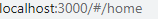 

​			特点：#后边的东西都不会作为资源发送给服务器


##### 路由组件和一般组件


路由组件与一般组件的最大区别是：

​				路由组件会收到路由器传递的三个重要的props：history,location,match

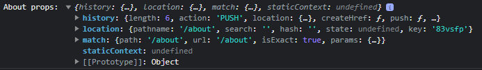 


##### 动态追加className


<NavLink>:

​			NavLink中有activeClassName属性，可以自定义类名


react-router-dom.js

```javascript
{
  NavLink.displayName = "NavLink";
  var ariaCurrentType = PropTypes.oneOf(["page", "step", "location", "date", "time", "true", "false"]);
  NavLink.propTypes = _extends({}, Link.propTypes, {
    "aria-current": ariaCurrentType,
    activeClassName: PropTypes.string,
    activeStyle: PropTypes.object,
    className: PropTypes.oneOfType([PropTypes.string, PropTypes.func]),
    exact: PropTypes.bool,
    isActive: PropTypes.func,
    location: PropTypes.object,
    sensitive: PropTypes.bool,
    strict: PropTypes.bool,
    style: PropTypes.oneOfType([PropTypes.object, PropTypes.func])
  });
}
```


App.js

```javascript
import { NavLink, Route } from 'react-router-dom'

import Home from './pages/Home'             // Home是路由组件
import About from './pages/About'           // About是路由组件
import Header from './components/Header'    // Header是一般组件

function App() {
  return (
    <div>
      <div className="row">
        <div className="col-xs-offset-2 col-xs-8">
          <Header a={1} />
        </div>
      </div>
      <div className="row">
        <div className="col-xs-2 col-xs-offset-2">
          <div className="list-group">
            {/* 原生html中，靠<a>跳转不同的页面 */}
            {/* <a className="list-group-item" href="./about.html">About</a>
            <a className="list-group-item active" href="./home.html">Home</a> */}

            {/* 在react中靠路由链接实现切换组件---编写路由链接 */}
            <NavLink activeClassName="active_test" className="list-group-item" to="/about">About</NavLink>
            <NavLink activeClassName="active_test" className="list-group-item" to="/home">Home</NavLink>

          </div>
        </div>
        <div className="col-xs-6">
          <div className="panel">
            <div className="panel-body">
              {/* 注册路由 */}
              <Route path="/about" component={About} />
              <Route path="/home" component={Home} />
            </div>
          </div>
        </div>
      </div>
    </div>
  );
}

export default App;
```


index.html

```html
<style>
    .active_test {
      background-color: orange !important;
      color: white !important;
    }
  </style>
```

**注意**：自定义的样式权限没有bootstrap高，需要 !important


##### 封装NavLink


为避免大量冗余类名出现在NavLink中，可以封装一个统一类名的NavLink。封装的NavLink是一般组件，并可以为其传递props


App.js

```javascript
import { NavLink, Route } from 'react-router-dom'

import Home from './pages/Home'             // Home是路由组件
import About from './pages/About'           // About是路由组件
import Header from './components/Header'    // Header是一般组件
import MyNavLink from './components/MyNavLink'

function App() {
  return (
    <div>
      <div className="row">
        <div className="col-xs-offset-2 col-xs-8">
          <Header a={1} />
        </div>
      </div>
      <div className="row">
        <div className="col-xs-2 col-xs-offset-2">
          <div className="list-group">
            {/* 原生html中，靠<a>跳转不同的页面 */}
            {/* <a className="list-group-item" href="./about.html">About</a>
            <a className="list-group-item active" href="./home.html">Home</a> */}

            {/* 在react中靠路由链接实现切换组件---编写路由链接 */}
            <MyNavLink to="/about" title="About"></MyNavLink>
            <MyNavLink to="/home" title="Home"></MyNavLink>
          </div>
        </div>
        <div className="col-xs-6">
          <div className="panel">
            <div className="panel-body">
              {/* 注册路由 */}
              <Route path="/about" component={About} />
              <Route path="/home" component={Home} />
            </div>
          </div>
        </div>
      </div>
    </div>
  );
}
export default App;
```


MyNavLink--->index.jsx

```jsx
import React, { Component } from 'react'

import { NavLink } from 'react-router-dom'

export default class MyNavLink extends Component {

    render() {
        const { to, title } = this.props;
        return (
            <NavLink activeClassName="active_test" className="list-group-item" to={to}>{title}</NavLink>
        )
    }
}
```


###### 如果要传递多组标签属性


若某个已封装的NavLink需要传入多组标签属性

```javascript
<MyNavLink to="/about" title="About" a="1" b={2} c={3}></MyNavLink>
```


可以在标签中使用 spread syntax

```jsx
import React, { Component } from 'react'

import { NavLink } from 'react-router-dom'

export default class MyNavLink extends Component {

    render() {
        const { title } = this.props;
        return (
            <NavLink activeClassName="active_test" className="list-group-item" {...this.props} >{title}</NavLink>
        )
    }
}
```


###### review


Ques:	{...this.props}是如何添加到NavLink的?


Ans:	Unsolve currently,possibly have some clues,but without strong evidence to prove it...


```http
https://legacy.reactjs.org/docs/jsx-in-depth.html
```


Fundamentally, JSX just provides syntactic sugar for the `React.createElement(component, props, ...children)` function.


The JSX code:

```jsx
<MyButton color="blue" shadowSize={2}>
  Click Me
</MyButton>
```

compiles into:

```javascript
React.createElement(
  MyButton,
  {color: 'blue', shadowSize: 2},
  'Click Me'
)
```

​	


当在封装的NavLink中传入标签体内容

```js
			<MyNavLink to="/about" a="1" b={2} c={3}>About</MyNavLink>
            <MyNavLink to="/home" >Home</MyNavLink>
```

 在props中会接收到 children这个属性

 


在展开后同样能传递给NavLink，让之前封装的NavLink的标签体内容变为NavLink的children

```jsx
<NavLink activeClassName="active_test" className="list-group-item" {...this.props} />
```


##### Switch


在匹配路径为 /home 时

```jsx
			  <Route path="/about" component={About} />
              <Route path="/home" component={Home} />
              <Route path="/home" component={Test_} />
```


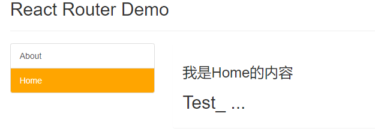 

如果有很多路由，匹配时会一个个去对应路径，这样会大大降低效率。


**如果用  <Switch>包裹整个路由**


```jsx
			 <Switch>
                <Route path="/about" component={About} />
                <Route path="/home" component={Home} />
                <Route path="/home" component={Test_} />
              </Switch>
```


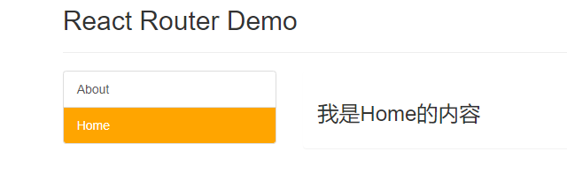 


这样在一个路由匹配成功后，就不会继续匹配相同路径的路由了。


##### 样式丢失问题


webpack配置localhost为public文件夹的根路径，

如果请求路径下没有相应的资源，那么会返回public下的index.html


```jsx
import { Route, Switch } from 'react-router-dom'

import Home from './pages/Home'             // Home是路由组件
import About from './pages/About'           // About是路由组件
import Test_ from './pages/Test_'

import Header from './components/Header'    // Header是一般组件
import MyNavLink from './components/MyNavLink'


function App() {
  return (
    <div>
      <div className="row">
        <div className="col-xs-offset-2 col-xs-8">
          <Header a={1} />
        </div>
      </div>
      <div className="row">
        <div className="col-xs-2 col-xs-offset-2">
          <div className="list-group">
            {/* 原生html中，靠<a>跳转不同的页面 */}
            {/* <a className="list-group-item" href="./about.html">About</a>
            <a className="list-group-item active" href="./home.html">Home</a> */}

            {/* 在react中靠路由链接实现切换组件---编写路由链接 */}
            <MyNavLink to="/xxx/about" a="1" b={2} c={3}>About</MyNavLink>
            <MyNavLink to="/xxx/home" >Home</MyNavLink>
          </div>
        </div>
        <div className="col-xs-6">
          <div className="panel">
            <div className="panel-body">
              {/* 注册路由 */}
              <Switch>
                <Route path="/xxx/about" component={About} />
                <Route path="/xxx/home" component={Home} />
                {/* <Route path="/home" component={Test_} /> */}
              </Switch>
            </div>
          </div>
        </div>
      </div>
    </div>
  );
}

export default App;
```


如果路由路径是多级的结构，刷新的时候会造成样式的丢失


 


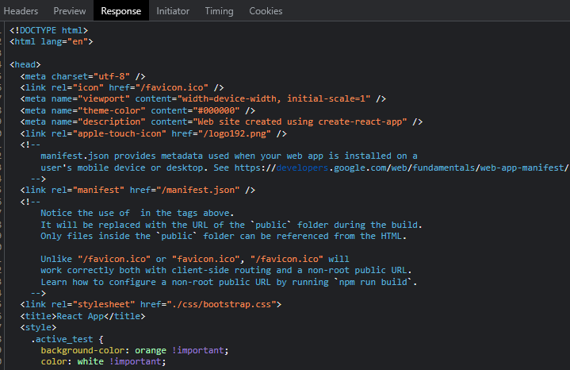 


###### 解决:

在index.html中

```tex
因为./是相对路径，所以匹配的是在/about之前的路径，错误的把 "http://localhost:3000/xxx/" 匹配到 "/css/bootstrap"
```

1.

```html
<link rel="stylesheet" href="/css/bootstrap.css">
```

2.

%PUBLIC_URL%代表的就是public的绝对路径

```html
<link rel="stylesheet" href="%PUBLIC_URL%/css/bootstrap.css">
```

3.

如果在index.html中仍使用相对路径，可以在index.js中使用HashRouter


```javascript
	<HashRouter>
        <App />
    </HashRouter>
```


 

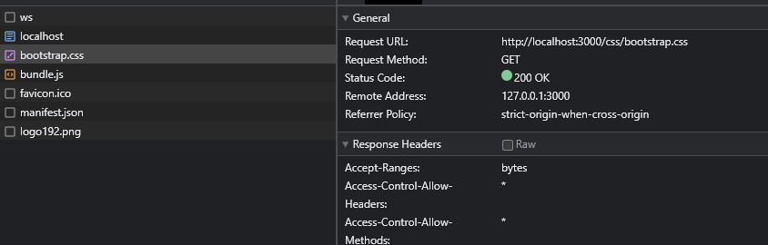 


##### 路由的精准匹配和模糊匹配


在路由跳转的时候只能比路由路径多而不能少，路由匹配默认就是模糊匹配


```jsx
import { Route, Switch } from 'react-router-dom'

import Home from './pages/Home'             // Home是路由组件
import About from './pages/About'           // About是路由组件
import Test_ from './pages/Test_'

import Header from './components/Header'    // Header是一般组件
import MyNavLink from './components/MyNavLink'


function App() {
  return (
    <div>
      <div className="row">
        <div className="col-xs-offset-2 col-xs-8">
          <Header a={1} />
        </div>
      </div>
      <div className="row">
        <div className="col-xs-2 col-xs-offset-2">
          <div className="list-group">
            {/* 原生html中，靠<a>跳转不同的页面 */}
            {/* <a className="list-group-item" href="./about.html">About</a>
            <a className="list-group-item active" href="./home.html">Home</a> */}

            {/* 在react中靠路由链接实现切换组件---编写路由链接 */}
            <MyNavLink to="/about" a="1" b={2} c={3}>About</MyNavLink>
            <MyNavLink to="/home/a/b" >Home</MyNavLink>
          </div>
        </div>
        <div className="col-xs-6">
          <div className="panel">
            <div className="panel-body">
              {/* 注册路由 */}
              <Switch>
                <Route path="/about" component={About} />
                <Route path="/home" component={Home} />
                {/* <Route path="/home" component={Test_} /> */}
              </Switch>
            </div>
          </div>
        </div>
      </div>
    </div>
  );
}

export default App;
```


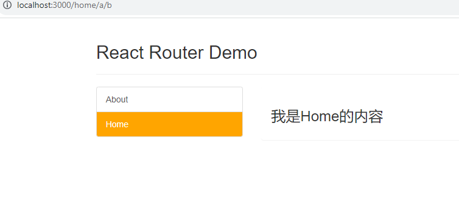 

跳转虽然到 /home/a/b，但仍能和 path="/home" 相匹配，并渲染出对应的组件


如果精准匹配


```jsx
{/* <Route exact={true} path="/home" component={Home} /> */}
<Route exact path="/home" component={Home} />
```


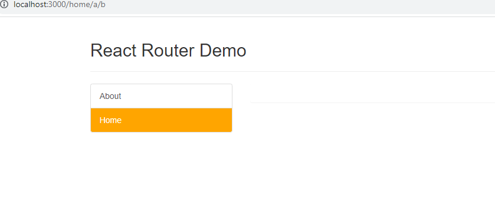 


如果路由跳转诡异再使用exact，默认不需要exact，有时候开启exact会导致无法继续匹配二级路由


##### Redirect


```jsx
	 <Switch>
                <Route path="/about" component={About} />
                <Route path="/home" component={Home} />
                <Redirect to="/about" />
      </Switch>
```


当刚进页面时，路由即没有匹配到 /about，也没有匹配到 /home，最终重定向 到 /about


一般写在所有注册路由的最下方，当所有路由都无法匹配时，跳转到Redirect指定的路由


#### nested route


newDir(

Home--->Message--->index.jsx

Home--->News--->index.jsx

)


Message

```jsx
import React, { Component } from 'react'

export default class Message extends Component {
  render() {
    return (
      <div>
        <ul>
          <li>
            <a href="/message1">message001</a>&nbsp;&nbsp;
          </li>
          <li>
            <a href="/message2">message002</a>&nbsp;&nbsp;
          </li>
          <li>
            <a href="/message/3">message003</a>&nbsp;&nbsp;
          </li>
        </ul>
      </div>
    )
  }
}
```


News

```jsx
import React, { Component } from 'react'

export default class News extends Component {
  render() {
    return (
      <ul>
        <li>news001</li>
        <li>news002</li>
        <li>news003</li>
      </ul>
    )
  }
}
```


Home

```jsx
import React, { Component } from 'react'

import MyNavLink from '../../components/MyNavLink'
import News from './News'
import Message from './Message'

export default class Home extends Component {
    render() {
        return (
            <div>
                <h2>Home组件内容</h2>
                <div>
                    <ul className="nav nav-tabs">
                        <li>
                            <MyNavLink to="/news">News</MyNavLink>
                        </li>
                        <li>
                            <MyNavLink to="/message">Message</MyNavLink>
                        </li>
                    </ul>
                    {/* 注册路由 */}

                </div>
            </div>
        )
    }
}
```


路由的匹配都是从最开始注册到最后注册这个流程走下去的


如上方的Home组件中路由跳转到 /news，会在最开始注册的路由中进行匹配，发现无法匹配会redirect到 /about


```jsx
 			<Switch>
                <Route path="/about" component={About} />
                <Route path="/home" component={Home} />
                <Redirect to="/about" />
              </Switch>
```


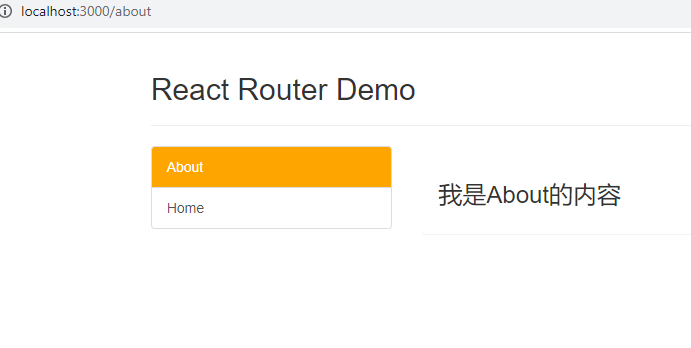 


现在修改Home--->index.jsx


```jsx
import React, { Component } from 'react'

import MyNavLink from '../../components/MyNavLink'
import { Route, Switch } from 'react-router-dom'

import News from './News'
import Message from './Message'

export default class Home extends Component {
    render() {
        return (
            <div>
                <h2>Home组件内容</h2>
                <div>
                    <ul className="nav nav-tabs">
                        <li>
                            <MyNavLink to="/home/news">News</MyNavLink>
                        </li>
                        <li>
                            <MyNavLink to="/home/message">Message</MyNavLink>
                        </li>
                    </ul>
                    {/* 注册路由 */}
                    <Switch>
                        <Route path="/home/news" component={News} />
                        <Route path="/home/message" component={Message} />
                    </Switch>
                </div>
            </div>
        )
    }
}
```


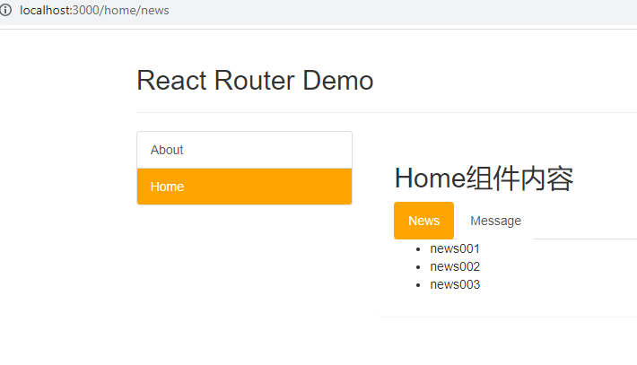 

看看点击Home再点击News发生了什么?


在点击News的时候path为 /home/news


```jsx
			<Switch>
                <Route path="/about" component={About} />
                <Route path="/home" component={Home} />
                <Redirect to="/about" />
              </Switch>
```

这时会和 /home匹配，所以Home组件还能存在于页面上

于是在Home组件中继续进行路由的匹配

```jsx
					<Switch>
                        <Route path="/home/news" component={News} />
                        <Route path="/home/message" component={Message} />
                    </Switch>
```

最终 /home/news 匹配到news组件


如果在第一层注册路由中使用exact

```jsx
			<Switch>
                <Route path="/about" component={About} />
                <Route exact path="/home" component={Home} />
                <Redirect to="/about" />
              </Switch>
```


 

无论是 /home/news 还是 /home/message都不会和 /home匹配，所以会redirect到 /about


#### 路由传参


newDir(

Home--->Message--->Detail--->index.jsx

)


Message

```jsx
import React, { Component } from 'react'

import Detail from './Detail';
import { Link, Route } from 'react-router-dom'


export default class Message extends Component {
  state = {
    messageArr: [
      { id: '01', title: 'message1' },
      { id: '02', title: 'message2' },
      { id: '03', title: 'message3' },
    ]
  }
  render() {
    const { messageArr } = this.state;
    return (
      <div>
        <ul>
          {
            messageArr.map((msgObj) => {
              return (
                <li key={msgObj.id}>
                  <Link to="/home/message/detail" >{msgObj.title}</Link>&nbsp;&nbsp;
                </li>
              )
            })
          }
        </ul>
        <hr />
        <Route path="/home/message/detail" component={Detail} />
      </div>
    )
  }
}
```


Detail

```jsx
import React, { Component } from 'react'


const detailData = [
    {id:'01',content:'Hi~'},
    {id:'02',content:'Goodbye~'},
    {id:'03',content:'GoodNight~'}
]

export default class Detail extends Component {
    render() {
        return (
            <ul>
                <li>ID:???</li>
                <li>TITLE:???</li>
                <li>CONTENT:???</li>
            </ul>
        )
    }
}
```


需要在路由跳转的时候传递参数，让Detail组件能动态变换数据


##### 1.params传参


Message

```jsx
import React, { Component } from 'react'

import Detail from './Detail';
import { Link, Route } from 'react-router-dom'


export default class Message extends Component {
  state = {
    messageArr: [
      { id: '01', title: 'message1' },
      { id: '02', title: 'message2' },
      { id: '03', title: 'message3' },
    ]
  }
  render() {
    const { messageArr } = this.state;
    return (
      <div>
        <ul>
          {
            messageArr.map((msgObj) => {
              return (
                <li key={msgObj.id}>
                  {/* 向路由组件传递params参数 */}
                  <Link to={`/home/message/detail/${msgObj.id}/${msgObj.title}`} >{msgObj.title}</Link>&nbsp;&nbsp;
                </li>
              )
            })
          }
        </ul>
        <hr />
        {/* 声明接收params参数 */}
        <Route path="/home/message/detail/:id/:title" component={Detail} />
      </div>
    )
  }
}
```


导航区(Message)在遍历的时候带着id和title

同时应在对应路由声明接收


Detail

```jsx
import React, { Component } from 'react'


const detailData = [
    { id: '01', content: 'Hi~' },
    { id: '02', content: 'Goodbye~' },
    { id: '03', content: 'GoodNight~' }
]

export default class Detail extends Component {
    render() {
        // console.log('Detail props:', this.props);
        const { id, title } = this.props.match.params;
        const findResult = detailData.find((detailObj) => {
            return detailObj.id === id;
        })
        return (
            <ul>
                <li>ID:{id}</li>
                <li>TITLE:{title}</li>
                <li>CONTENT:{findResult.content}</li>
            </ul>
        )
    }
}
```


可以在Detail中打印props

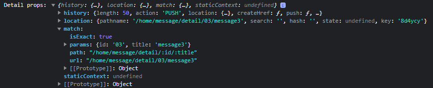 


 可以看到在 match中有 params属性，对应的值是一个整理后的对象，

下方中 path .../:id/:title 对应着值为 .../03/message3


##### 2.search参数


Message

```jsx
import React, { Component } from 'react'

import Detail from './Detail';
import { Link, Route } from 'react-router-dom'


export default class Message extends Component {
  state = {
    messageArr: [
      { id: '01', title: 'message1' },
      { id: '02', title: 'message2' },
      { id: '03', title: 'message3' },
    ]
  }
  render() {
    const { messageArr } = this.state;
    return (
      <div>
        <ul>
          {
            messageArr.map((msgObj) => {
              return (
                <li key={msgObj.id}>
                  {/* 向路由组件传递params参数 */}
                  {/* <Link to={`/home/message/detail/${msgObj.id}/${msgObj.title}`} >{msgObj.title}</Link>&nbsp;&nbsp; */}

                  {/* 向路由组件传递search参数 */}
                  <Link to={`/home/message/detail/?id=${msgObj.id}&title=${msgObj.title}`} >{msgObj.title}</Link>&nbsp;&nbsp;
                </li>
              )
            })
          }
        </ul>
        <hr />
        {/* 声明接收params参数 */}
        {/* <Route path="/home/message/detail/:id/:title" component={Detail} /> */}

        {/* search参数 无需声明接收 */}
        <Route path="/home/message/detail" component={Detail} />
      </div>
    )
  }
}
```


Detail

```jsx
import React, { Component } from 'react'


const detailData = [
    { id: '01', content: 'Hi~' },
    { id: '02', content: 'Goodbye~' },
    { id: '03', content: 'GoodNight~' }
]

export default class Detail extends Component {
    render() {
        console.log('Detail props:', this.props);

        // const { id, title } = this.props.match.params;      // 接收params参数

        const { search } = this.props.location // 接收search参数

        const findResult = detailData.find((detailObj) => {
            // return detailObj.id === id;
        })
        return (
            <ul>
                <li>ID:???</li>
                <li>TITLE:???</li>
                <li>CONTENT:???</li>
            </ul>
        )
    }
}
```


打印Dtail收到的props

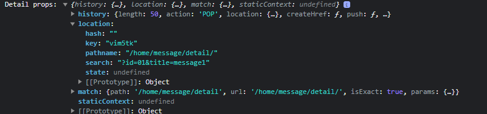 


可以看到 location.search中有 query

多组key value用&分隔(urlencoded)


引入一个库去处理query

querystring是内置库

```jsx
import qs from 'querystring'
```


Detail

```jsx
import React, { Component } from 'react'

import qs from 'querystring'

const detailData = [
    { id: '01', content: 'Hi~' },
    { id: '02', content: 'Goodbye~' },
    { id: '03', content: 'GoodNight~' }
]

export default class Detail extends Component {
    render() {
        console.log('Detail props:', this.props);

        // const { id, title } = this.props.match.params;      // 接收params参数

        const { search } = this.props.location // 接收search参数
        const { id, title } = qs.parse(search.slice(1))

        const findResult = detailData.find((detailObj) => {
            return detailObj.id === id;
        })
        return (
            <ul>
                <li>ID:{id}</li>
                <li>TITLE:{title}</li>
                <li>CONTENT:{findResult.content}</li>
            </ul>
        )
    }
}
```


##### 3.state参数


Message

```jsx
import React, { Component } from 'react'

import Detail from './Detail';
import { Link, Route } from 'react-router-dom'


export default class Message extends Component {
  state = {
    messageArr: [
      { id: '01', title: 'message1' },
      { id: '02', title: 'message2' },
      { id: '03', title: 'message3' },
    ]
  }
  render() {
    const { messageArr } = this.state;
    return (
      <div>
        <ul>
          {
            messageArr.map((msgObj) => {
              return (
                <li key={msgObj.id}>
                  {/* 向路由组件传递params参数 */}
                  {/* <Link to={`/home/message/detail/${msgObj.id}/${msgObj.title}`} >{msgObj.title}</Link>&nbsp;&nbsp; */}

                  {/* 向路由组件传递search参数 */}
                  {/* <Link to={`/home/message/detail/?id=${msgObj.id}&title=${msgObj.title}`} >{msgObj.title}</Link>&nbsp;&nbsp; */}

                  {/* 向路由组件传递state参数 */}
                  <Link to={{ pathname: '/home/message/detail', state: { id: msgObj.id, title: msgObj.title } }} >{msgObj.title}</Link>&nbsp;&nbsp;
                </li>
              )
            })
          }
        </ul>
        <hr />
        {/* 声明接收params参数 */}
        {/* <Route path="/home/message/detail/:id/:title" component={Detail} /> */}

        {/* search参数 无需声明接收 */}
        {/* <Route path="/home/message/detail" component={Detail} /> */}

        {/* state参数 无需声明接收 */}
        <Route path="/home/message/detail" component={Detail} />
      </div>
    )
  }
}
```


**注意：** 这里的state与react的state没有关系，这里的state只是路由props里的一个属性


传递state参数时注意传递的是一个对象最外的{}表示为js表达式,里面的{}才为对象


打印state

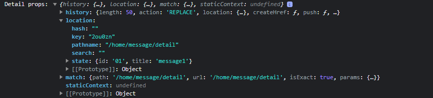 


可以发现state是一个对象


Detail

```jsx
import React, { Component } from 'react'

// import qs from 'querystring'

const detailData = [
    { id: '01', content: 'Hi~' },
    { id: '02', content: 'Goodbye~' },
    { id: '03', content: 'GoodNight~' }
]

export default class Detail extends Component {
    render() {
        console.log('Detail props:', this.props);

        // const { id, title } = this.props.match.params;       // 接收params参数

        // const { search } = this.props.location               // 接收search参数
        // const { id, title } = qs.parse(search.slice(1))

        const { id, title } = this.props.location.state         // 接收state参数

        const findResult = detailData.find((detailObj) => {
            return detailObj.id === id;
        })
        return (
            <ul>
                <li>ID:{id}</li>
                <li>TITLE:{title}</li>
                <li>CONTENT:{findResult.content}</li>
            </ul>
        )
    }
}
```


**注意：** 在使用state 传参的时候url是不会变化的，例如:点击message3 或 message1，URL不会有任何变化。

​			假如点击了message3再刷新页面Detail会丢失吗？


不会，由于使用了 BrowserRouter包裹了整个App，故BrowserRouter一直在操作浏览器的history


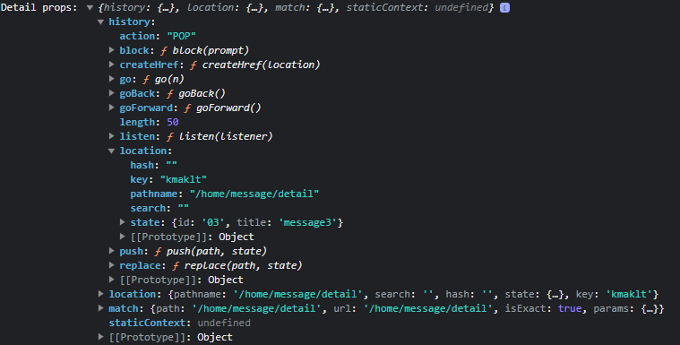 


可以看到传递的props里有维护的histroy


假如直接清除浏览器的缓存及所有数据


Detail

```jsx
import React, { Component } from 'react'

// import qs from 'querystring'

const detailData = [
    { id: '01', content: 'Hi~' },
    { id: '02', content: 'Goodbye~' },
    { id: '03', content: 'GoodNight~' }
]

export default class Detail extends Component {
    render() {
        console.log('Detail props:', this.props);

        // const { id, title } = this.props.match.params;       // 接收params参数

        // const { search } = this.props.location               // 接收search参数
        // const { id, title } = qs.parse(search.slice(1))

        const { id, title } = this.props.location.state || {}        // 接收state参数

        const findResult = detailData.find((detailObj) => {
            return detailObj.id === id;
        }) || {}
        return (
            <ul>
                <li>ID:{id}</li>
                <li>TITLE:{title}</li>
                <li>CONTENT:{findResult.content}</li>
            </ul>
        )
    }
}
```


以http://localhost:3000/home/message/detail该路径重新进入


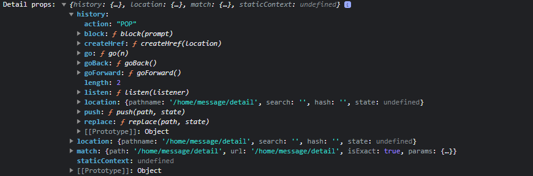 


可以看到state是undefined


##### review


to可以传字符串，也可以传对象的形式的值


react-rotuer-dom.js

```javascript
function _interopDefault (ex) 
{ return (ex && (typeof ex === 'object') && 'default' in ex) ? ex['default'] : ex; }

var PropTypes = _interopDefault(require('prop-types'));

var toType = PropTypes.oneOfType([PropTypes.string, PropTypes.object, PropTypes.func]);

Link.propTypes = {
    innerRef: refType,
    onClick: PropTypes.func,
    replace: PropTypes.bool,
    target: PropTypes.string,
    to: toType.isRequired
  };
```


to : object

An object that can have any of the following properties:

- `pathname`: A string representing the path to link to.
- `search`: A string representation of query parameters.
- `hash`: A hash to put in the URL, e.g. `#a-hash`.
- `state`: State to persist to the `location`.


**注：** 使用BrowseRouter 传递的props,类式组件this.props能找到；

​		而函数组件需要使用hooks "useHistory"

```http
https://v5.reactrouter.com/web/api/Hooks/usehistory
```


#### push与replace


默认路由跳转是 PUSH，PUSH 是一个压栈操作。


```typescript
export enum Action {
  /**
   * A POP indicates a change to an arbitrary index in the history stack, such
   * as a back or forward navigation. It does not describe the direction of the
   * navigation, only that the current index changed.
   *
   * Note: This is the default action for newly created history objects.
   */
  Pop = "POP",

  /**
   * A PUSH indicates a new entry being added to the history stack, such as when
   * a link is clicked and a new page loads. When this happens, all subsequent
   * entries in the stack are lost.
   */
  Push = "PUSH",

  /**
   * A REPLACE indicates the entry at the current index in the history stack
   * being replaced by a new one.
   */
  Replace = "REPLACE",
}
```


**注：**"POP"是一种默认的行为(如果不是push或replace)


现如果将 message1 message2 message3 设置为replace

```jsx
import React, { Component } from 'react'

import Detail from './Detail';
import { Link, Route } from 'react-router-dom'


export default class Message extends Component {
  state = {
    messageArr: [
      { id: '01', title: 'message1' },
      { id: '02', title: 'message2' },
      { id: '03', title: 'message3' },
    ]
  }
  render() {
    // console.log('Message props:', this.props);
    const { messageArr } = this.state;
    return (
      <div>
        <ul>
          {
            messageArr.map((msgObj) => {
              return (
                <li key={msgObj.id}>
                  {/* 向路由组件传递params参数 */}
                  {/* <Link to={`/home/message/detail/${msgObj.id}/${msgObj.title}`} >{msgObj.title}</Link>&nbsp;&nbsp; */}

                  {/* 向路由组件传递search参数 */}
                  {/* <Link to={`/home/message/detail/?id=${msgObj.id}&title=${msgObj.title}`} >{msgObj.title}</Link>&nbsp;&nbsp; */}

                  {/* 向路由组件传递state参数 */}
                  <Link replace to={{ pathname: '/home/message/detail', state: { id: msgObj.id, title: msgObj.title } }} >
                    {msgObj.title}
                  </Link>&nbsp;&nbsp;
                </li>
              )
            })
          }
        </ul>
        <hr />
        {/* 声明接收params参数 */}
        {/* <Route path="/home/message/detail/:id/:title" component={Detail} /> */}

        {/* search参数 无需声明接收 */}
        {/* <Route path="/home/message/detail" component={Detail} /> */}

        {/* state参数 无需声明接收 */}
        <Route path="/home/message/detail" component={Detail} />
      </div>
    )
  }
}
```


```tex
/home/message	--->将被replace
/home/news
/about
```


```tex
在 /home/message/detail 点击 浏览器的后退 会直接到 /home/news
```


如果路由跳转全设置为replace会不留下痕迹


#### 编程式路由导航


Message

```jsx
import React, { Component } from 'react'

import Detail from './Detail';
import { Link, Route } from 'react-router-dom'


export default class Message extends Component {
  state = {
    messageArr: [
      { id: '01', title: 'message1' },
      { id: '02', title: 'message2' },
      { id: '03', title: 'message3' },
    ]
  }

  replaceShow = (id, title) => {
    // replace跳转，携带params参数
    // this.props.history.replace(`/home/message/detail/${id}/${title}`)

    // replace跳转，携带search参数
    // this.props.history.replace(`/home/message/detail?id=${id}&title=${title}`)

    // replace跳转，携带state参数
    this.props.history.replace(`/home/message/detail`, { id, title })
  }
  pushShow = (id, title) => {
    // push跳转，携带params参数
    // this.props.history.push(`/home/message/detail/${id}/${title}`)

    // push跳转，携带search参数
    // this.props.history.push(`/home/message/detail?id=${id}&title=${title}`)

    // push跳转，携带state参数
    this.props.history.push(`/home/message/detail`, { id, title })
  }
  back = () => {
    this.props.history.goBack()
  }
  forward = () => {
    this.props.history.goForward()
  }
  go = (n) => {
    this.props.history.go(n)
  }

  render() {
    // console.log('Message props:', this.props);
    const { messageArr } = this.state;
    return (
      <div>
        <ul>
          {
            messageArr.map((msgObj) => {
              return (
                <li key={msgObj.id}>
                  {/* 向路由组件传递params参数 */}
                  {/* <Link to={`/home/message/detail/${msgObj.id}/${msgObj.title}`} >{msgObj.title}</Link>&nbsp;&nbsp; */}

                  {/* 向路由组件传递search参数 */}
                  {/* <Link to={`/home/message/detail/?id=${msgObj.id}&title=${msgObj.title}`} >{msgObj.title}</Link>&nbsp;&nbsp; */}

                  {/* 向路由组件传递state参数 */}
                  <Link to={{ pathname: '/home/message/detail', state: { id: msgObj.id, title: msgObj.title } }} >
                    {msgObj.title}
                  </Link>&nbsp;&nbsp;

                  &nbsp;<button onClick={() => this.pushShow(msgObj.id, msgObj.title)} >push查看</button>&nbsp;
                  &nbsp;<button onClick={() => this.replaceShow(msgObj.id, msgObj.title)}>replace查看</button>
                </li>
              )
            })
          }
        </ul>
        <hr />
        {/* 声明接收params参数 */}
        {/* <Route path="/home/message/detail/:id/:title" component={Detail} /> */}

        {/* search参数 无需声明接收 */}
        {/* <Route path="/home/message/detail" component={Detail} /> */}

        {/* state参数 无需声明接收 */}
        <Route path="/home/message/detail" component={Detail} />

        <button onClick={this.back}>回退</button>&nbsp;
        <button onClick={this.forward}>前进</button>&nbsp;
        <button onClick={() => this.go(2)}>前进2</button>&nbsp;
        <button onClick={() => this.go(-2)}>回退2</button>
      </div>
    )
  }
}
```


Detail

```jsx
import React, { Component } from 'react'

import qs from 'querystring'

const detailData = [
    { id: '01', content: 'Hi~' },
    { id: '02', content: 'Goodbye~' },
    { id: '03', content: 'GoodNight~' }
]
/* const PropTypes = _interopDefault(require('prop-types'));
function _interopDefault(ex) { console.log('ex:', ex); return (ex && (typeof ex === 'object') && 'default' in ex) ? ex['default'] : ex; }
const toType = PropTypes.oneOfType([PropTypes.string, PropTypes.object, PropTypes.func]); */


export default class Detail extends Component {
    render() {
        /* console.log('PropTypes:', PropTypes);
        console.log('PropTypes.object:', PropTypes.object); */

        console.log('Detail props:', this.props);

        // const { id, title } = this.props.match.params;       // 接收params参数

        /* const { search } = this.props.location               // 接收search参数
        const { id, title } = qs.parse(search.slice(1)) */

        const { id, title } = this.props.location.state || {}        // 接收state参数

        const findResult = detailData.find((detailObj) => {
            return detailObj.id === id;
        }) || {}
        return (
            <ul>
                <li>ID:{id}</li>
                <li>TITLE:{title}</li>
                <li>CONTENT:{findResult.content}</li>
            </ul>
        )
    }
}
```


 用函数来实现路由跳转


#### WithRouter


 一般组件和路由组件不同，拿不到路由器传递的props


```jsx
import React, { Component } from 'react'
import { withRouter } from 'react-router-dom'

class Header extends Component {
    back = () => {
        this.props.history.goBack()
    }
    forward = () => {
        this.props.history.goForward()
    }
    go = (n) => {
        this.props.history.go(n)
    }
    render() {
        console.log('Header props:', this.props);
        return (
            <div className="page-header">
                <h2>React Router Demo</h2>
                <button onClick={this.back}>回退</button>&nbsp;
                <button onClick={this.forward}>前进</button>&nbsp;
                <button onClick={() => this.go(2)}>前进2</button>&nbsp;
                <button onClick={() => this.go(-2)}>回退2</button>
            </div>

        )
    }
}
let C = withRouter(Header)
console.log('C:', C);
export default C
```


```javascript
/**
 * A public higher-order component to access the imperative API
 */

function withRouter(Component) {
  var displayName = "withRouter(" + (Component.displayName || Component.name) + ")";

  var C = function C(props) {
    var wrappedComponentRef = props.wrappedComponentRef,
        remainingProps = _objectWithoutPropertiesLoose(props, ["wrappedComponentRef"]);

    return /*#__PURE__*/React.createElement(context.Consumer, null, function (context) {
      !context ?  invariant(false, "You should not use <" + displayName + " /> outside a <Router>")  : void 0;
      return /*#__PURE__*/React.createElement(Component, _extends({}, remainingProps, context, {
        ref: wrappedComponentRef
      }));
    });
  };

  C.displayName = displayName;
  C.WrappedComponent = Component;

  {
    C.propTypes = {
      wrappedComponentRef: PropTypes.oneOfType([PropTypes.string, PropTypes.func, PropTypes.object])
    };
  }

  return hoistStatics(C, Component);
}
```


withRouter可以加工一般组件，让一般组件具备路由组件所持有的API

withRouter的返回值是一个新组件


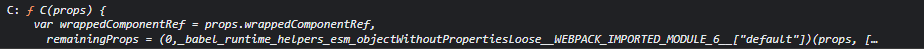 


可以看到withRotuer的返回值是C，为一个函数，函数体参照上面的reference


#### BrowserRouter和HashRouter


##### 1.原理

​			BrowserRouter使用的是H5的history API,不兼容IE9及以下版本

​			HashRouter使用的是URL的哈希值

##### 2.url

​			BrowserRouter的路径中没有#，例如：localhost:3000/demo/test

​			HashRouter的路径中包含#，例如：localhost:3000/#/demo/test 			

​			(#后面的都不会发送给服务器，它不认为是一种请求资源的路径)

##### 3.刷新后对路由state的影响

​			1)BrowserRouter没有任何影响，因为state保存在history对象中

​			2)HashRouter刷新后会导致路由state参数的丢失！！！

​			


如果用HashRouter来包裹App

```jsx
	<HashRouter>
        <App />
    </HashRouter>
```


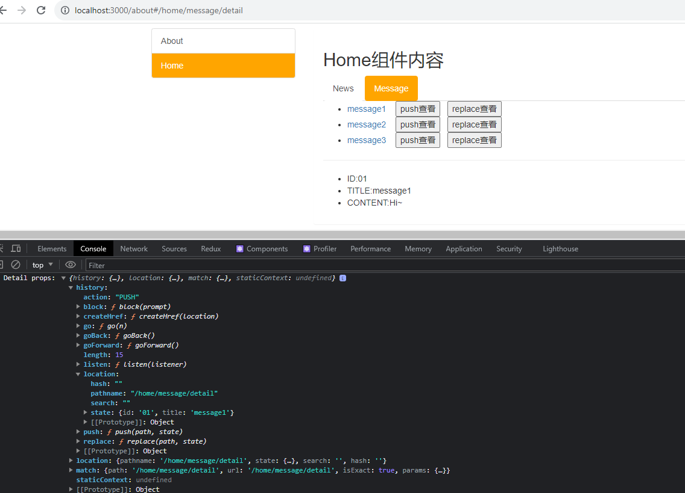 


如果点击刷新


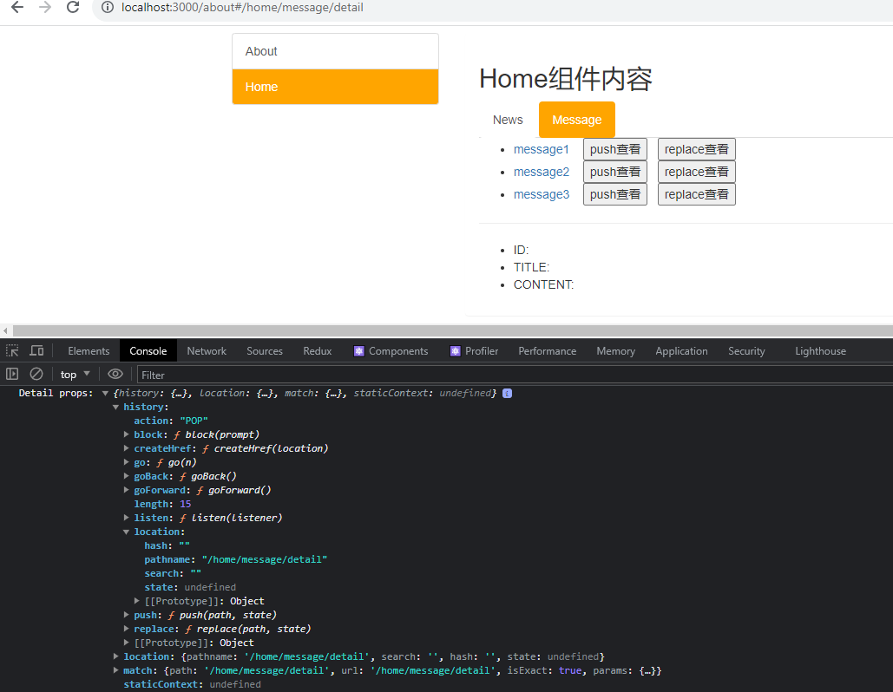 


可以看到state为undefined，页面上也无数据

(因为 HashRouter没有用 H5的history API，也就没有维护props里的history)


##### 4.注

​			HashRouter可以用于解决一些路径错误相关的问题


# Antd


# Redux


## redux工作流程


### action

1.动作的对象

2.包含2个属性

​	*type：标识属性，值为字符创，唯一，必要属性

​	*data：数据属性，值类型任意，可选属性


### reducer

1.用于初始化状态、加工状态

2.加工时，根据旧的state和action，产生新的state的纯函数


### store

1.将state、action、reducer联系在一起的对象 


### 使用react来实现一个案例


**(dir: component--->Count--->index.jsx)**

```jsx
import React, { Component } from 'react'

export default class Count extends Component {
    state = { count: 0 }

    // 加法
    increment = () => {
        const { value } = this.selectedNumber;
        const { count } = this.state;
        this.setState({ count: count + value * 1 });
    }
    // 减法
    decrement = () => {
        const { value } = this.selectedNumber;
        const { count } = this.state;
        this.setState({ count: count - value * 1 });
    }
    // 奇数再加
    incrementIfOdd = () => {
        const { value } = this.selectedNumber;
        const { count } = this.state;
        if (count % 2 !== 0) {
            this.setState({ count: count + value * 1 });
        }
    }
    incrementIfAsync = () => {
        const { value } = this.selectedNumber;
        const { count } = this.state;
        setTimeout(() => {
            this.setState({ count: count + value * 1 });
        }, 500);
    }
    render() {
        const { count } = this.state;

        return (
            <div>
                <h1>当前求和为:{count}</h1>
                <select ref={currentNode => this.selectedNumber = currentNode}>
                    <option value="1">1</option>
                    <option value="2">2</option>
                    <option value="3">3</option>
                </select>&nbsp;
                <button onClick={this.increment}>+</button>&nbsp;
                <button onClick={this.decrement}>-</button>&nbsp;
                <button onClick={this.incrementIfOdd}>当前求和为奇数再加</button>&nbsp;
                <button onClick={this.incrementIfAsync}>异步加</button>&nbsp;
            </div>
        )
    }
}

```


该方法存在大量的冗余代码，例如：实现一个加法操作，几乎相似的代码实现逻辑却多次重复出现在不同的函数中。


​	

### redux_mini


#### store

```js
/*
    该文件专门用于暴露一个store对象，整个应用只有一个store对象 
*/

// 引入createStore,专门用于创建redux中最为核心的store对象
import { createStore } from 'redux'
// 引入为Count组件服务的reducer
import countReducer from './count_reducer'

// 暴露store
export default createStore(countReducer)
```


log(store)

 


#### count_reducer


```js
/*
    1.该文件是用于为Count组件服务的reducer，reducer的本质就是一个函数,负责初始化和加工状态
    2.reducer函数会接到两个参数，分别为：之前的状态(prevState)，动作对象(action)
*/

const initState = 0;    // 初始化状态
export default function countReducer(prevState = initState, action) {
    console.log('in countReducer, prevState:', prevState);
    console.log('in countReducer, action:', action);
    console.log('--------------------------------------------------------');
    // 从action对象中获取:type,data
    const { type, data } = action;

    let incrementReturn = prevState + data
    let decrementReturn = prevState - data

    // 根据type决定如何加工数据
    switch (type) {
        case 'increment':   // 如果是.. 加
            console.log('countReducer handling..., Increment Success!');
            console.log('current value: ', incrementReturn);
            return incrementReturn;
        case 'decrement':   // 如果是.. 减
            console.log('countReducer handling..., Decrement Success!');
            console.log('current value: ', decrementReturn);
            return decrementReturn;
        // 初始化的时候
        default:
            return prevState;
    }
}
```

log(prevState)

log(action)

 


action的类型Action

**Actions must have a `type` field**

```typescript
/**
 * An *action* is a plain object that represents an intention to change the
 * state. Actions are the only way to get data into the store. Any data,
 * whether from UI events, network callbacks, or other sources such as
 * WebSockets needs to eventually be dispatched as actions.
 *
 * Actions must have a `type` field that indicates the type of action being
 * performed. Types can be defined as constants and imported from another
 * module. It's better to use strings for `type` than Symbols because strings
 * are serializable.
 *
 * Other than `type`, the structure of an action object is really up to you.
 * If you're interested, check out Flux Standard Action for recommendations on
 * how actions should be constructed.
 *
 * @template T the type of the action's `type` tag.
 */
export interface Action<T = any> {
  type: T
}
```


#### Component

**(dir: component--->Count--->index.jsx)**

```jsx
import React, { Component } from 'react'
// 引入store，用于获取redux中保存的状态
import store from '../../redux/store';

export default class Count extends Component {
    state = { carName: '奔驰c63' }

    /*
        componentDidMount() {
        // 监测redux中状态的变化，只要变化，就调用render
        store.subscribe(() => {
            // 只要redux中任何一个状态发生改变就会调用该回调
            // console.log('state changed');

            // setState有效率问题
            this.setState({});
        })
    }
    */
    
    // 加法
    increment = () => {
        const { value } = this.selectedNumber;
        // 通知redux 加 value
        // dispatch() 的参数是 action，返回值是 参数action
        const dispatchReturn = store.dispatch({
            type: 'increment',
            data: value * 1
        })
        // console.log('dispatchReturn:', dispatchReturn);
        console.log('--------------------------------------------------------');
        // redux只能管理状态，redux中状态的更改不会引起页面更新
    }
    // 减法
    decrement = () => {
        const { value } = this.selectedNumber;
        store.dispatch({
            type: 'decrement',
            data: value * 1
        })
    }
    // 奇数再加
    incrementIfOdd = () => {
        const { value } = this.selectedNumber;
        const count = store.getState();
        if (count % 2 !== 0) {
            store.dispatch({ type: 'increment', data: value * 1 })
        }
    }
    incrementIfAsync = () => {
        const { value } = this.selectedNumber;
        setTimeout(() => {
            store.dispatch({ type: 'increment', data: value * 1 })
        }, 500);
    }
    render() {
        // console.log(store);

        return (
            <div>
                {/* getState() 拿到的是redux保存的状态，redux里是reducer专门负责初始化和加工状态 */}
                {/* 页面上能有数据说明，countReducer被调用，Count组件当前并没有通知store处理state，这是因为store调用的为了拿到初始值 */}
                <h1>当前求和为:{store.getState()}</h1>
                <select ref={currentNode => this.selectedNumber = currentNode}>
                    <option value="1">1</option>
                    <option value="2">2</option>
                    <option value="3">3</option>
                </select>&nbsp;
                <button onClick={this.increment}>+</button>&nbsp;
                <button onClick={this.decrement}>-</button>&nbsp;
                <button onClick={this.incrementIfOdd}>当前求和为奇数再加</button>&nbsp;
                <button onClick={this.incrementIfAsync}>异步加</button>&nbsp;
            </div>
        )
    }
}

```


**(dir:src--->index.js)**


store.subscribe() 参数是一个监听回调，只要action dispatch就会调用该回调

只要redux中state改变就render根组件

```js
import React from 'react';
import ReactDOM from 'react-dom/client';
import App from './App';
import store from './redux/store';

const root = ReactDOM.createRoot(document.getElementById('root'));
root.render(
  <App />
);
store.subscribe(() => {
  // DOM diffing不会引起大面积重绘重排
  root.render(
    <App />
  );
})


```


#### **review**


##### store:

​			通过createStore()返回一个Store类型的**对象**，该对象里有常用的成员方法，如:getState(),dispatch(),subscribe()

​			createStore()的主要参数是reducer

```typescript
export declare function createStore<S, A extends Action, Ext, StateExt>(
  reducer: Reducer<S, A>,
  enhancer?: StoreEnhancer<Ext, StateExt>
): Store<S & StateExt, A> & Ext
```


##### reducer: 

​			reducer类型为Reducer是一个**函数**接收两个参数 state,action，返回state所属的类型

​			reducer主要负责初始化和加工从store dispatch过来的状态

​			reducer被第一次调用时,是store自动触发的，

​					传递的prevState是undefined(如果没有在该reducer初始化状态的话)

​					传递的action是 {type:'@@redux/INITx.x.x.x.x.x'}

```typescript
/**
 * A *reducer* (also called a *reducing function*) is a function that accepts
 * an accumulation and a value and returns a new accumulation. They are used
 * to reduce a collection of values down to a single value
 *
 * Reducers are not unique to Redux—they are a fundamental concept in
 * functional programming.  Even most non-functional languages, like
 * JavaScript, have a built-in API for reducing. In JavaScript, it's
 * `Array.prototype.reduce()`.
 *
 * In Redux, the accumulated value is the state object, and the values being
 * accumulated are actions. Reducers calculate a new state given the previous
 * state and an action. They must be *pure functions*—functions that return
 * the exact same output for given inputs. They should also be free of
 * side-effects. This is what enables exciting features like hot reloading and
 * time travel.
 *
 * Reducers are the most important concept in Redux.
 *
 * *Do not put API calls into reducers.*
 *
 * @template S The type of state consumed and produced by this reducer.
 * @template A The type of actions the reducer can potentially respond to.
 */
export type Reducer<S = any, A extends Action = AnyAction> = (
  state: S | undefined,
  action: A
) => S
```


##### dispatch:

​			dispatch的类型为Dispatch是一个**函数**参数为action,action的类型为**继承于A的T**,函数返回类型也是**继承于A的T**


​			**(The base dispatch function *always* synchronously sends an action to the store's reducer)**
```typescript
/**
 * A *dispatching function* (or simply *dispatch function*) is a function that
 * accepts an action or an async action; it then may or may not dispatch one
 * or more actions to the store.
 *
 * We must distinguish between dispatching functions in general and the base
 * `dispatch` function provided by the store instance without any middleware.
 *
 * The base dispatch function *always* synchronously sends an action to the
 * store's reducer, along with the previous state returned by the store, to
 * calculate a new state. It expects actions to be plain objects ready to be
 * consumed by the reducer.
 *
 * Middleware wraps the base dispatch function. It allows the dispatch
 * function to handle async actions in addition to actions. Middleware may
 * transform, delay, ignore, or otherwise interpret actions or async actions
 * before passing them to the next middleware.
 *
 * @template A The type of things (actions or otherwise) which may be
 *   dispatched.
 */
export interface Dispatch<A extends Action = AnyAction> {
  <T extends A>(action: T): T
}
```


##### action:

​			action的类型为A，是一个**对象**,A继承于Action,而接口Action只有type一个属性

​			通过调用action creators里面的函数来返回一个对象，该对象就是action, action中type是必须的,其他属性是自定义的。

如果action中没有定义type属性

**ERROR:**

**Actions may not have an undefined "type" property. You may have misspelled an action type string constant.**


​			**(Actions are the only way to get data into the store)**

​			**(Actions must have a `type` field)**

```typescript
/**
 * An *action* is a plain object that represents an intention to change the
 * state. Actions are the only way to get data into the store. Any data,
 * whether from UI events, network callbacks, or other sources such as
 * WebSockets needs to eventually be dispatched as actions.
 *
 * Actions must have a `type` field that indicates the type of action being
 * performed. Types can be defined as constants and imported from another
 * module. It's better to use strings for `type` than Symbols because strings
 * are serializable.
 *
 * Other than `type`, the structure of an action object is really up to you.
 * If you're interested, check out Flux Standard Action for recommendations on
 * how actions should be constructed.
 *
 * @template T the type of the action's `type` tag.
 */
export interface Action<T = any> {
  type: T
}
```


```
						subscribe()
							|
							|
							↓				return newSTATE
	createStore(REDUCER)--->store	<-------------------|
							|							|
							|							| 
							|	dispatch(ACTION)		|
							|--------------------->REDUCER(STATE,ACTION)


```


### redux_complete


(added up)


#### action creator


```js
/*
    该文件专门为Count组件生成action对象
    action creator
*/

import { INCREMENT, DECREMENT } from './constant';

export const createIncrementAction = data => ({ type: INCREMENT, data })
export const createDecrementAction = data => ({ type: DECREMENT, data })


```


#### constant


```js
/*
    该模块是用于定义action对象中type类型的常量值，目的只有一个：便于管理的同时防止输入错误
*/
export const INCREMENT = 'increment';
export const DECREMENT = 'decrement';
```


### redux_async_action


action:   Object类型的action为同步action；function类型的action为异步action


store.js

```js
/*
    该文件专门用于暴露一个store对象，整个应用只有一个store对象 
*/

// 引入createStore,专门用于创建redux中最为核心的store对象
import { createStore, applyMiddleware } from 'redux'
// 引入为Count组件服务的reducer
import countReducer from './count_reducer'
// 引入redux-thunk，用于支持异步action
import thunk from 'redux-thunk'

// 暴露store
export default createStore(countReducer, applyMiddleware(thunk))
```


count_action.js

```js
/*
    该文件专门为Count组件生成action对象
    action creator
*/

import { INCREMENT, DECREMENT } from './constant';

// 同步action
// 同步action，就是指action的值为为Object类型的一般对象 
export const createIncrementAction = data => ({ type: INCREMENT, data })
export const createDecrementAction = data => ({ type: DECREMENT, data })

// 异步action
// 异步action，就是指action的值为函数；异步action中一般都会调用同步action，异步action不是必须要用的
export const createIncrementAsyncAction = (data, time) => {
    // store调用的该函数
    // each middleware will be given the `dispatch` and `getState` functions as named arguments.
    return (dispatch) => {
        console.log(dispatch);
        setTimeout(() => {
            // 通知redux加data
            dispatch(createIncrementAction(data));
        }, time);
    }
}


```


index.jsx

```jsx
 incrementIfAsync = () => {
        const { value } = this.selectedNumber;
        store.dispatch(createIncrementAsyncAction(value * 1, 500))
    }
```


```
								subscribe()
									|
									|
									↓						return newSTATE
	createStore(REDUCER,	----->store(ENHANCED)	<-------------------|
applyMiddleware(MIDDLEWARE))		|									|
									|									| 
				   		   	------->|	   dispatch(ACTION)				|
				   			|		|--------------------->REDUCER(STATE,ACTION)
				   			|		↑	(needs MIDDLEWARE)
		 ACTION CREATOR---->|		|----------	|
				  								|
			sync ACTION			async ACTION-----
			(Plain Object)		(function)
```


#### review

​	

##### middleware:

​			**(Actions must be plain objects. Instead, the actual type was: 'function'. You may need to add middleware to your store setup to handle dispatching other values, such as 'redux-thunk' to handle dispatching functions.)**


​			异步action返回给store的是一个函数，而store只能接收plain object，故需要通过中间件来让store调用该函数；

​			

**applyMiddleware()**

```typescript
/**
 * Creates a store enhancer that applies middleware to the dispatch method
 * of the Redux store. This is handy for a variety of tasks, such as
 * expressing asynchronous actions in a concise manner, or logging every
 * action payload.
 *
 * See `redux-thunk` package as an example of the Redux middleware.
 *
 * Because middleware is potentially asynchronous, this should be the first
 * store enhancer in the composition chain.
 *
 * Note that each middleware will be given the `dispatch` and `getState`
 * functions as named arguments.
 *
 * @param middlewares The middleware chain to be applied.
 * @returns A store enhancer applying the middleware.
 *
 * @template Ext Dispatch signature added by a middleware.
 * @template S The type of the state supported by a middleware.
 */
export function applyMiddleware(): StoreEnhancer
export function applyMiddleware<Ext1, S>(
  middleware1: Middleware<Ext1, S, any>
): StoreEnhancer<{ dispatch: Ext1 }>
export function applyMiddleware<Ext1, Ext2, S>(
  middleware1: Middleware<Ext1, S, any>,
  middleware2: Middleware<Ext2, S, any>
): StoreEnhancer<{ dispatch: Ext1 & Ext2 }>
export function applyMiddleware<Ext1, Ext2, Ext3, S>(
  middleware1: Middleware<Ext1, S, any>,
  middleware2: Middleware<Ext2, S, any>,
  middleware3: Middleware<Ext3, S, any>
): StoreEnhancer<{ dispatch: Ext1 & Ext2 & Ext3 }>
export function applyMiddleware<Ext1, Ext2, Ext3, Ext4, S>(
  middleware1: Middleware<Ext1, S, any>,
  middleware2: Middleware<Ext2, S, any>,
  middleware3: Middleware<Ext3, S, any>,
  middleware4: Middleware<Ext4, S, any>
): StoreEnhancer<{ dispatch: Ext1 & Ext2 & Ext3 & Ext4 }>
export function applyMiddleware<Ext1, Ext2, Ext3, Ext4, Ext5, S>(
  middleware1: Middleware<Ext1, S, any>,
  middleware2: Middleware<Ext2, S, any>,
  middleware3: Middleware<Ext3, S, any>,
  middleware4: Middleware<Ext4, S, any>,
  middleware5: Middleware<Ext5, S, any>
): StoreEnhancer<{ dispatch: Ext1 & Ext2 & Ext3 & Ext4 & Ext5 }>
export function applyMiddleware<Ext, S = any>(
  ...middlewares: Middleware<any, S, any>[]
): StoreEnhancer<{ dispatch: Ext }>
```


TYPE Middleware

```typescript
/**
 * A middleware is a higher-order function that composes a dispatch function
 * to return a new dispatch function. It often turns async actions into
 * actions.
 *
 * Middleware is composable using function composition. It is useful for
 * logging actions, performing side effects like routing, or turning an
 * asynchronous API call into a series of synchronous actions.
 *
 * @template DispatchExt Extra Dispatch signature added by this middleware.
 * @template S The type of the state supported by this middleware.
 * @template D The type of Dispatch of the store where this middleware is
 *   installed.
 */
export interface Middleware<
  DispatchExt = {},
  S = any,
  D extends Dispatch = Dispatch
> {
  (api: MiddlewareAPI<D, S>): (
    next: Dispatch<AnyAction>
  ) => (action: any) => any
}
```


MiddlewareAPI 是 action中的异步action,作为middleware的参数api,

所以在action中返回一个回调函数时会收到两个参数，一个是dispatch,一个是getState

```typescript
/* middleware */

export interface MiddlewareAPI<D extends Dispatch = Dispatch, S = any> {
  dispatch: D
  getState(): S
}
```


##### middleware实现:

​			...waiting for a chance


##### custom middleware:

​			...waiting for a chance


### react-redux


#### 引入redux中的store


**如果没有引入store:**

**(Could not find "store" in the context of "Connect(Count)". Either wrap the root component in a <Provider>, or pass a custom React context provider to <Provider> and the corresponding React context consumer to Connect(Count) in connect options.)**


**可以**如此引入store

```jsx
import React, { Component } from 'react'
import Count from './containers/Count'

// 引入redux中的store
// 而不是在容器组件中引入
import store from './redux/store'

export default class App extends Component {
  render() {
    return (
      <div>
        <Count store={store} />
      </div>
    )
  }
}


```


#### 容器组件


创建目录 src --->containers--->Count--->index.jsx

容器组件来跟redux交互，UI组件只需接收容器组件传过去的props来实现页面功能

```jsx
// 引入Count的UI组件
import CountUI from '../../components/Count'

// 引入 action creator
import { createIncrementAction, createDecrementAction, createIncrementAsyncAction } from '../../redux/count_action'

// 引入connect用于连接UI组件与redux
import { connect } from 'react-redux'

// mapStateToProps函数的返回值作为状态传递给了UI组件
// mapStateToProps函数返回的对象中的key就作为传递给UI组件props的key，value就作为传递给UI组件props的value----->状态
const mapStateToProps = (state, ownProps) => {
    // console.log('state', state);
    // console.log('ownProps', ownProps);
    return {
        count: state
    };
}
// mapDispatchToProps函数的返回值作为操作状态的方法传递给了UI组件
// mapDispatchToProps函数返回的对象中的key就作为传递给UI组件props的key，value就作为传递给UI组件props的value----->操作状态的方法
const mapDispatchToProps = (dispatch) => {
    // console.log('dispatch', dispatch);
    return {
        increment: (number) => {
            // 通知redux执行加法
            dispatch(createIncrementAction(number))
        },
        decrement: number => dispatch(createDecrementAction(number)),
        incrementAsync: (number, time) => dispatch(createIncrementAsyncAction(number, time))
    };
}

// 使用connect()() 创建并暴露一个Count的容器组件
export default connect(mapStateToProps, mapDispatchToProps)(CountUI)

```


#### UI组件


修改UI组件

UI不应出现任何与redux交互的体现，调用的state是容器组件传递的props的属性，改变state的方法是容器组件传递的props的方法

```jsx
import React, { Component } from 'react'


export default class Count extends Component {
    state = { carName: '奔驰c63' }

    // 加法
    increment = () => {
        const { value } = this.selectedNumber;
        this.props.increment(value * 1);
    }
    // 减法
    decrement = () => {
        const { value } = this.selectedNumber;
    }
    // 奇数再加
    incrementIfOdd = () => {
        const { value } = this.selectedNumber;
    }
    // 异步加
    incrementIfAsync = () => {
        const { value } = this.selectedNumber;
    }
    render() {
        console.log('CountUI props:', this.props);
        return (
            <div>
                {/* getState() 拿到的是redux保存的状态，redux里是reducer专门负责初始化和加工状态 */}
                {/* 页面上能有数据说明，countReducer被调用，Count组件当前并没有通知store处理state，这是因为store调用的为了拿到初始值 */}
                <h1>当前求和为:{this.props.count}</h1>
                <select ref={currentNode => this.selectedNumber = currentNode}>
                    <option value="1">1</option>
                    <option value="2">2</option>
                    <option value="3">3</option>
                </select>&nbsp;
                <button onClick={this.increment}>+</button>&nbsp;
                <button onClick={this.decrement}>-</button>&nbsp;
                <button onClick={this.incrementIfOdd}>当前求和为奇数再加</button>&nbsp;
                <button onClick={this.incrementIfAsync}>异步加</button>&nbsp;
            </div>
        )
    }
}

```


#### connect()


```typescript
/**
 * Connects a React component to a Redux store.
 *
 * - Without arguments, just wraps the component, without changing the behavior / props
 *
 * - If 2 params are passed (3rd param, mergeProps, is skipped), default behavior
 * is to override ownProps (as stated in the docs), so what remains is everything that's
 * not a state or dispatch prop
 *
 * - When 3rd param is passed, we don't know if ownProps propagate and whether they
 * should be valid component props, because it depends on mergeProps implementation.
 * As such, it is the user's responsibility to extend ownProps interface from state or
 * dispatch props or both when applicable
 *
 * @param mapStateToProps
 * @param mapDispatchToProps
 * @param mergeProps
 * @param options
 */
export interface Connect<DefaultState = unknown> {
    (): InferableComponentEnhancer<DispatchProp>;
    /** mapState and mapDispatch (as a function)*/
    <TStateProps = {}, TDispatchProps = {}, TOwnProps = {}, State = DefaultState>(
        mapStateToProps: MapStateToPropsParam<TStateProps, TOwnProps, State>,
        mapDispatchToProps: MapDispatchToPropsNonObject<TDispatchProps, TOwnProps>): 			 	InferableComponentEnhancerWithProps<TStateProps & TDispatchProps, TOwnProps>;
}
```


MapStateToPropsParam:

```typescript
export declare type MapStateToProps<TStateProps, TOwnProps, State> = 
    (state: State, ownProps: TOwnProps) => TStateProps;

export declare type MapStateToPropsFactory<TStateProps, TOwnProps, State> = 
    (initialState: State, ownProps: TOwnProps) => MapStateToProps<TStateProps, TOwnProps, State>;

export declare type MapStateToPropsParam<TStateProps, TOwnProps, State> = MapStateToPropsFactory<TStateProps, TOwnProps, State> | MapStateToProps<TStateProps, TOwnProps, State> | null | undefined;


```


MapDispatchToProps:

```typescript
export declare type MapDispatchToPropsFunction<TDispatchProps, TOwnProps> = 
    (dispatch: Dispatch<Action<unknown>>, ownProps: TOwnProps) => TDispatchProps;

export declare type MapDispatchToPropsFactory<TDispatchProps, TOwnProps> = 
    (dispatch: Dispatch<Action<unknown>>, ownProps: TOwnProps) => MapDispatchToPropsFunction<TDispatchProps, TOwnProps>;

export declare type MapDispatchToPropsNonObject<TDispatchProps, TOwnProps> = MapDispatchToPropsFactory<TDispatchProps, TOwnProps> | MapDispatchToPropsFunction<TDispatchProps, TOwnProps>;

```


connect函数类型为InferableComponentEnhancer,实质还是一个函数，需要一个参数component

```typescript
export declare type InferableComponentEnhancerWithProps<TInjectedProps, TNeedsProps> = <C extends ComponentType<Matching<TInjectedProps, GetProps<C>>>>
    (component: C) => ConnectedComponent
<C, Mapped<DistributiveOmit<GetLibraryManagedProps<C>, keyof Shared<TInjectedProps, GetLibraryManagedProps<C>>> & TNeedsProps & ConnectPropsMaybeWithoutContext<TNeedsProps & GetProps<C>>>>;

export declare type InferableComponentEnhancer<TInjectedProps> = InferableComponentEnhancerWithProps<TInjectedProps, {}>;

```


#### Simplify


mapDispatchToProps的简写

mapDispatchToProps不仅能以函数形式存在，还能以对象形式存在

```jsx
// 引入Count的UI组件
import CountUI from '../../components/Count'

// 引入 action creator
import { createIncrementAction, createDecrementAction, createIncrementAsyncAction } from '../../redux/count_action'

// 引入connect用于连接UI组件与redux
import { connect } from 'react-redux'

// 使用connect()() 创建并暴露一个Count的容器组件
export default connect(
    state => ({ count: state }),

    // mapDispatchToProps的 一般写法
    /* dispatch => ({
        increment: number => { dispatch(createIncrementAction(number)) },
        decrement: number => dispatch(createDecrementAction(number)),
        incrementAsync: (number, time) => dispatch(createIncrementAsyncAction(number, time))
    }) */

    // mapDispatchToProps的 简写 
    /*
        boundActionCreators[key] = (...args) => dispatch(actionCreator(...args));
    */
    {
        increment: createIncrementAction,
        /* 
            increment: (...args) => dispatch(createIncrementAction(...args));
        */
        decrement: createDecrementAction,
        incrementAsync: createIncrementAsyncAction 
    }

)(CountUI)
```


```typescript
    /** mapState and mapDispatch (as an object) */
    <TStateProps = {}, TDispatchProps = {}, TOwnProps = {}, State = DefaultState>
    (mapStateToProps: MapStateToPropsParam<TStateProps, TOwnProps, State>, 
    mapDispatchToProps: MapDispatchToPropsParam<TDispatchProps, TOwnProps>): InferableComponentEnhancerWithProps<TStateProps & ResolveThunks<TDispatchProps>, TOwnProps>;

```


```typescript
export declare type MapDispatchToPropsFunction<TDispatchProps, TOwnProps> = 
    (dispatch: Dispatch<Action<unknown>>, ownProps: TOwnProps) => TDispatchProps;

export declare type MapDispatchToProps<TDispatchProps, TOwnProps> = MapDispatchToPropsFunction<TDispatchProps, TOwnProps> | TDispatchProps;

export declare type MapDispatchToPropsFactory<TDispatchProps, TOwnProps> = 
    (dispatch: Dispatch<Action<unknown>>, ownProps: TOwnProps) => MapDispatchToPropsFunction<TDispatchProps, TOwnProps>;


export declare type MapDispatchToPropsParam<TDispatchProps, TOwnProps> = MapDispatchToPropsFactory<TDispatchProps, TOwnProps> | MapDispatchToProps<TDispatchProps, TOwnProps>;

```


例： 				 	**increment**: *(...args) => dispatch(actionCreator(...args))*

实质就是:	 		increment: (...args) => dispatch(createIncrementAction(...args));

```javascript
function bindActionCreators(actionCreators, dispatch) {
  const boundActionCreators = {};
  for (const key in actionCreators) {
    const actionCreator = actionCreators[key];
    if (typeof actionCreator === 'function') {
      boundActionCreators[key] = (...args) => dispatch(actionCreator(...args));
    }
  }
  return boundActionCreators;
}
```

(actionCreators 就是在容器组件中 mapDispatchToProps作为一个对象)


#### Provider


App.jsx

```jsx
import React, { Component } from 'react'
import Count from './containers/Count'

// 引入redux中的store
// 而不是在容器组件中引入
import store from './redux/store'

export default class App extends Component {
  render() {
    return (
      <div>
        {/* 给容器组件传递store */}
        {/* <Count store={store} testOwnProps={"ownProp"} />  */}
        <Count store={store} />
        {/* 如果有很多容器组件，那么一遍遍传递store会很麻烦 */}
        <Demo1 store={store}></Demo1>
        <Demo2 store={store}></Demo2>
        <Demo3 store={store}></Demo3>
        <Demo4 store={store}></Demo4>
      </div>
    )
  }
}
```

**只要在项目中使用了react-redux，无需再监测状态的改变,容器组件已经能自动监测**


**Provider**

避免重复的在各容器组件中传入store，使用Provider统一传入store到各容器组件

index.js

```javascript
import React from 'react';
import ReactDOM from 'react-dom/client';
import App from './App';

import store from './redux/store'
import { Provider } from 'react-redux'

const root = ReactDOM.createRoot(document.getElementById('root'));
root.render(
  <Provider store={store}>
    <App />
  </Provider>
);
```


```typescript
export interface ProviderProps<A extends Action = AnyAction, S = unknown> {
    /**
     * The single Redux store in your application.
     */
    store: Store<S, A>;
    /**
     * An optional server state snapshot. Will be used during initial hydration render if available, to ensure that the UI output is consistent with the HTML generated on the server.
     */
    serverState?: S;
    /**
     * Optional context to be used internally in react-redux. Use React.createContext() to create a context to be used.
     * If this is used, you'll need to customize `connect` by supplying the same context provided to the Provider.
     * Initial value doesn't matter, as it is overwritten with the internal state of Provider.
     */
    context?: Context<ReactReduxContextValue<S, A>>;
    /** Global configuration for the `useSelector` stability check */
    stabilityCheck?: CheckFrequency;
    /** Global configuration for the `useSelector` no-op check */
    noopCheck?: CheckFrequency;
    children: ReactNode;
}
declare function Provider<A extends Action = AnyAction, S = unknown>
({ store, context, children, serverState, stabilityCheck, noopCheck, }: ProviderProps<A, S>): JSX.Element;

```


### Structuring files


将UI组件与容器组件整合


dir:(src--->containers--->Count)

```jsx
import React, { Component } from 'react'

// 引入 action creator
import { createIncrementAction, createDecrementAction, createIncrementAsyncAction } from '../../redux/count_action'

// 引入connect用于连接UI组件与redux
import { connect } from 'react-redux'

// 定义UI组件
class Count extends Component {
    state = { carName: '奔驰c63' }

    // 加法
    increment = () => {
        const { value } = this.selectedNumber;
        this.props.increment(value * 1);
    }
    // 减法
    decrement = () => {
        const { value } = this.selectedNumber;
        this.props.decrement(value * 1);
    }
    // 奇数再加
    incrementIfOdd = () => {
        const { value } = this.selectedNumber;
        if (this.props.count % 2 != 0) {
            this.props.increment(value * 1);
        }
    }
    // 异步加
    incrementIfAsync = () => {
        const { value } = this.selectedNumber;
        this.props.incrementAsync(value * 1, 500)
    }
    render() {
        console.log('CountUI props:', this.props);
        return (
            <div>
                {/* getState() 拿到的是redux保存的状态，redux里是reducer专门负责初始化和加工状态 */}
                {/* 页面上能有数据说明，countReducer被调用，Count组件当前并没有通知store处理state，这是因为store调用的为了拿到初始值 */}
                <h1>当前求和为:{this.props.count}</h1>
                <select ref={currentNode => this.selectedNumber = currentNode}>
                    <option value="1">1</option>
                    <option value="2">2</option>
                    <option value="3">3</option>
                </select>&nbsp;
                <button onClick={this.increment}>+</button>&nbsp;
                <button onClick={this.decrement}>-</button>&nbsp;
                <button onClick={this.incrementIfOdd}>当前求和为奇数再加</button>&nbsp;
                <button onClick={this.incrementIfAsync}>异步加</button>&nbsp;
            </div>
        )
    }
}


// 使用connect()() 创建并暴露一个Count的容器组件
export default connect(
    state => ({ count: state }),

    // mapDispatchToProps的 一般写法
    /* dispatch => ({
        increment: number => { dispatch(createIncrementAction(number)) },
        decrement: number => dispatch(createDecrementAction(number)),
        incrementAsync: (number, time) => dispatch(createIncrementAsyncAction(number, time))
    }) */

    // mapDispatchToProps的 简写 
    /*
        boundActionCreators[key] = (...args) => dispatch(actionCreator(...args));
    */
    {
        increment: createIncrementAction,
        /* 
            increment: (...args) => dispatch(createIncrementAction(...args));
        */
        decrement: createDecrementAction,
        incrementAsync: createIncrementAsyncAction 
    }

)(Count)

```


### Multi-components sharing


#### 现新建一个component


newdir(

​	src--->containers--->Person--->index.jsx,

​	src--->redux--->actions--->person.js,

​	src--->redux--->reducers--->person.js,

)


Person

```jsx
import React, { Component } from 'react'
import { connect } from 'react-redux'

import { nanoid } from 'nanoid'

class Person extends Component {

    addPerson = () => {
        const name = this.nameNode.value;
        const age = this.ageNode.value;
        const personObj = {
            id: nanoid(),
            name,
            age
        };
        console.log(personObj);
    }

    render() {
        return (
            <div>
                <h2>我是Person组件</h2>
                <input ref={cur => this.nameNode = cur} type="text" placeholder='输入名字' />
                <input ref={cur => this.ageNode = cur} type="text" placeholder='输入年龄' />
                <button onClick={this.addPerson}>添加</button>
                <ul>
                    <li>名字1---年龄1</li>
                    <li>名字2---年龄2</li>
                    <li>名字3---年龄3</li>
                </ul>
            </div>
        )
    }
}
export default connect(

)(Person)

```


```javascript
import { ADD_PERSON } from '../constant'

// 创建增加一个人的action动作对象
export const createAddPersonAction = personObj => ({ type: ADD_PERSON, data: personObj })
```


```javascript
import { ADD_PERSON } from '../constant'

// 初始化人的列表
const initState = [{ id: '001', name: 'tom', age: 18 }];

export default function personReducer(prevState = initState, action) {
    // console.log('personReducer>>> ');

    // 这里解构的data来自于该action creator返回的对象中的data属性
    const { type, data } = action;
    switch (type) {
        case ADD_PERSON:    // 若添加一个人
            return [data, ...prevState];
        default:
            return prevState;
    }
}
```


#### make reducers


store.js

```javascript
/*
    该文件专门用于暴露一个store对象，整个应用只有一个store对象 
*/

// 引入createStore,专门用于创建redux中最为核心的store对象
import { createStore, applyMiddleware, combineReducers } from 'redux'
// 引入为Count组件服务的reducer
import countReducer from './reducers/count'
// 引入为Person组件服务的reducer
import personReducer from './reducers/person'
// 引入redux-thunk，用于支持异步action
import thunk from 'redux-thunk'

// 合并各个reducer
// combineReducers传入的对象就是redux里保存的总状态对象
const reducers = combineReducers({
    sum: countReducer,
    persons: personReducer
})

// 暴露store
export default createStore(reducers, applyMiddleware(thunk))
```


**注意:现在redux中的state是整合了各个reducer后的state**

​			原来当单个组件使用redux的时候state的值的类型即为single reducer内初始化的state值的类型

​		当reducer ---> reducers 的时候，state是一个**对象**,

​			该对象的key是调用combineReducers时传入对象的(自定义的)key

​			该对象的value是reducer


#### Sharing state


在Person中

```jsx
import React, { Component } from 'react'
import { connect } from 'react-redux'
import { createAddPersonAction } from '../../redux/actions/person'

import { nanoid } from 'nanoid'

class Person extends Component {

    addPerson = () => {
        const name = this.nameNode.value;
        const age = this.ageNode.value;
        const personObj = {
            id: nanoid(),
            name,
            age
        };
        this.props.addPerson(personObj);
        this.nameNode.value = '';
        this.ageNode.value = '';
    }

    render() {
        console.log('PersontUI props:', this.props);
        return (
            <div>
                <h2>我是Person组件,上方组件求和为{this.props.sum}</h2>
                <input ref={cur => this.nameNode = cur} type="text" placeholder='输入名字' />
                <input ref={cur => this.ageNode = cur} type="text" placeholder='输入年龄' />
                <button onClick={this.addPerson}>添加</button>
                <ul>
                    {
                        this.props.persons.map((person) => {
                            return <li key={person.id}>{person.name}---{person.age}</li>
                        })
                    }
                </ul>
            </div>
        )
    }
}

export default connect(
    state => ({ persons: state.persons, sum: state.sum }),  // 映射状态
    {   //映射操作状态的方法
        addPerson: createAddPersonAction
    }
)(Person)
```


在Count中

```jsx
import React, { Component } from 'react'

// 引入 action creator
import { createIncrementAction, createDecrementAction, createIncrementAsyncAction } from '../../redux/actions/count'

// 引入connect用于连接UI组件与redux
import { connect } from 'react-redux'

// 定义UI组件
class Count extends Component {
    state = { carName: '奔驰c63' }

    // 加法
    increment = () => {
        const { value } = this.selectedNumber;
        this.props.increment(value * 1);
    }
    // 减法
    decrement = () => {
        const { value } = this.selectedNumber;
        this.props.decrement(value * 1);
    }
    // 奇数再加
    incrementIfOdd = () => {
        const { value } = this.selectedNumber;
        if (this.props.count % 2 !== 0) {
            this.props.increment(value * 1);
        }
    }
    // 异步加
    incrementIfAsync = () => {
        const { value } = this.selectedNumber;
        this.props.incrementAsync(value * 1, 500)
    }
    render() {
        console.log('CountUI props:', this.props);
        return (
            <div>
                {/* getState() 拿到的是redux保存的状态，redux里是reducer专门负责初始化和加工状态 */}
                {/* 页面上能有数据说明，countReducer被调用，Count组件当前并没有通知store处理state，这是因为store调用的为了拿到初始值 */}
                <h2>我是Count组件,下方组件总人数为:{this.props.personNum}</h2>
                <h4>当前求和为:{this.props.count}</h4>
                <select ref={currentNode => this.selectedNumber = currentNode}>
                    <option value="1">1</option>
                    <option value="2">2</option>
                    <option value="3">3</option>
                </select>&nbsp;
                <button onClick={this.increment}>+</button>&nbsp;
                <button onClick={this.decrement}>-</button>&nbsp;
                <button onClick={this.incrementIfOdd}>当前求和为奇数再加</button>&nbsp;
                <button onClick={this.incrementIfAsync}>异步加</button>&nbsp;
            </div>
        )
    }
}


// 使用connect()() 创建并暴露一个Count的容器组件
export default connect(
    // 当合并了reducers，也就意味着合并了各个reducer使用的state，现在的state是总状态
    state => ({ count: state.sum, personNum: state.persons.length }),
    {
        increment: createIncrementAction,
        /* 
            increment: (...args) => dispatch(createIncrementAction(...args));
        */
        decrement: createDecrementAction,
        incrementAsync: createIncrementAsyncAction
    }

)(Count)
```


即形成了组件间的数据共享


 


#### review


##### combineReducers


```typescript
/**
 * Turns an object whose values are different reducer functions, into a single
 * reducer function. It will call every child reducer, and gather their results
 * into a single state object, whose keys correspond to the keys of the passed
 * reducer functions.
 *
 * @template S Combined state object type.
 *
 * @param reducers An object whose values correspond to different reducer
 *   functions that need to be combined into one. One handy way to obtain it
 *   is to use ES6 `import * as reducers` syntax. The reducers may never
 *   return undefined for any action. Instead, they should return their
 *   initial state if the state passed to them was undefined, and the current
 *   state for any unrecognized action.
 *
 * @returns A reducer function that invokes every reducer inside the passed
 *   object, and builds a state object with the same shape.
 */
export function combineReducers<S>(
  reducers: ReducersMapObject<S, any>
): Reducer<CombinedState<S>>
export function combineReducers<S, A extends Action = AnyAction>(
  reducers: ReducersMapObject<S, A>
): Reducer<CombinedState<S>, A>
export function combineReducers<M extends ReducersMapObject<any, any>>(
  reducers: M
): Reducer<
  CombinedState<StateFromReducersMapObject<M>>,
  ActionFromReducersMapObject<M>
>
```


##### state


当combineReducers后，state不再是单个reducer初始化时该类型的值，而是一个对象


## Pure Function


页面不会更新


```javascript
import { ADD_PERSON } from '../constant'

// 初始化人的列表
const initState = [{ id: '001', name: 'tom', age: 18 }];

export default function personReducer(prevState = initState, action) {
    // console.log('personReducer>>> ');

    // 这里解构的data来自于该action creator返回的对象中的data属性
    const { type, data } = action;
    switch (type) {
        case ADD_PERSON:    // 若添加一个人
            prevState.unshift(data);
            // return [data, ...prevState];
            return prevState;
        default:
            return prevState;
    }
}
```


在reducer中，如果返回的prevState和传入的prevState，react-redux不会使页面更新。

这是因为用以上的方法传入的prevState的地址值和返回的prevState的地址值相同，而react-redux对state的判断是浅比较，

故不会引起页面的更新，但在redux中确实能够存在新增的数据。


同时，破坏了reducer是纯函数的原则

unshift()影响了原数组(影响了参数)


纯函数的约束：

(相同的输入必定得到相同的输出)

​			1.不得修改参数数据

​			2.不会产生任何副作用，例如：网络请求，输入和输出设备

​			3.不能调用 Date.now()或Math.random()等不纯的方法


## redux dev


1.install Redux DevTools


2.npm i @redux-devtools/extension


```javascript
/*
    该文件专门用于暴露一个store对象，整个应用只有一个store对象 
*/

// 引入createStore,专门用于创建redux中最为核心的store对象
import { createStore, applyMiddleware, combineReducers } from 'redux'
// 引入为Count组件服务的reducer
import countReducer from './reducers/count'
// 引入为Person组件服务的reducer
import personReducer from './reducers/person'
// 引入redux-thunk，用于支持异步action
import thunk from 'redux-thunk'

// 引入 @redux-devtools/extension
import { composeWithDevTools } from '@redux-devtools/extension'

// 合并各个reducer
// combineReducers传入的对象就是redux里保存的总状态对象
const reducers = combineReducers({
    sum: countReducer,
    persons: personReducer
})

// 暴露store
export default createStore(reducers, composeWithDevTools(applyMiddleware(thunk)))
```


在redux-dev中，左边的是actions的各个type，可以jump到之前


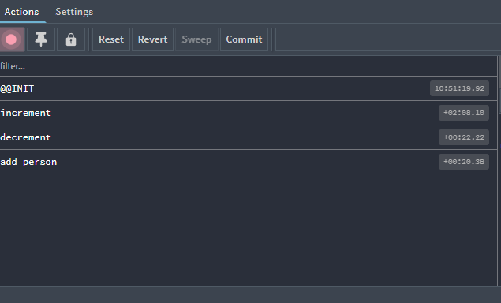 


点击show dispatch可以在页面dispatch

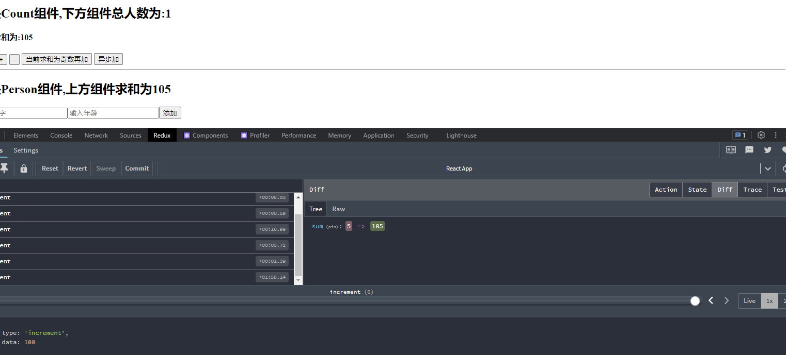


## final version


person action

```javascript
import { ADD_PERSON } from '../constant'

// 创建增加一个人的action动作对象
export const addPerson = personObj => ({ type: ADD_PERSON, data: personObj })
```


count action

```javascript
/*
    该文件专门为Count组件生成action对象
    action creator
*/

import { INCREMENT, DECREMENT } from '../constant';

// 同步action
// 同步action，就是指action的值为为Object类型的一般对象 
export const increment = data => ({ type: INCREMENT, data })
export const decrement = data => ({ type: DECREMENT, data })

// 异步action
// 异步action，就是指action的值为函数；异步action中一般都会调用同步action，异步action不是必须要用的
export const incrementAsync = (data, time) => {
    // store调用的该函数
    // each middleware will be given the `dispatch` and `getState` functions as named arguments.
    return (dispatch) => {
        // console.log(dispatch);
        setTimeout(() => {
            // 通知redux加data
            dispatch(increment(data));
        }, time);
    }
}
```


person container

```jsx
import React, { Component } from 'react'
import { connect } from 'react-redux'
import { addPerson } from '../../redux/actions/person'

import { nanoid } from 'nanoid'

class Person extends Component {

    addPerson = () => {
        const name = this.nameNode.value;
        const age = this.ageNode.value * 1;
        const personObj = {
            id: nanoid(),
            name,
            age
        };
        this.props.addPerson(personObj);
        this.nameNode.value = '';
        this.ageNode.value = '';
    }

    render() {
        console.log('PersontUI props:', this.props);
        return (
            <div>
                <h2>我是Person组件,上方组件求和为{this.props.sum}</h2>
                <input ref={cur => this.nameNode = cur} type="text" placeholder='输入名字' />
                <input ref={cur => this.ageNode = cur} type="text" placeholder='输入年龄' />
                <button onClick={this.addPerson}>添加</button>
                <ul>
                    {
                        this.props.persons.map((person) => {
                            return <li key={person.id}>{person.name}---{person.age}</li>
                        })
                    }
                </ul>
            </div>
        )
    }
}

export default connect(
    state => ({ persons: state.persons, sum: state.sum }),  // 映射状态
    {   //映射操作状态的方法
        addPerson
    }
)(Person)

```


count container

```jsx
import React, { Component } from 'react'

// 引入 action creator
import { increment, decrement, incrementAsync } from '../../redux/actions/count'

// 引入connect用于连接UI组件与redux
import { connect } from 'react-redux'

// 定义UI组件
class Count extends Component {
    state = { carName: '奔驰c63' }

    // 加法
    increment = () => {
        const { value } = this.selectedNumber;
        this.props.increment(value * 1);
    }
    // 减法
    decrement = () => {
        const { value } = this.selectedNumber;
        this.props.decrement(value * 1);
    }
    // 奇数再加
    incrementIfOdd = () => {
        const { value } = this.selectedNumber;
        if (this.props.sum % 2 !== 0) {
            this.props.increment(value * 1);
        }
    }
    // 异步加
    incrementIfAsync = () => {
        const { value } = this.selectedNumber;
        this.props.incrementAsync(value * 1, 500)
    }
    render() {
        console.log('CountUI props:', this.props);
        return (
            <div>
                {/* getState() 拿到的是redux保存的状态，redux里是reducer专门负责初始化和加工状态 */}
                {/* 页面上能有数据说明，countReducer被调用，Count组件当前并没有通知store处理state，这是因为store调用的为了拿到初始值 */}
                <h2>我是Count组件,下方组件总人数为:{this.props.personNum}</h2>
                <h4>当前求和为:{this.props.sum}</h4>
                <select ref={currentNode => this.selectedNumber = currentNode}>
                    <option value="1">1</option>
                    <option value="2">2</option>
                    <option value="3">3</option>
                </select>&nbsp;
                <button onClick={this.increment}>+</button>&nbsp;
                <button onClick={this.decrement}>-</button>&nbsp;
                <button onClick={this.incrementIfOdd}>当前求和为奇数再加</button>&nbsp;
                <button onClick={this.incrementIfAsync}>异步加</button>&nbsp;
            </div>
        )
    }
}


// 使用connect()() 创建并暴露一个Count的容器组件
export default connect(
    // 当合并了reducers，也就意味着合并了各个reducer使用的state，现在的state是总状态
    state => ({ sum: state.sum, personNum: state.persons.length }),
    {
        increment,
        decrement,
        incrementAsync
    }
)(Count)
```


# ReactRouter6


### React Router

​			React Router 以三个不同的包发布到npm上，分别为：

​					1.react-router: 路由的核心库，提供了很多的：组件、钩子。

​					2.react-router-dom: 包含react-router所有内容，并添加一些专门用于DOM的组件，例如 <BrowserRouter>等。

​					3.react-router: 包括react-router所有内容，并添加一些专门用于ReactNative的API，例如<NativeRouter>等。


​			与React Router 5相比改变了什么？

​					1.内置组件的变化：移除 <Switch />，新增 <Routes />等

​					2.语法的变化：component={About} 变为 element={<About />}

​					3.新增多个hooks：useParams,useNavigate,useMatch等

​					4.明确推荐函数式组件！


#### react-router-dom


##### make an example


newDir(

pages--->About--->index.jsx

pages--->Home--->index.jsx

)


index.js

```javascript
import React from 'react';
import ReactDOM from 'react-dom/client';
import App from './App';

import { BrowserRouter } from 'react-router-dom'

const root = ReactDOM.createRoot(document.getElementById('root'));
root.render(
  <BrowserRouter>
    <App />
  </BrowserRouter>
);

```


App.js

```javascript
import { NavLink, Routes, Route } from "react-router-dom"

import About from "./pages/About";
import Home from "./pages/Home";

function App() {
  return (
    <div>
      <div className="row">
        <div className="col-xs-offset-2 col-xs-8">
          <div className="page-header"><h2>React Router Demo</h2></div>
        </div>
      </div>
      <div className="row">
        <div className="col-xs-2 col-xs-offset-2">
          <div className="list-group">
            {/* 路由链接 */}
            <NavLink className="list-group-item" to="/about">About</NavLink>
            <NavLink className="list-group-item" to="/home">Home</NavLink>
          </div>
        </div>
        <div className="col-xs-6">
          <div className="panel">
            <div className="panel-body">
              {/* 注册路由 */}
              <Routes>
                <Route path="/about" element={<About />} />
                <Route path="/home" element={<Home />} />
              </Routes>
            </div>
          </div>
        </div>
      </div>
    </div>
  );
}

export default App;
```


About

```jsx
import React from 'react'

export default function About() {
    return (
        <h3>我是About的内容</h3>
    )
}
```


Home

```jsx
import React from 'react'

export default function Home() {
    return (
        <h3>我是Home的内容</h3>
    )
}
```


假如没有用Routes包裹<Route />

则会报错:

**A <Route> is only ever to be used as the child of <Routes> element, never rendered directly. Please wrap your <Route> in a <Routes>.**


而在React Router 5中用Switch可以包裹也可以不包裹


和Switch一样，如果匹配到了一个path，不会再接着匹配同名path

```jsx
			<Routes>
                <Route path="/about" element={<About />} />
                <Route path="/about" element={<Demo />} />
                <Route path="/home" element={<Home />} />
              </Routes>
```


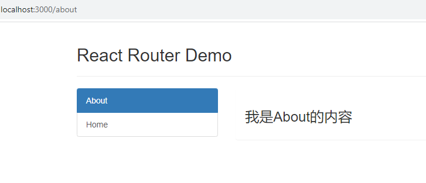 


